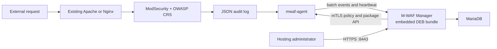

# M-WAF MVP

M-WAF is a lightweight hosting-provider WAF control plane. Customer web servers keep their existing Apache or Nginx process and install exactly two M-WAF packages:

1. `mwaf-agent`
2. `mwaf-modsecurity-apache` or `mwaf-modsecurity-nginx`

The separate Manager server runs MariaDB and one Manager container. That Manager image embeds the exact Agent package and both web-server module packages produced from the same `dev` commit.

## Project introduction page

The no-build static introduction page is published with GitHub Pages:

- Public URL: <https://fhwang0926.github.io/m-waf/>
- Page source: `site/`
- Deployment workflow: `.github/workflows/pages.yml`
- Trigger: a `dev` push that changes `site/**` or the Pages workflow, and manual workflow dispatch

Before the first publication, set **Repository Settings → Pages → Build and deployment → Source** to **GitHub Actions**. The workflow uploads only the `site/` directory and uses the minimum Pages deployment permissions. Until the workflow has been pushed and completed successfully, the public URL may return 404.

## MVP support scope

| Item | Supported now |
|---|---|
| Manager | Linux amd64 host with Docker Engine and Docker Compose |
| Database | MariaDB 11.8.6 container |
| Customer OS | Ubuntu Server 24.04 LTS, amd64 |
| Web server | Ubuntu 24.04 distro-default Apache or Nginx build matching the embedded catalog |
| WAF | Apache ModSecurity v2 distro module or Nginx libmodsecurity v3 connector package |
| Rules | Unmodified OWASP CRS v4.28.0 |
| Policy | Per-server `DetectionOnly` or `On`, signed and rollback-safe |
| Events | ModSecurity JSON audit log batch forwarding and Manager event list |

Rocky Linux/RPM, ARM64, custom-built web servers, server groups, rule exclusions, RBAC, HA, and automatic Agent/module upgrades are outside this first executable MVP. Unsupported inventory is rejected before the installer changes the web-server configuration.

## Supported customer web servers and versions

The MVP supports only the following Ubuntu 24.04 LTS amd64 web-server builds. The package revisions below are the versions confirmed from the Ubuntu repository on 2026-08-06; the signed bundle manifest embedded in each Manager image is the final compatibility source of truth.

| Web server | Supported server version | Confirmed Ubuntu package revision | M-WAF package | Open-source WAF components |
|---|---:|---:|---|---|
| Apache HTTP Server | `2.4.58` | `apache2 2.4.58-1ubuntu8.15` | `mwaf-modsecurity-apache` | `libapache2-mod-security2 2.9.7-1build3` + OWASP CRS `4.28.0` |
| Nginx | `1.24.0` | `nginx 1.24.0-2ubuntu7.15` | `mwaf-modsecurity-nginx` | `libnginx-mod-http-modsecurity 1.0.3-1build3` + libmodsecurity `3.0.12` + OWASP CRS `4.28.0` |

“Same version” alone is not sufficient. Before downloading a module, Manager requires all of these inventory fields to match one embedded catalog entry:

| Compatibility field | Required value |
|---|---|
| Operating system | `/etc/os-release`: `ID=ubuntu`, `VERSION_ID=24.04` |
| Architecture | `amd64` (`x86_64`) |
| Web-server type | Exactly `apache` or `nginx` |
| Server version | Apache `2.4.58` or Nginx `1.24.0` for the current baseline |
| Build identity | SHA-256 of normalized `apachectl -V`/`httpd -V` or `nginx -V` output must exactly match the Manager bundle manifest |

This exact build check prevents installing an ABI-incompatible Nginx dynamic module or an Apache module built for a different distro configuration. If any field differs, package resolution returns an unsupported-inventory error and the installer exits before modifying Apache or Nginx.

Ubuntu security updates may change a package revision or build identity while retaining the same visible server version. In that case, manually run the workflow on the `dev` branch or push a new `dev` commit to build a new Manager image and matching package catalog before enrolling the updated server. Do not reuse a module from an older Manager image merely because `apachectl -v` or `nginx -v` looks unchanged.

### Explicitly unsupported in this MVP

- Ubuntu 22.04, Ubuntu 26.04, Debian, Rocky Linux, AlmaLinux, RHEL, and CentOS
- ARM64 and other non-amd64 architectures
- Apache or Nginx compiled directly from source
- Nginx from `nginx.org`, a PPA, third-party repositories, or a custom build
- OpenResty, LiteSpeed, Caddy, IIS, and other web servers
- An Apache/Nginx version or normalized build hash absent from the current Manager image

If Apache and Nginx are both installed, the operator must explicitly select one with `--webserver apache` or `--webserver nginx`. One Agent manages one active web-server type in the MVP.

## Architecture



The Compose stack intentionally has only two runtime services: `mariadb` and `manager`. Agent and module are not containers; their signed DEB files live under `/opt/mwaf/bundles/current` inside the Manager image and are installed on real customer web servers.

## Deploy the Manager from a clone

Prerequisites: Docker Engine, the Docker Compose plugin, OpenSSL, and access to the public GHCR image.

After the first successful `dev` workflow publish, the repository owner must perform GitHub's one-time visibility setting: **Profile → Packages → m-waf-manager → Package settings → Change visibility → Public**. GitHub creates a personal-account package as private by default even when it is linked to a public source repository. Public container visibility is required for anonymous clone-to-deploy pulls and cannot later be changed back to private.

```sh
git clone https://github.com/Fhwang0926/m-waf.git
cd m-waf
git switch dev
cp deploy/compose/.env.example deploy/compose/.env
```

Before the first start, edit these two values in `deploy/compose/.env`:

```dotenv
MWAF_MANAGER_HOST=manager.example.com
MWAF_AGENT_PUBLIC_URL=https://manager.example.com:9443
```

Then deploy:

```sh
make deploy-dev
```

`prepare.sh` only creates missing secret files and certificates. It never overwrites existing secrets or volumes. The database port is internal to Compose and is not published on the host.

Read the generated initial password and open the administrator UI:

```sh
cat deploy/compose/secrets/mwaf_admin_password
docker compose --env-file deploy/compose/.env -f deploy/compose/compose.yaml ps
```

- Admin UI: `https://manager.example.com:8443`
- Agent/package API: `https://manager.example.com:9443`
- Local CA certificate to import or securely copy: `deploy/compose/secrets/mwaf_ca_cert.pem`

The generated TLS certificate is signed by the local M-WAF CA. For public browser trust, terminate Admin HTTPS at an existing reverse proxy with an approved certificate while leaving the Agent API mTLS path intact.

## Install a customer web server

1. Sign in to Manager.
2. Choose **서버 등록** and create a one-use enrollment token.
3. Securely copy `mwaf_ca_cert.pem` to the customer server.
4. Run the command shown by Manager after reviewing the downloaded script.

Example:

```sh
curl --fail --cacert ./mwaf_ca_cert.pem https://manager.example.com:9443/bootstrap/v1/install.sh -o /tmp/mwaf-install.sh
sudo sh /tmp/mwaf-install.sh \
  --manager https://manager.example.com:9443 \
  --token 'ONE_USE_TOKEN' \
  --ca ./mwaf_ca_cert.pem
```

If both Apache and Nginx are installed, add `--webserver apache` or `--webserver nginx`. The installer:

- reads OS, architecture, web-server version, and build hash;
- asks Manager for one exact Agent package and one exact module package;
- downloads only those two embedded files;
- verifies both SHA-256 values;
- installs dependencies through Ubuntu APT without installing the distro CRS recommendation;
- enables the Agent, which completes certificate enrollment over TLS.

No compiler, Go toolchain, Docker runtime, or source checkout is required on the customer server.

## Operate the MVP

- **서버** shows inventory, Agent/module versions, status, heartbeat, and applied policy revision.
- **정책 배포** creates a signed per-server policy containing only `SecRuleEngine DetectionOnly` or `SecRuleEngine On`.
- Agent verifies the Ed25519 signature and SHA-256, writes `/etc/mwaf/active/main.conf`, runs `apachectl configtest` or `nginx -t`, and reloads only on a change.
- If validation or reload fails, Agent restores the prior policy and reloads it.
- ModSecurity writes JSON lines to `/var/log/modsecurity/audit.jsonl`; Agent sends at most 500 events per idempotent batch.

Useful Manager commands:

```sh
make logs
make pull-dev
make down
```

Do not use `docker compose down -v` on an environment whose MariaDB data must be retained.

## `dev` image publication

Every push to `dev` runs `.github/workflows/dev-manager-image.yml`. The workflow:

1. tests the Go code;
2. builds the Linux amd64 Agent;
3. builds `mwaf-agent`, Apache, and Nginx DEB packages;
4. downloads official CRS v4.28.0 and verifies its locked SHA-256;
5. records exact Apache/Nginx version and build hashes in the bundle catalog;
6. signs the bundle manifest;
7. embeds all three packages in the Manager image;
8. publishes `ghcr.io/fhwang0926/m-waf-manager:dev` and `:dev-<full-commit-sha>`;
9. publishes build provenance using GitHub OIDC.

The workflow publishes the package but cannot perform GitHub's irreversible first-time visibility choice. After making the package public once, confirm anonymous access before distributing the Compose stack:

```sh
docker pull ghcr.io/fhwang0926/m-waf-manager:dev
```

For a stable dev signing identity, set repository secret `DEV_BUNDLE_SIGNING_KEY_B64` to a base64-encoded Ed25519 PKCS#8 private-key PEM. If absent, the dev workflow creates an image-local ephemeral signing key so a clean public fork can still build. Production releases should require a protected persistent key and deploy by immutable digest.

## Local backend verification

```sh
make fmt
go test ./...
docker compose --env-file deploy/compose/.env.example -f deploy/compose/compose.yaml config --quiet
```

These checks do not start MariaDB or modify a database. A full integration test additionally needs an Ubuntu 24.04 amd64 Apache/Nginx VM and a published Manager image.

## Repository layout

```text
cmd/                         Manager, Agent, and bundle assembler entrypoints
internal/agent/              Inventory, policy apply/rollback, audit forwarding
internal/manager/            Admin UI, enrollment, mTLS Agent/package APIs
internal/packages/           Signed embedded package catalog
migrations/                  Forward-only MariaDB schema
packaging/                   Agent/module DEB builders and source locks
build/containers/manager/    Manager multi-stage Dockerfile
deploy/compose/              Clone-to-deploy Manager stack
.github/workflows/           dev branch build and GHCR publication
site/                        No-build GitHub Pages introduction site
docs/                        Detailed design and completion records
```

The detailed engineering plan is in `docs/todo/2026-08-06-m-waf-development-plan.md`. Third-party source and license notes are in `THIRD_PARTY_NOTICES.md`.
