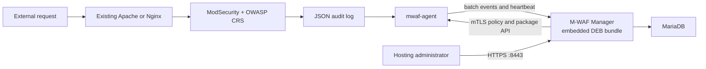

# M-WAF MVP

M-WAF is a lightweight hosting-provider WAF control plane. Customer web servers keep their existing Apache or Nginx process and install exactly two M-WAF packages:

1. `mwaf-agent`
2. the matching Apache/Nginx `distro` or `external` M-WAF integration package

The separate Manager server runs MariaDB and one Manager container. A tagged release image embeds the exact Agent package plus distro and pre-installed-connector integration packages for both web servers from the same release commit.

## Project introduction page

The no-build static introduction page is published with GitHub Pages:

- Public URL: <https://fhwang0926.github.io/m-waf/>
- Page source: `site/`
- Deployment workflow: `.github/workflows/pages.yml`
- Trigger: a `dev` push that changes `site/**` or the Pages workflow, and manual workflow dispatch
- Product positioning: enterprise-oriented architecture, support scope, and a source-attributed comparison with the DeepFinder software WAF

Before the first publication, set **Repository Settings → Pages → Build and deployment → Source** to **GitHub Actions**. The workflow uploads only the `site/` directory and uses the minimum Pages deployment permissions. Until the workflow has been pushed and completed successfully, the public URL may return 404.

## MVP support scope

| Item | Supported now |
|---|---|
| Manager | Linux amd64 host with Docker Engine and Docker Compose |
| Database | MariaDB 11.8.6 container |
| Customer OS | Ubuntu Server 24.04 LTS, amd64 |
| Web server | Ubuntu 24.04 distribution packages, or an operator-managed Apache/Nginx custom build using `external` integration |
| WAF | Distro connector package, or a compatible ModSecurity connector already built and loaded by the hosting operator |
| Rules | OWASP CRS v4.28.0 from the repository source lock, with managed sensitivity, threshold, URL/IP exclusions, and restricted custom `SecRule` additions |
| Policy | Versioned templates, an enterprise DetectionOnly seed, per-server/group overrides, signed revisions, migration metadata, and deployment status |
| Events | ModSecurity JSON audit log batch forwarding and Manager event list |
| Access | Enterprise-isolated users, enterprise administrators, and one first-setup system administrator |

Rocky Linux/RPM, ARM64, OpenResty, automatic connector compilation, HA, and unreviewed direct-to-production upstream releases are outside this executable MVP. CRS discovery is automated, but a changed source lock still goes through a pull request and the normal signed-bundle verification and approval flow. A manager can force a compatible signed-bundle Agent/integration update or manifest-declared rollback. Unsupported inventory is rejected before the installer changes the web-server configuration.

## Supported customer web servers and versions

The MVP supports two explicit modes on Ubuntu 24.04 LTS amd64. `distro` uses Ubuntu packages. `external` keeps an operator-managed web-server binary and pre-installed ModSecurity connector, then installs only M-WAF CRS/configuration integration and the Agent. The following distro versions are the release baseline confirmed from the Ubuntu repository on 2026-08-06.

| Web server | Supported server version | Confirmed Ubuntu package revision | M-WAF package | Open-source WAF components |
|---|---:|---:|---|---|
| Apache HTTP Server | `2.4.58` | `apache2 2.4.58-1ubuntu8.15` | `mwaf-modsecurity-apache` | `libapache2-mod-security2 2.9.7-1build3` + OWASP CRS `4.28.0` |
| Nginx | `1.24.0` | `nginx 1.24.0-2ubuntu7.15` | `mwaf-modsecurity-nginx` | `libnginx-mod-http-modsecurity 1.0.3-1build3` + libmodsecurity `3.0.12` + OWASP CRS `4.28.0` |

| External mode | Required customer-side condition | M-WAF package |
|---|---|---|
| Apache 2.4 custom build | Absolute `apachectl` path, loaded `security2_module`, and a dedicated config path already covered by an Apache `Include`/`IncludeOptional` | `mwaf-modsecurity-apache-external` |
| Nginx custom build | Absolute Nginx path, ModSecurity-nginx Connector compiled for that build and loaded, and a dedicated config path under an existing `http` include | `mwaf-modsecurity-nginx-external` |

Before downloading a module, Manager requires these inventory fields to match an embedded catalog entry:

| Compatibility field | Required value |
|---|---|
| Operating system | `/etc/os-release`: `ID=ubuntu`, `VERSION_ID=24.04` |
| Architecture | `amd64` (`x86_64`) |
| Web-server type | Exactly `apache` or `nginx` |
| Integration mode | Exactly `distro` or `external`; an empty legacy value means `distro` |
| Server version and build | Collected for visibility; distribution package dependencies and CI configuration tests determine compatibility |

The distro DEBs depend on Ubuntu's ModSecurity packages. External DEBs depend only on `logrotate`; they do not install or replace Apache, Nginx, libmodsecurity, or a Connector. External compatibility is fail-closed through module/load inspection, dedicated-include verification, web-server configuration testing, and managed-file rollback. It cannot certify every possible compiler/ABI combination.

### Explicitly unsupported in this MVP

- Ubuntu 22.04, Ubuntu 26.04, Debian, Rocky Linux, AlmaLinux, RHEL, and CentOS
- ARM64 and other non-amd64 architectures
- Custom builds where the matching ModSecurity connector is not already compiled and loaded
- Custom layouts without an absolute control binary and a dedicated included M-WAF configuration file
- OpenResty, LiteSpeed, Caddy, IIS, and other web servers
- Apache or Nginx packages whose dependencies cannot be satisfied from the configured Ubuntu repositories

If Apache and Nginx are both installed, the operator must explicitly select one with `--webserver apache` or `--webserver nginx`. One Agent manages one active web-server type in the MVP.

## Architecture



The Compose stack intentionally has only two runtime services: `mariadb` and `manager`. Agent and module are not containers; their signed DEB files live under `/opt/mwaf/bundles/current` inside the Manager image and are installed on real customer web servers.

## Local source development

Prerequisites are Docker Engine with the Compose plugin, OpenSSL, and Go 1.26 or newer. Start the complete local development path with one command:

```sh
make dev
```

The command creates missing local secrets and certificates, starts an isolated `mwaf-local` MariaDB project on `127.0.0.1:3306`, applies forward-only migrations to that local database, and runs the Manager directly from the current source with `go run`. It does not build a Manager Docker image. It uses `dist/bundle` when present and otherwise extracts the signed package bundle from `MWAF_BUNDLE_IMAGE`. Before the first tagged release exists, Manager still starts for UI/API development with package installation endpoints marked unavailable.

- Admin UI: `https://localhost:8443/setup`
- Agent API: `https://localhost:10443`
- Stop the foreground Manager: `Ctrl-C`
- Stop local MariaDB without deleting its volume: `make dev-down`
- Follow local MariaDB output: `make dev-db-logs`

Admin UI and Agent API ports are independent. Override either one before `make dev` or in `deploy/compose/.env`:

```dotenv
MWAF_ADMIN_PORT=8443
MWAF_AGENT_PORT=10443
```

For a one-off local run, the same values can be supplied in one command:

```sh
MWAF_ADMIN_PORT=18443 MWAF_AGENT_PORT=20443 make dev
```

Local source development binds both endpoints to loopback by default. `MWAF_DEV_ADMIN_BIND` and `MWAF_DEV_AGENT_BIND` can change those local bind addresses. Container deployment uses `MWAF_ADMIN_BIND` and `MWAF_AGENT_BIND`; keep the Admin UI on a management network, while protected servers must be able to reach the Agent API.

Port `10443` is opened by Manager, not by the Agent. The Agent has no inbound management listener; it initiates authenticated HTTPS requests to this Manager endpoint for heartbeat, desired policy, package deployment, status reporting, and fixed control-command polling.

HTML templates and CSS are embedded in the Go binary. After changing Go, HTML, or CSS, stop the foreground process and run `make dev` again. Never add `-v` to the local Compose shutdown command unless the isolated development data is intentionally disposable.

## Deploy a tagged Manager release from a clone

Prerequisites: Docker Engine, the Docker Compose plugin, OpenSSL, and access to the public GHCR image.

After the first tagged release is published, the repository owner must perform GitHub's one-time visibility setting: **Profile → Packages → m-waf-manager → Package settings → Change visibility → Public**. GitHub creates a personal-account package as private by default even when it is linked to a public source repository. Public container visibility is required for anonymous clone-to-deploy pulls and cannot later be changed back to private.

```sh
git clone https://github.com/Fhwang0926/m-waf.git
cd m-waf
cp deploy/compose/.env.example deploy/compose/.env
```

Before the first start, set the final DNS name or IP address in `deploy/compose/.env`. The generated certificate is preserved on later runs, so do not deploy once with `localhost` and change the address afterward without a reviewed certificate rotation:

```dotenv
MWAF_MANAGER_HOST=manager.example.com
MWAF_ADMIN_PORT=8443
MWAF_AGENT_PORT=10443
MWAF_AGENT_PUBLIC_URL=https://manager.example.com:10443
MWAF_MANAGER_IMAGE=ghcr.io/fhwang0926/m-waf-manager:0.1.0
```

Then deploy:

```sh
make deploy
```

`prepare.sh` only creates missing secret files and certificates. It never overwrites existing secrets or volumes. The database port is internal to Compose and is not published on the host.

New installations use an ECDSA P-256 CA and server certificate. A DNS `MWAF_MANAGER_HOST` is written as a DNS SAN and an IPv4/IPv6 address is written as an IP SAN, while `localhost` and `127.0.0.1` remain available for host-local diagnosis. Existing certificates are validated but never replaced automatically; a host mismatch or legacy certificate algorithm is reported as a warning so an enrolled Agent trust chain cannot be silently broken.

For local Docker Compose, file-backed secrets are bind-mounted with their host ownership. `prepare.sh` therefore keeps `deploy/compose/secrets` at mode `0700` and only the files explicitly mounted into containers at `0644`. The directory prevents other host users from traversing or reading those files, while the file mode allows the distroless Manager running as UID/GID `65532` to read its read-only mounts. Do not change the mounted files to `0600`; that prevents the non-root Manager from starting.

Manager and MariaDB container output uses Docker's size-bounded `local` logging driver (`10 MB` per file, up to `5` compressed files per container). MariaDB's file-based slow-query log is disabled in the minimal stack because it requires a separate host log-rotation policy.

Check that the services are running and open the administrator UI:

```sh
docker compose --env-file deploy/compose/.env -f deploy/compose/compose.yaml ps
```

- Admin UI: `https://manager.example.com:8443`
- Agent/package API: `https://manager.example.com:10443`
- Local CA certificate to import or securely copy: `deploy/compose/secrets/mwaf_ca_cert.pem`

On the first visit, `/setup` asks for the system administrator username, display name, and password. The setup route closes after the first account is created. The system administrator then creates each enterprise and its first enterprise administrator from **기업 관리** and **사용자 관리**.

The generated TLS certificate is signed by the local M-WAF CA. Its DNS/IP identity is valid for the configured Manager host, but browsers still require that CA to be explicitly trusted. For public browser trust, terminate Admin HTTPS at an existing reverse proxy with an approved certificate while leaving the Agent API mTLS path intact.

## Install a customer web server

1. Sign in to Manager.
2. Choose **서버 등록** and create a one-use enrollment token.
3. Securely copy `mwaf_ca_cert.pem` to the customer server.
4. Run the command shown by Manager after reviewing the downloaded script.

Example:

```sh
curl --fail --cacert ./mwaf_ca_cert.pem https://manager.example.com:10443/bootstrap/v1/install.sh -o /tmp/mwaf-install.sh
sudo sh /tmp/mwaf-install.sh \
  --manager https://manager.example.com:10443 \
  --token 'ONE_USE_TOKEN' \
  --ca ./mwaf_ca_cert.pem
```

If both Apache and Nginx are installed, add `--webserver apache` or `--webserver nginx`. The installer:

- reads OS, architecture, web-server version, and build hash;
- asks Manager for the compatible Agent package and selected web-server integration package;
- downloads only those two embedded files;
- verifies both SHA-256 values;
- installs dependencies through Ubuntu APT without installing the distro CRS recommendation;
- enables the Agent, which completes certificate enrollment over TLS.

For a hosting-provider custom build, use `--integration external`, `--webserver-bin`, and `--integration-config`. The connector must already be built and loaded by the operator; M-WAF does not compile it on the customer server. Apache/Nginx, the Connector, and their existing main configuration are not replaced. See [Custom Apache/Nginx installation](docs/custom-webserver-installation.md) for prerequisites, examples, verification, and rollback behavior.

No compiler, Go toolchain, Docker runtime, or source checkout is required by M-WAF on the customer server.

### If DEB installation fails

The installer stops on the first package download, checksum, APT/DPKG, Connector, include, configuration-test, or service-start error. It does not silently copy binaries or switch to an unsigned archive. A failed APT transaction can leave one M-WAF package unpacked or installed, so inspect the package state before retrying:

```sh
sudo dpkg --audit
dpkg-query -W -f='${binary:Package}\t${db:Status-Abbrev}\t${Version}\n' \
  mwaf-agent mwaf-modsecurity-apache mwaf-modsecurity-apache-external \
  mwaf-modsecurity-nginx mwaf-modsecurity-nginx-external 2>/dev/null || true
```

Resolve the reported lock, disk-space, repository, dependency, or interrupted-DPKG problem first, then rerun the same reviewed installer command. An enrollment token is consumed only when Agent enrollment succeeds; if it has expired or was already consumed, create a new one in Manager. Do not purge Apache/Nginx, delete `/etc/mwaf`, or force-install an incompatible package as a recovery shortcut.

The current MVP has no supported `tar.gz`, manual-copy, or RPM installation path, and a failed bootstrap/APT transaction is not rolled back automatically. Systems that cannot use Ubuntu 24.04 amd64 DEBs remain unsupported. Detailed diagnosis and recovery steps are in [Custom Apache/Nginx installation — DEB installation failure](docs/custom-webserver-installation.md#deb-설치가-실패한-경우).

## Operate the MVP

- **시스템 관리자** can view all enterprises, create enterprises, create enterprise administrators/users, and operate every server.
- **기업 사용자** can monitor and operate only its enterprise, including server enrollment/control, groups, enterprise policies, staged rollout approval/retry, and rollback.
- **기업 관리자** has the same enterprise-scoped operating permissions and additionally manages enterprise users and administrator roles. Self-demotion/deactivation/deletion and removal of the last active enterprise administrator are blocked.
- **시스템 설정** controls WAF event retention (default 30 days) and administrator audit retention (default 365 days). Cleanup runs at startup and then on the configured cleanup interval in bounded batches.
- **서버** shows inventory, Agent/module versions, heartbeat, policy/package deployment results, and the latest fixed control command.
- A server is displayed as `OFFLINE` when no heartbeat has arrived for two minutes.
- **이벤트** filters by server, block/detect result, severity, URL, Rule ID, or message and pages through 100 records at a time.
- Agent control uses authenticated HTTPS polling during the normal heartbeat loop. It does not open a WebSocket or arbitrary command port, and arbitrary shell execution is not provided.
- `Agent 중지` and `서버 종료` cannot be reversed through Manager after connectivity is lost; use the host console, service manager, hypervisor, or power controller to recover them.
- Starting with the second tagged release, the release workflow resolves the highest earlier semantic GHCR tag, verifies that signed image, and embeds its Agent and module packages as explicit rollback targets.
- **서버 그룹** manages enterprise-scoped groups used by enterprise-policy targets.
- **시스템 정책** is a system-administrator read-only catalog of immutable GitHub-managed versions, CRS compatibility, lifecycle status, source commit, migration notes, and adoption counts. Manager does not provide create, edit, or publish controls for this catalog.
- **기업 정책** adopts one published system-policy version and owns the enterprise target, detection/blocking mode, CRS sensitivity, anomaly threshold, request-body inspection, URL/IP exclusions, restricted custom `SecRule` lines, and update strategy. New standalone policies are blocked; untraceable existing revisions remain `LEGACY_LOCKED` until an administrator explicitly converts them.
- Manager creates one enterprise-wide `DetectionOnly` baseline when an enterprise first enrolls an unprotected server. The signed seed is attributed to the M-WAF system and starts with the `MANUAL` update strategy.
- Enterprise users choose `MANUAL` (approve each update), `AUTOMATIC` (start a staged rollout), or `PINNED` (show updates without applying them).
- The policy controller runs at startup, after enrollment and Agent state changes, and every `MWAF_POLICY_SYNC_INTERVAL` (default `15m`). Target resolution keeps `server > group > enterprise` precedence.
- Every update uses one online canary and then batches of at most 25. Offline servers remain deferred without blocking online servers; the first failure pauses the remaining rollout.
- When CRS changes, Manager first applies a minimum signed `DetectionOnly` transition, deploys the compatible signed Agent/module pair, waits for heartbeat to confirm the target CRS, and then applies the migrated immutable enterprise revision. The migration preserves enterprise settings and validated custom rules.
- Enterprise users can retry a failed rollout or roll back only to the immediately previous successful revision. Rollback restores the compatible Agent/CRS package pair as well as the policy and is blocked when the signed bundle is missing or the target system-policy version is withdrawn.
- **서버 제어** queues only four fixed polling commands: Agent restart/stop and server restart/poweroff. Arbitrary shell input is not accepted.
- **패키지 제어** force-installs the current compatible signed bundle or its explicit rollback pair; success is recorded only after the restarted Agent reports matching installed versions.
- **등록 해제** preserves server/event history but blocks the enrolled Agent certificate immediately.
- **사용자 관리** is limited to enterprise/system administrators and supports administrator creation, display-name/role/password updates, activation changes, and audit-preserving soft deletion within scope. **내 계정** lets every signed-in user rotate their own password and invalidates existing sessions.
- Agent verifies the Ed25519 signature and SHA-256, writes `/etc/mwaf/active/main.conf`, runs `apachectl configtest` or `nginx -t`, and reloads only on a change.
- If validation or reload fails, Agent restores the prior policy and reloads it.
- Each Agent uses a Manager-issued client certificate so the mTLS API can bind heartbeat, policy, package, command, and event traffic to one enrolled server without storing a reusable API password.
- Agent renews its 90-day mTLS certificate with the existing private key beginning 30 days before expiration. A renewed certificate replaces the stored serial on its first authenticated request; the prior serial is then rejected.
- ModSecurity writes JSON lines to `/var/log/modsecurity/audit.jsonl`; distro `logrotate` bounds the file and Agent tracks device, inode, and offset across truncation or replacement.
- Agent drains up to 20 idempotent batches of 500 events every 2 seconds, applies exponential retry backoff up to one minute, and limits its on-disk event spool to 512 MiB by default.

Useful Manager commands:

```sh
make logs
make pull
make down
```

Do not use `docker compose down -v` on an environment whose MariaDB data must be retained.

## Container deployment E2E

The repository includes a Linux-only deployment test that starts an isolated Manager/MariaDB stack plus Ubuntu 24.04 Apache and Nginx customer containers. It uses the real HTTPS setup, enrollment, mTLS heartbeat, signed policy, ModSecurity audit, and event APIs. It never seeds or resets MariaDB directly.

Run it on a dedicated Linux amd64 test host with Docker Engine, the Compose plugin, OpenSSL, curl, and jq:

```sh
git clone --branch dev https://github.com/Fhwang0926/m-waf.git
cd m-waf
./deploy/e2e/run.sh all \
  --manager-image ghcr.io/fhwang0926/m-waf-manager:0.1.0
```

Use an immutable release tag or digest when the result must be reproducible. `latest` is accepted for convenience but produces a warning. The host ports can be changed independently:

```sh
./deploy/e2e/run.sh all \
  --manager-image ghcr.io/fhwang0926/m-waf-manager:0.1.0 \
  --admin-port 18443 \
  --agent-port 20443 \
  --apache-port 18080 \
  --nginx-port 18081
```

The default host endpoints are:

- Admin UI: `https://localhost:8443`
- Agent API: `https://localhost:10443` (loopback only; customer containers use the internal `manager` DNS name)
- Apache customer: `http://localhost:18080`
- Nginx customer: `http://localhost:18081`

The first run creates a random system-administrator password under `.local/mwaf-e2e/admin.password` with mode `0600`; it is not printed or copied into Compose. Set `MWAF_E2E_ADMIN_PASSWORD` before the first run if a chosen password is required. Runtime certificates, cookies, and evidence are also kept under the ignored `.local/mwaf-e2e` directory and are separate from `deploy/compose` production material.

The `all` command verifies that both Agents become online, one enterprise-scoped group policy reaches `APPLIED` on both servers, normal and excluded requests return 200, a restricted custom test rule returns 403, and both blocked events arrive at Manager. Evidence and size-bounded diagnostic logs are written under `.local/mwaf-e2e/results/<run-id>` without enrollment tokens or passwords.

Operational commands are also exposed through Make:

```sh
make e2e-status
make e2e-verify
make e2e-logs
make e2e-down
```

`make e2e-down` removes the E2E containers and networks but deliberately keeps named volumes, generated credentials, certificates, and evidence. It never passes `-v`. Restore the same `.local/mwaf-e2e` directory when reusing those database volumes; otherwise the stored system-administrator password cannot be recovered.

The two customer fixtures run systemd because the production installer and Agent restart behavior use `systemctl`. Docker therefore runs only those two test containers with `privileged: true` and a cgroup mount. Manager and MariaDB are not privileged, and no container receives the Docker socket or the Manager CA private key. Run this on an isolated test host; server reboot, poweroff, Agent stop, package rollback, and other intentionally disruptive controls are not part of the automatic test.

## System policy and CRS lifecycle

`packaging/sources.lock.yaml` is the repository source of truth for the approved CRS tag, commit, archive, and SHA-256. `internal/systempolicy/catalog.json` records the current immutable policy version and each version's `PUBLISHED`, `DEPRECATED`, or `WITHDRAWN` lifecycle status. Matching JSON files under `internal/systempolicy/templates/` define the immutable version contents. Enterprise-policy revisions copy both the system-policy and CRS versions, so a deployed revision remains auditable after the repository moves forward.

`.github/workflows/crs-updates.yml` checks the official `coreruleset/coreruleset` GitHub releases each day. It accepts only non-draft stable CRS v4 releases, requires GitHub to report the annotated tag signature as verified, calculates the archive digest, adds a new immutable template version, advances the lifecycle catalog, updates the source lock, and opens or refreshes a review pull request. It does not merge, publish a bundle, or update customer servers directly.

After that pull request passes the standard package and installation checks and an approved Manager bundle is deployed, the runtime controller records the new system-policy version. It waits for enterprise approval under `MANUAL`, starts the staged rollout under `AUTOMATIC`, and only reports availability under `PINNED`. No GitHub synchronization path directly replaces an enterprise policy.

## Verification and tag-only image publication

Relevant pull requests, every push to `dev`, and `vMAJOR.MINOR.PATCH` tags run `.github/workflows/dev-manager-image.yml`. The read-only verification job:

1. tests the Go code;
2. builds the Linux amd64 Agent;
3. builds `mwaf-agent` and four Apache/Nginx distro/external integration DEB packages;
4. reads the CRS version/archive/hash from `packaging/sources.lock.yaml`, restores the exact archive from cache or downloads it, and always verifies its locked SHA-256;
5. records the supported Ubuntu, architecture, and web-server type in the bundle catalog;
6. installs the Agent and Apache module on a clean pinned Ubuntu 24.04 amd64 container and runs `apachectl configtest`;
7. installs the Agent and Nginx module on a separate clean container and runs `nginx -t`;
8. verifies both clean environments load ModSecurity and CRS and create the protected audit log;
9. installs the external packages against pre-installed Apache/Nginx connectors through non-default absolute binary paths and verifies they do not depend on distro web-server packages;
10. starts both web servers with a deterministic test rule, verifies an HTTP `403` response and a non-empty JSON audit log, and checks the dedicated include, configuration test, CRS, log path, and managed-file guard;
11. signs a temporary five-package verification bundle without creating a Manager Docker image.

The workflow reuses four bounded caches: Go modules/build outputs keyed by `go.sum`, the CRS archive keyed by its locked SHA-256, a pinned Ubuntu 24.04 Apache/Nginx install-test fixture, and Manager BuildKit layers in a separate image scope. The fixture is refreshed at least once per UTC week so Ubuntu dependency drift is still detected; within that period it only avoids repeating package downloads. Every verification run still installs the newly built local DEBs and performs the same configuration, module-load, HTTP block, and audit-log checks. Cache misses fall back to normal downloads and builds. Release signing keys, signed bundles, DEBs, workflow artifacts, and GHCR rollback inputs are never restored from these cross-run caches.

Pull requests, `dev` pushes, and manual workflow runs stop after verification. They do not build or publish the project Docker image. Only a validated semantic release tag push such as `v0.1.0` starts the publish job. The job downloads the exact tested DEBs through a workflow artifact, requires `RELEASE_BUNDLE_SIGNING_KEY_B64`, signs the release bundle, embeds it in the Manager image, and then publishes:

1. `ghcr.io/fhwang0926/m-waf-manager:<major.minor.patch>`;
2. moving convenience tags `<major.minor>`, `<major>`, and `latest` (`latest` is updated only by a validated `vMAJOR.MINOR.PATCH` tag release);
3. immutable `sha-<full-commit-sha>`;
4. build provenance using GitHub OIDC.

For the first successful tagged publication, the workflow lists GHCR package versions through the GitHub Packages API. A package shell, an untagged version, or a version tagged only with the current release does not count as a previous approved release, so failed pre-publication attempts do not permanently block the first successful image. From the second successful release onward, the workflow selects the highest semantic `x.y.z` tag lower than the current release and verifies that exact signed image before embedding N-1 rollback packages. A missing or invalid previous semantic image, an API error, or an out-of-order release still fails closed. Rollback assembly no longer depends on the moving `latest` tag.

The workflow does not initialize MariaDB or run browser/frontend tests. External-mode CI validates the M-WAF integration contract against pre-installed connectors, not every possible customer compiler/ABI combination. Full Manager-to-Agent enrollment, mTLS, policy, event-ingest, and database integration stays outside CI and is available through `deploy/e2e/run.sh` on a dedicated disposable Linux host.

The workflow publishes the package but cannot perform GitHub's irreversible first-time visibility choice. After making the package public once, confirm anonymous access before distributing the Compose stack:

```sh
docker pull ghcr.io/fhwang0926/m-waf-manager:latest
```

Set repository secret `RELEASE_BUNDLE_SIGNING_KEY_B64` to a base64-encoded Ed25519 PKCS#8 private-key PEM before pushing the first release tag. Tagged publication fails closed when the key is absent; release images never use an ephemeral signing identity. Production deployments should pin the full version tag or image digest rather than `latest`.

## Local backend verification

```sh
make fmt
go test ./...
docker compose --env-file deploy/compose/.env.example -f deploy/compose/compose.yaml config --quiet
```

These checks do not start MariaDB or modify a database. A full integration test additionally needs a representative hosting-provider custom build, an Ubuntu 24.04 amd64 VM, and a published Manager image.

## Repository layout

```text
cmd/                         Manager, Agent, and bundle assembler entrypoints
internal/agent/              Inventory, policy apply/rollback, audit forwarding
internal/manager/            Admin UI, enrollment, mTLS Agent/package APIs
internal/packages/           Signed embedded package catalog
migrations/                  Forward-only MariaDB schema
packaging/                   Agent/module DEB builders and source locks
build/containers/manager/    Manager multi-stage Dockerfile
build/containers/ci-webservers/ Cached Ubuntu install-test fixture
deploy/compose/              Clone-to-deploy Manager stack
.github/workflows/           PR/dev verification and tag-only GHCR publication
site/                        No-build GitHub Pages introduction site
docs/                        Detailed design and completion records
```

The detailed engineering plan is in `docs/todo/2026-08-06-m-waf-development-plan.md`. Third-party source and license notes are in `THIRD_PARTY_NOTICES.md`.
