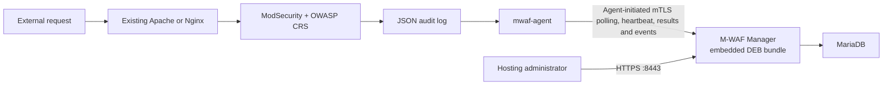

# M-WAF MVP

[](https://github.com/Fhwang0926/m-waf/actions/workflows/dev-manager-image.yml)

M-WAF is a lightweight hosting-provider WAF control plane. Customer web servers keep their existing Apache or Nginx process and use exactly two M-WAF components:

1. the signed `mwaf-agent` DEB installed first;
2. a Manager-approved Apache/Nginx module, either a distribution DEB or an exact-build custom ZIP.

The separate Manager server runs MariaDB and one Manager container. Every published Manager image embeds the verified Agent and distribution module packages from the same commit. A hosting provider can add its exact-build custom ZIP artifacts to its signed Manager bundle.

## Project introduction page

The no-build static introduction page is published with GitHub Pages:

- Public URL: <https://fhwang0926.github.io/m-waf/>
- Page source: `site/`
- Deployment workflow: `.github/workflows/pages.yml`
- Trigger: a `dev` push that changes `site/**` or the Pages workflow, and manual workflow dispatch
- Product positioning: enterprise-oriented architecture, support scope, and a source-attributed comparison with publicly documented open-source WAF projects

Before the first publication, set **Repository Settings → Pages → Build and deployment → Source** to **GitHub Actions**. The workflow uploads only the `site/` directory and uses the minimum Pages deployment permissions. Until the workflow has been pushed and completed successfully, the public URL may return 404.

## MVP support scope

| Item | Supported now |
|---|---|
| Manager | Linux amd64 host with Docker Engine and Docker Compose |
| Database | MariaDB 11.8.6 container |
| Customer OS | Ubuntu Server 24.04 LTS or Debian 12 Bookworm, amd64; Ubuntu 18.04 amd64 is Agent discovery only |
| Web server | Supported Ubuntu/Debian distribution packages, or an operator-managed Apache/Nginx custom build using `external` integration |
| WAF | Distro connector package, or a compatible ModSecurity connector already built and loaded by the hosting operator |
| Rules | OWASP CRS v4.28.0 from the repository source lock, with managed sensitivity, threshold, URL/IP exclusions, and restricted custom `SecRule` additions |
| Policy | No implicit first-install policy; a verified CRS source is reviewed into an immutable system policy, then enterprise URL/IP detect/block overrides are deployed as signed revisions |
| Events | ModSecurity JSON audit log batch forwarding and Manager event list |
| Access | Enterprise-isolated users, enterprise administrators, and one first-setup system administrator |

Rocky Linux/RPM, ARM64, OpenResty, automatic connector compilation, HA, and unreviewed direct-to-production upstream releases are outside this executable MVP. CRS discovery is automated, but a changed source lock still goes through a pull request and the normal signed-bundle verification and approval flow. A manager can force a compatible signed-bundle Agent/integration update or manifest-declared rollback. Unsupported inventory is rejected before the installer changes the web-server configuration.

## Supported customer web servers and versions

The full package-based MVP supports Ubuntu 24.04 LTS and Debian 12 Bookworm, both amd64. Ubuntu 18.04 amd64 can install the dependency-free Agent for registration and inventory, but it has no distro module artifact. `distro` uses the selected supported distribution's packages. `external` keeps an operator-managed web-server binary and pre-installed ModSecurity connector, then installs only M-WAF CRS/configuration integration and the Agent.

| Web server | Supported server version | Confirmed Ubuntu package revision | M-WAF package | Open-source WAF components |
|---|---:|---:|---|---|
| Apache HTTP Server | `2.4.58` | `apache2 2.4.58-1ubuntu8.15` | `mwaf-modsecurity-apache` | `libapache2-mod-security2 2.9.7-1build3` + OWASP CRS `4.28.0` |
| Nginx | `1.24.0` | `nginx 1.24.0-2ubuntu7.15` | `mwaf-modsecurity-nginx` | `libnginx-mod-http-modsecurity 1.0.3-1build3` + libmodsecurity `3.0.12` + OWASP CRS `4.28.0` |

Debian 12 uses the same signed M-WAF DEBs with separate compatibility metadata. Its baseline is Apache 2.4 with `libapache2-mod-security2 >= 2.9.7-1`, or Nginx `>= 1.22.0` with `libnginx-mod-http-modsecurity >= 1.0.3-1`, from the configured Bookworm repositories.

| Custom ZIP mode | Required customer-side condition | M-WAF artifact |
|---|---|---|
| Apache 2.4 custom build | Running binary discoverable by Agent and Connector compiled for the exact Apache build/ABI | Signed Apache build-specific ZIP |
| Nginx custom build | Running binary discoverable by Agent and ModSecurity-nginx Connector compiled for the exact Nginx build/ABI | Signed Nginx build-specific ZIP |

Before downloading a module, Manager requires these inventory fields to match an embedded catalog entry:

| Compatibility field | Required value |
|---|---|
| Operating system | Agent: Ubuntu `18.04`/`24.04` or Debian `12`; module DEB: Ubuntu `24.04` or Debian `12` |
| Architecture | `amd64` (`x86_64`) |
| Web-server type | Exactly `apache` or `nginx` |
| Integration mode | Exactly `distro` or `external`; an empty legacy value means `distro` |
| Server version and build | Distribution packages use package compatibility; custom ZIP requires an exact normalized build-hash match |

The distro DEBs depend on the supported distribution's ModSecurity packages. Custom ZIP installation never invokes APT/RPM for the module and only writes its payload below `/opt/m-waf/modules`; the hosting provider remains responsible for building the Connector. Compatibility is fail-closed through signed metadata, exact build hash/ABI, safe extraction, include verification, and web-server configuration testing.

### Explicitly unsupported in this MVP

- Ubuntu 18.04 distro module packages, Ubuntu 22.04, Ubuntu 26.04, Debian releases other than 12, Rocky Linux, AlmaLinux, RHEL, and CentOS
- ARM64 and other non-amd64 architectures
- Custom builds where the matching ModSecurity connector is not already compiled and loaded
- Custom layouts without an absolute control binary and a dedicated included M-WAF configuration file
- OpenResty, LiteSpeed, Caddy, IIS, and other web servers
- Apache or Nginx packages whose dependencies cannot be satisfied from the configured Ubuntu/Debian repositories

If Apache and Nginx are both present, Agent reports both candidates and the operator chooses the protected server in Manager. One Agent manages one active web-server type in the MVP.

## Architecture



The Manager Compose stack intentionally has only two runtime services: `mariadb` and `manager`. The signed Agent and module DEBs live under `/opt/mwaf/bundles/current` inside the Manager image and are installed into the customer web-server host or the same Ubuntu/Debian container that runs that web server. M-WAF does not add a separate Agent sidecar that cannot inspect the protected process and files.

## Local source development

Prerequisites are Docker Engine with the Compose plugin, OpenSSL, and Go 1.26 or newer. Start the complete local development path with one command:

```sh
make dev
```

The command creates missing local secrets and certificates, starts an isolated `mwaf-local` MariaDB project on `127.0.0.1:3306`, applies forward-only migrations to that local database, and runs the Manager directly from the current source. It does not build a Manager Docker image. Go, template, CSS, and JavaScript changes are rebuilt and restarted locally by the source watcher. `make dev` uses the latest published signed bundle, so it is the fast path for Manager and UI work.

When Agent or package behavior also changed, build and use a local signed development bundle without GitHub Actions:

```sh
make dev-full
```

`make dev-full` performs these local-only steps:

1. verifies a cached schema-v2 release bundle and reuses its immutable CRS source files;
2. builds the current Linux amd64 Agent;
3. builds Ubuntu 24.04 and Debian 12 Agent/Apache/Nginx package metadata in a cached Docker builder;
4. signs a development bundle with a local key under the ignored `deploy/compose/secrets` directory;
5. starts the source Manager with that local bundle.

Because `make dev-full` requires the initial `make dev` setup, it starts the replacement Manager with schema migration disabled and keeps the existing local MariaDB volume. It does not reset or recreate the database.

Use `make dev-bundle` when only the local Agent/package bundle should be rebuilt. The current local bundle path is recorded under `.local/mwaf-manager`; neither the bundle nor its development signing key is committed or uploaded. A verified schema-v2 published bundle must have been cached by one successful `make dev` before the first offline `make dev-full` run.

For an Agent-only change, increase `packaging/agent/VERSION`, add the matching `docs/agent-releases/<version>.md`, and use `make agent-check` followed by `make dev-agent-bundle`. The Agent-only bundle preserves the current module and CRS artifacts byte-for-byte. The running local Manager detects the active manifest change and restarts without a database migration. See [Agent continuous connection and update](docs/agent-continuous-update.md).

To reproduce a specific signed release bundle once without editing `.env`, pass its immutable tag through the development-only override:

```sh
MWAF_DEV_BUNDLE_IMAGE=ghcr.io/fhwang0926/m-waf-manager:VERSION make dev
```

- Admin UI: `https://localhost:8443/setup`
- Agent/API endpoint: the same `https://localhost:8443`
- Stop the foreground Manager: `Ctrl-C`
- Stop local MariaDB without deleting its volume: `make dev-down`
- Follow local MariaDB output: `make dev-db-logs`

The administrator UI and Agent API share one HTTPS listener. Override it before `make dev` or in `deploy/compose/.env`:

```dotenv
MWAF_ADMIN_PORT=8443
```

For a one-off local run, the same values can be supplied in one command:

```sh
MWAF_ADMIN_PORT=18443 make dev
```

Local source development binds the endpoint to loopback by default. `MWAF_DEV_ADMIN_BIND` changes the local bind address and container deployment uses `MWAF_ADMIN_BIND`. Protected servers must be able to reach this Manager endpoint. The Agent opens no inbound port: every heartbeat, desired-state fetch, command check, event upload, and result report is an Agent-initiated HTTPS request. See [Agent protocol v1](docs/agent-protocol-v1.md).

HTML templates, CSS, and JavaScript are embedded in the Go binary. While `make dev` is running, changes under the Manager source are rebuilt automatically, the Manager restarts without rerunning migrations, and open administrator pages reload after the new process is ready. Production and remote Docker deployments remain immutable and require a new image build and deployment. Never add `-v` to the local Compose shutdown command unless the isolated development data is intentionally disposable.

## Deploy a tagged Manager release from a clone

Prerequisites: Docker Engine, the Docker Compose plugin, OpenSSL, and access to the public GHCR image.

After the first image is published from `dev` or a version tag, the repository owner must perform GitHub's one-time visibility setting: **Profile → Packages → m-waf-manager → Package settings → Change visibility → Public**. GitHub creates a personal-account package as private by default even when it is linked to a public source repository. Public container visibility is required for anonymous clone-to-deploy pulls and cannot later be changed back to private.

```sh
git clone https://github.com/Fhwang0926/m-waf.git
cd m-waf
cp deploy/compose/.env.example deploy/compose/.env
```

Before the first start, set the final DNS name or IP address in `deploy/compose/.env`. The generated certificate is preserved on later runs, so do not deploy once with `localhost` and change the address afterward without a reviewed certificate rotation:

```dotenv
MWAF_MANAGER_HOST=manager.example.com
MWAF_ADMIN_PORT=8443
MWAF_PUBLIC_URL=https://manager.example.com:8443
MWAF_MANAGER_IMAGE=ghcr.io/fhwang0926/m-waf-manager:0.1.0
```

Then deploy:

```sh
make deploy
```

`prepare.sh` only creates missing secret files and certificates. It never overwrites existing secrets or volumes. The database port is internal to Compose and is not published on the host.

New installations use an ECDSA P-256 CA and server certificate. A DNS `MWAF_MANAGER_HOST` is written as a DNS SAN and an IPv4/IPv6 address is written as an IP SAN, while `localhost` and `127.0.0.1` remain available for host-local diagnosis. Existing certificates are validated but never replaced automatically; a host mismatch or legacy certificate algorithm is reported as a warning so an enrolled Agent trust chain cannot be silently broken.

For local Docker Compose, file-backed secrets are bind-mounted with their host ownership. `prepare.sh` therefore keeps `deploy/compose/secrets` at mode `0700` and only the files explicitly mounted into containers at `0644`. The directory prevents other host users from traversing or reading those files, while the file mode allows the distroless Manager running as UID/GID `65532` to read its read-only mounts. Do not change the mounted files to `0600`; that prevents the non-root Manager from starting.

Manager and MariaDB container output uses Docker's size-bounded `local` logging driver (`10 MB` per file, up to `5` compressed files per container). MariaDB's file-based slow-query log is disabled in the minimal stack because it requires a separate host log-rotation policy.

Check that the services are running and open the administrator UI:

```sh
docker compose --env-file deploy/compose/.env -f deploy/compose/compose.yaml ps
```

- Admin UI: `https://manager.example.com:8443`
- Agent/package API: the same `https://manager.example.com:8443`
- Local CA certificate to import or securely copy: `deploy/compose/secrets/mwaf_ca_cert.pem`

On the first visit, `/setup` asks for the system administrator username, display name, and password. The setup route closes after the first account is created. The system administrator then creates each enterprise and its first enterprise administrator from **기업 관리** and **사용자 관리**.

The generated TLS certificate is signed by the local M-WAF CA. Its DNS/IP identity is valid for the configured Manager host, but browsers still require that CA to be explicitly trusted. If a reverse proxy terminates public browser TLS, it must preserve the authenticated Agent mTLS path to the shared Manager listener or route Agent paths directly to Manager.

## Install a customer web server

1. Sign in to Manager.
2. Choose **서버 설치** and click **설치 명령 복사**.
3. Manager creates a 15-minute, one-use enrollment token and inserts it into the copied installation block automatically.
4. Run the block on the customer web server. No separate token prompt is shown.

The quick-copy command contains the one-use token, the installer SHA-256, and the Manager TLS public-key pin. `wget --no-check-certificate` is limited to the initial installer download, whose exact bytes are then checked against the SHA-256 copied from the authenticated Manager UI. The verified installer uses the public-key pin to download the public M-WAF CA and then uses that CA for normal enrollment and package TLS verification.

Example:

```sh
mkdir -p ./mwaf_install && wget --no-check-certificate https://manager.example.com:8443/bootstrap/v1/install.sh -O ./mwaf_install/installer.sh && printf '%s  %s\n' 'INSTALLER_SHA256_FROM_UI' './mwaf_install/installer.sh' | sha256sum -c - && printf '%s\n' 'ONE_USE_ENROLLMENT_TOKEN_FROM_UI' | sh ./mwaf_install/installer.sh -d https://manager.example.com:8443 --bootstrap-pin 'sha256//MANAGER_TLS_PUBLIC_KEY_PIN_FROM_UI' --token-stdin
```

The quick-install button uses the existing authenticated administrator API to create a short-lived, one-use enrollment token. The copied command sends it to the installer over standard input instead of an installer process argument; it becomes unusable after one successful enrollment or 15 minutes. Manager also maintains one reusable install token per enterprise for unattended deployment. Store that reusable token in a mode `0600` secret file and use `--install-token-file /secure/path/token`.

The first-stage installer downloads and installs only the signed Agent DEB. It does not install Apache, Nginx, ModSecurity, logrotate, or a WAF module, and it does not edit or reload a web-server configuration.

The same Agent command supports Ubuntu 18.04/24.04 and Debian 12 containers. Ubuntu 18.04 stops after registration and inventory until an exact compatible custom ZIP module is available. Hosts and containers use the same `/usr/sbin/mwaf-agent-service` command; it selects the existing systemd unit or the packaged lightweight supervisor automatically. A systemd-free Docker/OCI container does not install systemd or any additional runtime dependency. Check it with:

```sh
/usr/sbin/mwaf-agent-service status
```

An install performed inside a running container survives only that container's current writable filesystem. For a normal restart, add `/usr/sbin/mwaf-agent-service start` to the existing container startup command before starting Apache/Nginx. Persist `/etc/mwaf-agent`, `/var/lib/mwaf-agent`, `/etc/mwaf`, `/opt/m-waf`, and the ModSecurity audit-log path as volumes. Recreating the container from its original image removes `/usr/bin/mwaf-agent`; use a reviewed derived image containing the same verified Agent DEB and mount the identity/config volumes at runtime. Do not bake enrollment tokens, Agent private keys, or certificates into the image.

After registration, the Agent reports OS, architecture, running Apache/Nginx binaries, versions, normalized build hashes, and distribution-package ownership. In **보호 서버 → 서버 상세**, the operator selects one of two explicit plans:

- **Package-based** for a supported distribution Apache/Nginx. The Agent installs the signed module DEB; APT may install the module package's declared dependencies.
- **Custom ZIP** for a hosting-provider build. The Agent requires an exact signed build-hash/ABI match, extracts only below `/opt/m-waf/modules`, and never invokes APT for the module.

Both plans leave the customer's Apache/Nginx configuration and reload procedure to the hosting operator. Manager shows the exact M-WAF-owned include file, then Agent verifies configtest, the active include, and the signed policy before reporting `보호 중`. See [Custom Apache/Nginx installation](docs/custom-webserver-installation.md) for the ZIP contract and activation procedure.

No compiler, Go toolchain, Docker runtime, or source checkout is required by M-WAF inside the customer server or web-server container.

### If DEB installation fails

The Agent installer stops on the first download, checksum, APT/DPKG, or service-start error. A later module plan reports Connector, ZIP/ABI, package, include, and configuration-test failures separately; it never switches to an unsigned archive. A failed APT transaction can leave an M-WAF DEB unpacked or installed, so inspect the package state before retrying:

```sh
sudo dpkg --audit
dpkg-query -W -f='${binary:Package}\t${db:Status-Abbrev}\t${Version}\n' \
  mwaf-agent mwaf-modsecurity-apache mwaf-modsecurity-apache-external \
  mwaf-modsecurity-nginx mwaf-modsecurity-nginx-external 2>/dev/null || true
```

Resolve the reported lock, disk-space, repository, dependency, or interrupted-DPKG problem first, then rerun the same reviewed Agent installer command. After Agent registration, retry module installation from the server detail page. Do not purge Apache/Nginx, delete `/etc/mwaf`, or force-install an incompatible package as a recovery shortcut.

The current MVP has no supported Agent `tar.gz`, manual-copy, or RPM installation path. A Manager-triggered Agent-only update keeps a verified previous Agent DEB locally and automatically restores it when the new Agent does not confirm a heartbeat; initial installation and web-server module APT failures still require the documented package-state recovery procedure. Custom builds use a signed exact-match ZIP for the web-server module. The Agent requires a signed Ubuntu 18.04/24.04 or Debian 12 amd64 DEB; Ubuntu 18.04 has no distro module package. Detailed diagnosis and recovery steps are in [Custom Apache/Nginx installation](docs/custom-webserver-installation.md#실패-처리).

## Operate the MVP

사용자 역할, 기업 범위, 계정 수명주기와 보호 규칙의 상세 기준은 [사용자 및 접근 권한 관리](docs/user-access-management.md)를 참고하세요.

탐지 이벤트의 MariaDB 저장, 커서 페이지 처리, 대시보드 집계 보호와 외부 이벤트 저장소 분리 기준은 [탐지 이벤트 저장 및 조회 확장 기준](docs/security-event-storage-and-scaling.md)을 참고하세요.

- **시스템 관리자** can view all enterprises, create enterprises, create enterprise administrators/users, safely delete an unused enterprise, terminate an enterprise with retained history, and operate every server.
- **기업 사용자** can monitor and operate only its enterprise, including server enrollment/control, protection-policy membership, staged rollout approval/retry, and rollback.
- **기업 관리자** has the same enterprise-scoped operating permissions and additionally manages enterprise users and administrator roles. Self-demotion/deactivation/deletion and removal of the last active enterprise administrator are blocked.
- **시스템 설정** controls WAF event retention (default 30 days) and administrator audit retention (default 365 days). Cleanup runs at startup and then on the configured cleanup interval in bounded batches.
- **서버** shows inventory, Agent/module versions, heartbeat, policy/package deployment results, and the latest fixed control command.
- A server is displayed as `OFFLINE` when no heartbeat has arrived for two minutes.
- **이벤트** filters by server, block/detect result, severity, URL, Rule ID, or message and pages through 100 records at a time.
- **보고서** summarizes detections, blocks, source IPs, server availability, event trends, and top attack dimensions for the selected enterprise, protection policy, server, and time range. Report timestamps and print output use KST.
- Agent control uses authenticated HTTPS polling during the normal heartbeat loop. It does not open a WebSocket or arbitrary command port, and arbitrary shell execution is not provided.
- `Agent 중지` and `서버 종료` cannot be reversed through Manager after connectivity is lost; use the host console, service manager, hypervisor, or power controller to recover them.
- Starting with the second tagged release, the release workflow resolves the highest earlier semantic GHCR tag, verifies that signed image, and embeds its Agent and module packages as explicit rollback targets.
- **보호 정책**은 기업 범위의 서버 그룹 역할을 하며 한 정책에 여러 서버를 연결합니다.
- **오픈소스 CRS** lets a system administrator verify the pinned LTS line or newest official Stable v4 source from GitHub. Manager verifies the signed annotated tag, exact commit, archive digest, Rule index, and Setup schema before storing an immutable source; synchronization never publishes or deploys a system policy.
- **시스템 정책** is one immutable `crs-baseline` policy family managed by system administrators. CI supplies verified CRS and package artifacts but never publishes a policy. A clean Manager creates `crs-baseline@1.0.0` only after an administrator selects a verified LTS or Stable source and completes the five-step review; later publications create the next patch. CRS and policy versions cannot be typed manually. Self-contained v3 policies require a reporting Agent, a loaded Connector, a passing web-server configtest, and `policy-bundle-v3` capability. Legacy v2 policies keep package-coverage and rollback-package gates.
- **기업 정책** adopts one published system-policy version and owns one or more server memberships, an explicit choice to inherit system policy scalars or override them, Rule/Target/Tag exceptions, restricted custom `SecRule` lines, emergency bypasses, and update strategy. Manager validates the composed base plus enterprise override before signing a revision. Each server belongs to at most one active protection policy. New standalone policies are blocked; untraceable existing revisions remain `LEGACY_LOCKED` until an administrator explicitly converts them.
- On a clean installation, enterprise policy creation waits until a system administrator publishes the first canonical `crs-baseline`. A newly enrolled server remains unassigned with a `DetectionOnly` safe placeholder. An enterprise user creates a protection policy by selecting at least one server, and Manager automatically inherits the currently published system policy; it does not create an enterprise-wide default policy automatically.
- Enterprise users choose `MANUAL` (approve each update), `AUTOMATIC` (start a staged rollout), or `PINNED` (show updates without applying them).
- The policy controller runs at startup, after enrollment and Agent state changes, and every `MWAF_POLICY_SYNC_INTERVAL` (default `15m`). Updates, rollback, and synchronization target only the servers currently connected to each protection policy.
- Every update uses one online canary, observes the exact CRS/revision and recent heartbeat for 10 minutes, and then expands in batches of at most 25. Expansion stops when the new block rate exceeds the greater of 5 per minute or three times the previous 60-minute baseline. A failed canary is restored automatically; offline servers remain deferred and an offline pre-apply canary is replaced by another online target.
- When a self-contained CRS source changes, Manager signs the immutable base containing unchanged upstream CRS files separately from the enterprise override. Agent fetches both from Manager, verifies their pinned composition, and applies them atomically. Package-managed legacy v2 transitions continue to use the compatible signed Agent/module pair. The migration preserves enterprise settings and validated custom rules.
- Enterprise users can retry a failed rollout or roll back only to the immediately previous successful revision. Rollback restores the compatible Agent/CRS package pair as well as the policy and is blocked when the signed bundle is missing or the target system-policy version is withdrawn.
- **서버 제어** queues only four fixed polling commands: Agent restart/stop and server restart/poweroff. Arbitrary shell input is not accepted.
- **패키지 제어** force-installs the current compatible signed bundle or its explicit rollback pair; success is recorded only after the restarted Agent reports matching installed versions.
- **등록 해제** preserves server/event history but blocks the enrolled Agent certificate immediately.
- **사용자 관리** is limited to enterprise/system administrators and supports administrator creation, display-name/role/password updates, activation changes, and audit-preserving soft deletion within scope. **내 계정** lets every signed-in user rotate their own password and invalidates existing sessions.
- Existing `conf-v1`, `policy-bundle-v2`, and single-artifact `policy-bundle-v3` revisions remain supported. New structured enterprise revisions derived from a v3 system policy use a signed `policy-base-v1` artifact plus a signed `policy-override-v1` artifact. Manager validates the effective composition and records its digest before delivery.
- Agent verifies both Ed25519 signatures, whole-artifact SHA-256 values, the pinned base/override/effective hashes, tar entry allowlists, and every manifest file hash; stages the combined revision directory, atomically switches `/etc/mwaf/active`, runs `apachectl configtest` or `nginx -t`, and performs a graceful reload.
- If validation or reload fails, Agent atomically restores the previous revision and revalidates the web server.
- Each Agent uses a Manager-issued client certificate so the mTLS API can bind all Agent traffic to one enrolled server. Detection-event batches additionally include the enterprise installation verification token; that token is not sent to heartbeat, policy, package, command, or certificate APIs.
- Agent renews its 90-day mTLS certificate with the existing private key beginning 30 days before expiration. A renewed certificate replaces the stored serial on its first authenticated request; the prior serial is then rejected.
- ModSecurity writes JSON lines to `/var/log/modsecurity/audit.jsonl`; distro `logrotate` bounds the file and Agent tracks device, inode, and offset across truncation or replacement.
- Agent drains up to 20 idempotent batches of 500 events every 2 seconds, applies exponential retry backoff up to one minute, and limits its on-disk event spool to 512 MiB by default.

Useful Manager commands:

```sh
make logs
make pull
make down
```

If the initial system administrator cannot log in, reset only that account through the Manager recovery command. This does not recreate the setup state, initialize MariaDB, change roles, or reactivate a disabled account. The new password file must contain exactly one line with 12 to 256 characters:

```sh
chmod 600 ./admin.password
./deploy/compose/reset-system-admin-password.sh 3vi ./admin.password
```

The script requires the deployed MariaDB container to already be healthy. It starts a short-lived Manager container with the same deployed image, network, application database credential, and secrets; sends the password through standard input; updates only the named active `system_admin`; records `system_admin.password_reset` in the administrator audit log; and exits. The password is never placed in command arguments or printed. Existing browser sessions become invalid because session validation is tied to the stored password hash. Use a Manager image version that includes this recovery command, then log in again with the new password.

Do not use `docker compose down -v` on an environment whose MariaDB data must be retained.

## Container deployment E2E

The repository includes a Linux-only deployment test that starts an isolated Manager/MariaDB stack plus Apache and Nginx customer containers. Ubuntu 24.04 is the default fixture; Debian 12 uses the same flow through `make e2e-debian12`. It uses the real HTTPS setup, enrollment, mTLS heartbeat, signed policy, ModSecurity audit, and event APIs. It never seeds or resets MariaDB directly.

Run it on a dedicated Linux amd64 test host with Docker Engine, the Compose plugin, OpenSSL, curl, and jq:

```sh
git clone --branch dev https://github.com/Fhwang0926/m-waf.git
cd m-waf
./deploy/e2e/run.sh all \
  --manager-image ghcr.io/fhwang0926/m-waf-manager:0.1.0
```

Run the same isolated lifecycle with Debian 12 customer containers after publishing a bundle that contains Debian 12 package metadata:

```sh
make e2e-debian12
```

Use an immutable release tag or digest when the result must be reproducible. `latest` is accepted for convenience but produces a warning. The host ports can be changed independently:

```sh
./deploy/e2e/run.sh all \
  --manager-image ghcr.io/fhwang0926/m-waf-manager:0.1.0 \
  --admin-port 18443 \
  --apache-port 18080 \
  --nginx-port 18081
```

The default host endpoints are:

- Admin UI: `https://localhost:8443`
- Agent API: the same `https://localhost:8443` (loopback only; customer containers use the internal `manager` DNS name)
- Apache customer: `http://localhost:18080`
- Nginx customer: `http://localhost:18081`

The first run creates a random system-administrator password under `.local/mwaf-e2e/admin.password` with mode `0600`; it is not printed or copied into Compose. Set `MWAF_E2E_ADMIN_PASSWORD` before the first run if a chosen password is required. Runtime certificates, cookies, and evidence are also kept under the ignored `.local/mwaf-e2e` directory and are separate from `deploy/compose` production material.

The `all` command creates one enterprise install token, reuses it for the Apache and Nginx installations, verifies that both Agents become online, waits for one enterprise-scoped group policy to reach `APPLIED`, checks normal and excluded requests return 200, checks a restricted custom rule returns 403, and confirms both blocked events arrive at Manager. Evidence and size-bounded diagnostic logs are written under `.local/mwaf-e2e/results/<run-id>` without enrollment tokens or passwords.

To run the same customer-container flow against the existing test Manager at `https://192.168.7.200:18443`, use that same URL for Agent traffic and the CA certificate generated on that Manager host. The remote mode never starts MariaDB or another Manager and never performs first-time setup. It does create or reuse the named `mwaf-e2e` enterprise, group, and policy, and creates an enterprise install token, server records, and test events in the existing Manager:

```sh
export MWAF_E2E_ADMIN_USERNAME='EXISTING_SYSTEM_ADMIN'
export MWAF_E2E_ADMIN_PASSWORD_FILE='/secure/path/admin.password'
make e2e-remote
```

By default, `make e2e-remote` reads `deploy/compose/secrets/mwaf_ca_cert.pem`, which is correct when the test runs from the checkout used to deploy that Manager. From another test host, securely copy only that public CA certificate and override `MWAF_E2E_REMOTE_CA_CERT=/secure/path/mwaf_ca_cert.pem`. Do not substitute an unrelated local CA and do not disable TLS verification. The remote test uses a separate Compose project and `.local/mwaf-e2e-192-168-7-200` runtime so it cannot reuse Agent state from the isolated local E2E stack.

When `MWAF_E2E_ADMIN_PASSWORD_FILE` or `MWAF_E2E_ADMIN_PASSWORD` is explicitly supplied to `make e2e-remote`, the remote runtime credential copy is refreshed before login. This allows an administrator password recovered after an earlier failed E2E attempt to be used without manually editing `.local/mwaf-e2e-192-168-7-200/admin.password`. A standalone `make e2e-remote-verify` reuses the protected runtime copy because it does not receive credentials again.

After the first run, `make e2e-remote-verify` repeats policy, blocking, and event checks with the preserved remote test state. `make e2e-remote-down` removes only the two local customer containers and their network; it preserves their named volumes and does not delete Manager-side audit records.

If a customer fixture container is recreated, Docker preserves its Agent identity and certificate volumes but not the DEB packages installed in the old container filesystem. A later `make e2e-remote` detects that state, authenticates with the existing Agent certificate, downloads only the package pair already assigned to that server, verifies each Manager-provided SHA-256, and reinstalls it without creating another server identity. It never deletes or overwrites the enrolled identity to bypass the installer's duplicate-enrollment protection.

Operational commands are also exposed through Make:

```sh
make e2e-status
make e2e-verify
make e2e-logs
make e2e-down
```

`make e2e-down` removes the E2E containers and networks but deliberately keeps named volumes, generated credentials, certificates, and evidence. It never passes `-v`. Restore the same `.local/mwaf-e2e` directory when reusing those database volumes; otherwise the stored system-administrator password cannot be recovered.

The two customer fixtures run systemd because the production installer and Agent restart behavior use `systemctl`. Docker therefore runs only those two test containers with `privileged: true` and a cgroup mount. Manager and MariaDB are not privileged, and no container receives the Docker socket or the Manager CA private key. Run this on an isolated test host; server reboot, poweroff, Agent stop, package rollback, and other intentionally disruptive controls are not part of the automatic test.

## System policy and CRS lifecycle

`packaging/sources.lock.yaml` pins the two CRS sources carried by a release package for offline installation and rollback. Manager independently checks the configured official LTS line and newest signed Stable v4 release, resolves each annotated tag to an exact commit, verifies the archive SHA-256, builds the Rule/Setup index, and stores the immutable source in its artifact store and DB catalog. Neither the release bundle nor runtime synchronization publishes a system policy automatically.

The signed CI bundle imports verified CRS source and compatible package artifacts only. It never creates a system-policy version. Manager checks both channels at startup and every `MWAF_CRS_SYNC_INTERVAL` (default `24h`); development live reload skips the startup check so source rebuilds do not exhaust GitHub API limits, while periodic and manual synchronization remain available. The LTS channel remains inside `MWAF_CRS_LTS_LINE`, while Stable chooses the highest signed non-prerelease v4 tag. `MWAF_CRS_GITHUB_TOKEN` is optional for authenticated GitHub API limits and can be set in `deploy/compose/.env` for both Compose and `make dev`. A system administrator selects one verified source to create `crs-baseline@1.0.0`; later migrations create the next patch of the same canonical family. Existing `crs-lts-baseline` and `crs-stable-baseline` versions remain read-only history and are deprecated when the canonical policy is first published.

Runtime synchronization only adds a verified immutable CRS release and its DB search index; it never publishes or deploys a system policy. A system administrator reviews Rule/Setup changes and overlays before explicit publication. Same-channel migrations allow only higher CRS versions; LTS/Stable channel changes require a separate confirmation and may use a numerically lower version. Safe `AUTOMATIC` enterprise policies enter the canary queue, `MANUAL` policies wait for approval, and `PINNED` policies only show availability. Existing v2 artifacts and legacy JSON remain readable for rollback and compatibility, while new structured snapshots are authoritative for new revisions.

## Verification and tagged version releases

Relevant pull requests, manual workflow dispatches, and pushed Git tags run `.github/workflows/dev-manager-image.yml`. A normal `dev` branch push does not run this workflow and never creates a Manager image. Local development uses `make dev` or `make dev-full`. Only a valid `vMAJOR.MINOR.PATCH` tag continues from verification into release publication. The verification job:

1. tests the Go code;
2. builds the Linux amd64 Agent;
3. builds `mwaf-agent` and four Apache/Nginx distro/external integration DEB packages;
4. reads the LTS and Stable CRS tag/commit/archive/hash entries from `packaging/sources.lock.yaml`, restores both exact archives, and verifies both locked SHA-256 values;
5. records Ubuntu 18.04 Agent-only compatibility and Ubuntu 24.04/Debian 12 full package compatibility in the bundle catalog;
6. installs and executes the dependency-free Agent DEB on a clean pinned Ubuntu 18.04 amd64 container and confirms that it adds no Apache/Nginx files;
7. installs the Agent and Apache module on clean pinned Ubuntu 24.04 and Debian 12 amd64 containers, runs `apachectl configtest`, verifies a `DetectionOnly` request remains HTTP `200`, then verifies an `On` request is blocked with HTTP `403`;
8. repeats the same install, detection, blocking, and `nginx -t` checks for Nginx on both operating systems;
9. verifies all four clean environments load ModSecurity and write distinct detection and blocking markers to the protected audit log;
10. installs the external packages against pre-installed Apache/Nginx connectors through non-default absolute binary paths and verifies they do not depend on distro web-server packages;
11. starts both web servers with a deterministic test rule, verifies an HTTP `403` response and a non-empty JSON audit log, and checks the dedicated include, configuration test, CRS, log path, and managed-file guard;
12. signs a temporary five-file, eleven-platform-artifact verification bundle without creating a Manager Docker image.

The workflow reuses bounded caches for Go modules/build outputs keyed by `go.sum`, CRS archives keyed by their locked SHA-256, pinned Ubuntu 24.04 and Debian 12 Apache/Nginx install-test fixtures, and Manager BuildKit layers. The fixtures are refreshed at least once per UTC week so distribution dependency drift is still detected; within that period they only avoid repeating package downloads. Every verification run still installs the newly built local DEBs and performs the same configuration, module-load, HTTP detection, HTTP blocking, and audit-log checks. Cache misses fall back to normal downloads and builds. Release signing keys, signed bundles, DEBs, workflow artifacts, and GHCR rollback inputs are never restored from these cross-run caches.

Pull requests and manual workflow runs stop after verification. A validated semantic tag such as `v0.1.0` publishes the version tags, `latest`, and `sha-<full-commit-sha>`, then fast-forwards `main` to that exact tagged commit and creates a GitHub Release. The tagged path downloads the exact tested DEBs through a workflow artifact, requires `RELEASE_BUNDLE_SIGNING_KEY_B64`, signs the bundle, and embeds it in the Manager image.

1. `ghcr.io/fhwang0926/m-waf-manager:<major.minor.patch>`;
2. moving convenience tags `<major.minor>`, `<major>`, and `latest` for a version release;
3. immutable `sha-<full-commit-sha>`;
4. build provenance using GitHub OIDC.

For the first successful tagged publication, the workflow lists GHCR package versions through the GitHub Packages API. A package shell, an untagged version, or a version tagged only with the current release does not count as a previous approved release, so failed pre-publication attempts do not permanently block the first successful image. From the second successful release onward, the workflow selects the highest semantic `x.y.z` tag lower than the current release and verifies that exact signed image before embedding N-1 rollback packages. A missing or invalid previous semantic image, an API error, or an out-of-order release still fails closed. Rollback assembly no longer depends on the moving `latest` tag.

The workflow does not initialize MariaDB or run browser/frontend tests. External-mode CI validates the M-WAF integration contract against pre-installed connectors, not every possible customer compiler/ABI combination. Full Manager-to-Agent enrollment, mTLS, policy, event-ingest, and database integration stays outside CI and is available through `deploy/e2e/run.sh` on a dedicated disposable Linux host.

The workflow publishes the package but cannot perform GitHub's irreversible first-time visibility choice. After making the package public once, confirm anonymous access before distributing the Compose stack:

```sh
docker pull ghcr.io/fhwang0926/m-waf-manager:latest
```

Set repository secret `RELEASE_BUNDLE_SIGNING_KEY_B64` to a base64-encoded Ed25519 PKCS#8 private-key PEM before pushing the first release tag. Publication fails closed when the key is absent; published images never use an ephemeral signing identity. Production deployments should pin the full version tag or image digest rather than `latest`.

## Local backend verification

```sh
make fmt
go test ./...
docker compose --env-file deploy/compose/.env.example -f deploy/compose/compose.yaml config --quiet
```

These checks do not start MariaDB or modify a database. A full integration test additionally needs a representative hosting-provider custom build, an Ubuntu 24.04 or Debian 12 amd64 VM, and a published Manager image.

## Repository layout

```text
cmd/                         Manager, Agent, and bundle assembler entrypoints
internal/agent/              Inventory, policy apply/rollback, audit forwarding
internal/manager/            Admin UI, enrollment, mTLS Agent/package APIs
internal/packages/           Signed embedded package catalog
migrations/                  Forward-only MariaDB schema
packaging/                   Agent/module DEB builders and source locks
build/containers/manager/    Manager multi-stage Dockerfile
build/containers/ci-webservers/ Cached Ubuntu/Debian install-test fixture
deploy/compose/              Clone-to-deploy Manager stack
.github/workflows/           PR verification and tagged release publication/promotion
site/                        No-build GitHub Pages introduction site
docs/                        Detailed design and completion records
```

The detailed engineering plan is in `docs/todo/2026-08-06-m-waf-development-plan.md`. Third-party source and license notes are in `THIRD_PARTY_NOTICES.md`.
