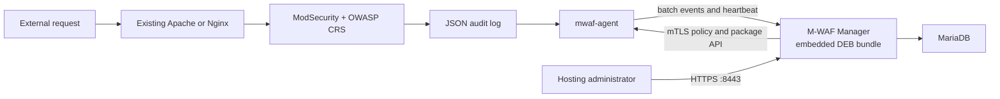

# M-WAF MVP

M-WAF is a lightweight hosting-provider WAF control plane. Customer web servers keep their existing Apache or Nginx process and install exactly two M-WAF packages:

1. `mwaf-agent`
2. `mwaf-modsecurity-apache` or `mwaf-modsecurity-nginx`

The separate Manager server runs MariaDB and one Manager container. A tagged release image embeds the exact Agent package and both web-server module packages produced from the same release commit.

## Project introduction page

The no-build static introduction page is published with GitHub Pages:

- Public URL: <https://fhwang0926.github.io/m-waf/>
- Page source: `site/`
- Deployment workflow: `.github/workflows/pages.yml`
- Trigger: a `dev` push that changes `site/**` or the Pages workflow, and manual workflow dispatch
- Product positioning: enterprise-oriented architecture, support scope, and a source-attributed comparison with the DeepFinder software WAF

Before the first publication, set **Repository Settings → Pages → Build and deployment → Source** to **GitHub Actions**. The workflow uploads only the `site/` directory and uses the minimum Pages deployment permissions. Until the workflow has been pushed and completed successfully, the public URL may return 404.

## MVP support scope

| Item | Supported now |
|---|---|
| Manager | Linux amd64 host with Docker Engine and Docker Compose |
| Database | MariaDB 11.8.6 container |
| Customer OS | Ubuntu Server 24.04 LTS, amd64 |
| Web server | Ubuntu 24.04 distro-default Apache or Nginx build matching the embedded catalog |
| WAF | Apache ModSecurity v2 distro module or Nginx libmodsecurity v3 connector package |
| Rules | OWASP CRS v4.28.0 with managed sensitivity, threshold, URL/IP exclusions, and restricted custom `SecRule` additions |
| Policy | Per-server or server-group policy revisions, signed, status-tracked, and rollback-safe |
| Events | ModSecurity JSON audit log batch forwarding and Manager event list |
| Access | Enterprise-isolated users, enterprise administrators, and one first-setup system administrator |

Rocky Linux/RPM, ARM64, custom-built web servers, custom permission sets, HA, and unattended scheduled upgrades are outside this first executable MVP. A manager can force a compatible signed-bundle Agent/module update or manifest-declared rollback. Unsupported inventory is rejected before the installer changes the web-server configuration.

## Supported customer web servers and versions

The MVP supports only the following Ubuntu 24.04 LTS amd64 web-server builds. The package revisions below are the versions confirmed from the Ubuntu repository on 2026-08-06; the signed bundle manifest embedded in each Manager image is the final compatibility source of truth.

| Web server | Supported server version | Confirmed Ubuntu package revision | M-WAF package | Open-source WAF components |
|---|---:|---:|---|---|
| Apache HTTP Server | `2.4.58` | `apache2 2.4.58-1ubuntu8.15` | `mwaf-modsecurity-apache` | `libapache2-mod-security2 2.9.7-1build3` + OWASP CRS `4.28.0` |
| Nginx | `1.24.0` | `nginx 1.24.0-2ubuntu7.15` | `mwaf-modsecurity-nginx` | `libnginx-mod-http-modsecurity 1.0.3-1build3` + libmodsecurity `3.0.12` + OWASP CRS `4.28.0` |

“Same version” alone is not sufficient. Before downloading a module, Manager requires all of these inventory fields to match one embedded catalog entry:

| Compatibility field | Required value |
|---|---|
| Operating system | `/etc/os-release`: `ID=ubuntu`, `VERSION_ID=24.04` |
| Architecture | `amd64` (`x86_64`) |
| Web-server type | Exactly `apache` or `nginx` |
| Server version | Apache `2.4.58` or Nginx `1.24.0` for the current baseline |
| Build identity | SHA-256 of normalized `apachectl -V`/`httpd -V` or `nginx -V` output must exactly match the Manager bundle manifest |

This exact build check prevents installing an ABI-incompatible Nginx dynamic module or an Apache module built for a different distro configuration. If any field differs, package resolution returns an unsupported-inventory error and the installer exits before modifying Apache or Nginx.

Ubuntu security updates may change a package revision or build identity while retaining the same visible server version. In that case, manually run the workflow on the `dev` branch or push a new `dev` commit to build a new Manager image and matching package catalog before enrolling the updated server. Do not reuse a module from an older Manager image merely because `apachectl -v` or `nginx -v` looks unchanged.

### Explicitly unsupported in this MVP

- Ubuntu 22.04, Ubuntu 26.04, Debian, Rocky Linux, AlmaLinux, RHEL, and CentOS
- ARM64 and other non-amd64 architectures
- Apache or Nginx compiled directly from source
- Nginx from `nginx.org`, a PPA, third-party repositories, or a custom build
- OpenResty, LiteSpeed, Caddy, IIS, and other web servers
- An Apache/Nginx version or normalized build hash absent from the current Manager image

If Apache and Nginx are both installed, the operator must explicitly select one with `--webserver apache` or `--webserver nginx`. One Agent manages one active web-server type in the MVP.

## Architecture



The Compose stack intentionally has only two runtime services: `mariadb` and `manager`. Agent and module are not containers; their signed DEB files live under `/opt/mwaf/bundles/current` inside the Manager image and are installed on real customer web servers.

## Local source development

Prerequisites are Docker Engine with the Compose plugin, OpenSSL, and Go 1.26 or newer. Start the complete local development path with one command:

```sh
make dev
```

The command creates missing local secrets and certificates, starts an isolated `mwaf-local` MariaDB project on `127.0.0.1:3306`, applies forward-only migrations to that local database, and runs the Manager directly from the current source with `go run`. It does not build a Manager Docker image. It uses `dist/bundle` when present and otherwise extracts the signed package bundle from `MWAF_BUNDLE_IMAGE`. Before the first tagged release exists, Manager still starts for UI/API development with package installation endpoints marked unavailable.

- Admin UI: `https://localhost:8443/setup`
- Agent API: `https://localhost:10443`
- Stop the foreground Manager: `Ctrl-C`
- Stop local MariaDB without deleting its volume: `make dev-down`
- Follow local MariaDB output: `make dev-db-logs`

Admin UI and Agent API ports are independent. Override either one before `make dev` or in `deploy/compose/.env`:

```dotenv
MWAF_ADMIN_PORT=8443
MWAF_AGENT_PORT=10443
```

Local source development binds both endpoints to loopback by default. `MWAF_DEV_ADMIN_BIND` and `MWAF_DEV_AGENT_BIND` can change those local bind addresses. Container deployment uses `MWAF_ADMIN_BIND` and `MWAF_AGENT_BIND`; keep the Admin UI on a management network, while protected servers must be able to reach the Agent API.

HTML templates and CSS are embedded in the Go binary. After changing Go, HTML, or CSS, stop the foreground process and run `make dev` again. Never add `-v` to the local Compose shutdown command unless the isolated development data is intentionally disposable.

## Deploy a tagged Manager release from a clone

Prerequisites: Docker Engine, the Docker Compose plugin, OpenSSL, and access to the public GHCR image.

After the first tagged release is published, the repository owner must perform GitHub's one-time visibility setting: **Profile → Packages → m-waf-manager → Package settings → Change visibility → Public**. GitHub creates a personal-account package as private by default even when it is linked to a public source repository. Public container visibility is required for anonymous clone-to-deploy pulls and cannot later be changed back to private.

```sh
git clone https://github.com/Fhwang0926/m-waf.git
cd m-waf
cp deploy/compose/.env.example deploy/compose/.env
```

Before the first start, edit these two values in `deploy/compose/.env`:

```dotenv
MWAF_MANAGER_HOST=manager.example.com
MWAF_ADMIN_PORT=8443
MWAF_AGENT_PORT=10443
MWAF_AGENT_PUBLIC_URL=https://manager.example.com:10443
MWAF_MANAGER_IMAGE=ghcr.io/fhwang0926/m-waf-manager:0.1.0
```

Then deploy:

```sh
make deploy
```

`prepare.sh` only creates missing secret files and certificates. It never overwrites existing secrets or volumes. The database port is internal to Compose and is not published on the host.

Manager and MariaDB container output uses Docker's size-bounded `local` logging driver (`10 MB` per file, up to `5` compressed files per container). MariaDB's file-based slow-query log is disabled in the minimal stack because it requires a separate host log-rotation policy.

Check that the services are running and open the administrator UI:

```sh
docker compose --env-file deploy/compose/.env -f deploy/compose/compose.yaml ps
```

- Admin UI: `https://manager.example.com:8443`
- Agent/package API: `https://manager.example.com:10443`
- Local CA certificate to import or securely copy: `deploy/compose/secrets/mwaf_ca_cert.pem`

On the first visit, `/setup` asks for the system administrator username, display name, and password. The setup route closes after the first account is created. The system administrator then creates each enterprise and its first enterprise administrator from **기업 관리** and **사용자 관리**.

The generated TLS certificate is signed by the local M-WAF CA. For public browser trust, terminate Admin HTTPS at an existing reverse proxy with an approved certificate while leaving the Agent API mTLS path intact.

## Install a customer web server

1. Sign in to Manager.
2. Choose **서버 등록** and create a one-use enrollment token.
3. Securely copy `mwaf_ca_cert.pem` to the customer server.
4. Run the command shown by Manager after reviewing the downloaded script.

Example:

```sh
curl --fail --cacert ./mwaf_ca_cert.pem https://manager.example.com:10443/bootstrap/v1/install.sh -o /tmp/mwaf-install.sh
sudo sh /tmp/mwaf-install.sh \
  --manager https://manager.example.com:10443 \
  --token 'ONE_USE_TOKEN' \
  --ca ./mwaf_ca_cert.pem
```

If both Apache and Nginx are installed, add `--webserver apache` or `--webserver nginx`. The installer:

- reads OS, architecture, web-server version, and build hash;
- asks Manager for one exact Agent package and one exact module package;
- downloads only those two embedded files;
- verifies both SHA-256 values;
- installs dependencies through Ubuntu APT without installing the distro CRS recommendation;
- enables the Agent, which completes certificate enrollment over TLS.

No compiler, Go toolchain, Docker runtime, or source checkout is required on the customer server.

## Operate the MVP

- **시스템 관리자** can view all enterprises, create enterprises, create enterprise administrators/users, and operate every server.
- **기업 관리자** can view and operate only its enterprise, and can add read-only enterprise users.
- **기업 사용자** can view only its enterprise's servers and WAF events.
- **시스템 설정** controls WAF event retention (default 30 days) and administrator audit retention (default 365 days). Cleanup runs at startup and then on the configured cleanup interval in bounded batches.
- **서버** shows inventory, Agent/module versions, heartbeat, policy/package deployment results, and the latest fixed control command.
- Agent control uses authenticated HTTPS polling during the normal heartbeat loop. It does not open a WebSocket or arbitrary command port, and arbitrary shell execution is not provided.
- `Agent 중지` and `서버 종료` cannot be reversed through Manager after connectivity is lost; use the host console, service manager, hypervisor, or power controller to recover them.
- Package rollback is enabled only when the signed bundle manifest names valid previous Agent and module artifacts.
- **서버 그룹** manages enterprise-scoped groups and deploys one immutable policy revision to every active member.
- **정책 관리** configures detection/blocking mode, CRS sensitivity, anomaly threshold, request-body inspection, URL/IP exclusions, and restricted custom `SecRule` lines. It also shows per-revision pending, success, and failure counts.
- **서버 제어** queues only four fixed polling commands: Agent restart/stop and server restart/poweroff. Arbitrary shell input is not accepted.
- **패키지 제어** force-installs the current compatible signed bundle or the bundle manifest's explicit rollback pair and records the Agent result.
- **등록 해제** preserves server/event history but blocks the enrolled Agent certificate immediately.
- **사용자 관리** supports display-name/role/password updates, activation changes, and audit-preserving soft deletion within the administrator's enterprise scope.
- Agent verifies the Ed25519 signature and SHA-256, writes `/etc/mwaf/active/main.conf`, runs `apachectl configtest` or `nginx -t`, and reloads only on a change.
- If validation or reload fails, Agent restores the prior policy and reloads it.
- Each Agent uses a Manager-issued client certificate so the mTLS API can bind heartbeat, policy, package, command, and event traffic to one enrolled server without storing a reusable API password.
- Agent renews its 90-day mTLS certificate with the existing private key beginning 30 days before expiration.
- ModSecurity writes JSON lines to `/var/log/modsecurity/audit.jsonl`; distro `logrotate` bounds the file and Agent tracks device, inode, and offset across truncation or replacement.
- Agent drains up to 20 idempotent batches of 500 events every 2 seconds and applies exponential retry backoff up to one minute when Manager is unavailable.

Useful Manager commands:

```sh
make logs
make pull
make down
```

Do not use `docker compose down -v` on an environment whose MariaDB data must be retained.

## Verification and tag-only image publication

Relevant pull requests, every push to `dev`, and `vMAJOR.MINOR.PATCH` tags run `.github/workflows/dev-manager-image.yml`. The read-only verification job:

1. tests the Go code;
2. builds the Linux amd64 Agent;
3. builds `mwaf-agent`, Apache, and Nginx DEB packages;
4. downloads official CRS v4.28.0 and verifies its locked SHA-256;
5. records exact Apache/Nginx version and build hashes in the bundle catalog;
6. installs the Agent and Apache module on a clean pinned Ubuntu 24.04 amd64 container and runs `apachectl configtest`;
7. installs the Agent and Nginx module on a separate clean container and runs `nginx -t`;
8. verifies both clean environments match the catalog's exact server version/build hash, load ModSecurity and CRS, and create the protected audit log;
9. signs a temporary verification bundle without creating a Manager Docker image.

Pull requests, `dev` pushes, and manual workflow runs stop after verification. They do not build or publish the project Docker image. Only a validated semantic release tag push such as `v0.1.0` starts the publish job. The job downloads the exact tested DEBs through a workflow artifact, requires `RELEASE_BUNDLE_SIGNING_KEY_B64`, signs the release bundle, embeds it in the Manager image, and then publishes:

1. `ghcr.io/fhwang0926/m-waf-manager:<major.minor.patch>`;
2. moving convenience tags `<major.minor>`, `<major>`, and `latest`;
3. immutable `sha-<full-commit-sha>`;
4. build provenance using GitHub OIDC.

The workflow does not initialize MariaDB or run browser/frontend tests. Full Manager-to-Agent enrollment, mTLS, policy, event-ingest, and database integration remains a separate disposable-environment test stage.

The workflow publishes the package but cannot perform GitHub's irreversible first-time visibility choice. After making the package public once, confirm anonymous access before distributing the Compose stack:

```sh
docker pull ghcr.io/fhwang0926/m-waf-manager:latest
```

Set repository secret `RELEASE_BUNDLE_SIGNING_KEY_B64` to a base64-encoded Ed25519 PKCS#8 private-key PEM before pushing the first release tag. Tagged publication fails closed when the key is absent; release images never use an ephemeral signing identity. Production deployments should pin the full version tag or image digest rather than `latest`.

## Local backend verification

```sh
make fmt
go test ./...
docker compose --env-file deploy/compose/.env.example -f deploy/compose/compose.yaml config --quiet
```

These checks do not start MariaDB or modify a database. A full integration test additionally needs an Ubuntu 24.04 amd64 Apache/Nginx VM and a published Manager image.

## Repository layout

```text
cmd/                         Manager, Agent, and bundle assembler entrypoints
internal/agent/              Inventory, policy apply/rollback, audit forwarding
internal/manager/            Admin UI, enrollment, mTLS Agent/package APIs
internal/packages/           Signed embedded package catalog
migrations/                  Forward-only MariaDB schema
packaging/                   Agent/module DEB builders and source locks
build/containers/manager/    Manager multi-stage Dockerfile
deploy/compose/              Clone-to-deploy Manager stack
.github/workflows/           PR/dev verification and tag-only GHCR publication
site/                        No-build GitHub Pages introduction site
docs/                        Detailed design and completion records
```

The detailed engineering plan is in `docs/todo/2026-08-06-m-waf-development-plan.md`. Third-party source and license notes are in `THIRD_PARTY_NOTICES.md`.
