# Hosting tenant and policy lifecycle

## Cloud tenant boundary

One M-WAF Manager can serve multiple hosting companies. The existing `enterprise` domain is the hosting tenant boundary; servers, groups, users, enterprise policies, revisions, rollout targets, events, and install tokens always carry or resolve through an enterprise ID.

- Enterprise user: operates permitted resources only in the home enterprise.
- Enterprise administrator: has the same tenant scope and additionally manages that enterprise's users.
- System administrator: belongs to the M-WAF operating enterprise and can select all hosting tenants for system operation.

`TenantScope` separates the system administrator's home enterprise from global read authority. Tenant mutation helpers default an omitted enterprise to the home enterprise and verify an explicitly selected enterprise before a write. Enterprise accounts ignore a tenant ID supplied in a URL or form and remain fixed to their session enterprise.

This design retains one database and one Manager deployment while enforcing logical tenant isolation. Separate per-hosting-company databases and regional control planes remain outside the current scope.

## CRS to system policy

```mermaid
flowchart LR
    GitHub["Official OWASP CRS stable v4"] --> Sync["Manager source verification and import"]
    Sync --> Catalog["Manager verified CRS catalog"]
    Catalog --> Review["System administrator migration review"]
    Review --> System["Immutable system policy publication"]
    System --> Enterprise["Enterprise policy override"]
    Enterprise --> Rollout["Canary and staged rollout"]
    Rollout --> Agent["Agent applies signed policy-bundle-v3"]
```

Manager checks only the official `coreruleset/coreruleset` stable v4 release. It requires a GitHub-verified signed tag, resolves the exact commit, calculates the archive and Rule-index digests, validates Rule IDs and Setup metadata, and stores an immutable archive plus a Manager-signed source manifest. The first administrator can synchronize immediately, and Manager repeats discovery on the configured interval. Synchronization never publishes a system policy.

A clean installation has no active system or enterprise policy. The system administrator selects the newest verified catalog source, reviews all initially linked Rules and Setup fields, adds M-WAF Setup or overlays, validates server compatibility, and explicitly publishes the first system policy. Later catalog sources use the same flow as migrations so continuous upstream updates cannot bypass review.

## Configuration layers

The applied artifact preserves the upstream CRS layout and order:

1. `00-engine.conf`: engine mode and body inspection;
2. `20-crs-setup.conf`: upstream Setup include followed by reviewed M-WAF Setup overrides;
3. `30-before-crs-exclusions.conf`: conditional Rule and Target exclusions;
4. `40-crs-rules.conf`: read-only, self-contained upstream CRS Rule files;
5. `50-after-crs-exclusions.conf`: static Rule and Target exclusions;
6. `60-service-rules.conf`: reviewed M-WAF system and enterprise Rules.

Upstream Rule text is never rewritten. Every system policy pins the source ID, tag, commit, archive digest, and Rule-index digest. M-WAF changes are represented as Setup values or before/after overlays, which keeps upstream comparison and rollback auditable.

`policy-bundle-v3` carries the verified upstream `crs-setup.conf`, `rules/` tree, and license with the reviewed M-WAF configuration. Agent checks the whole signature, every file digest, path allowlist, and size limits before atomic activation. Existing `conf-v1` and package-linked `policy-bundle-v2` revisions remain readable for compatibility.

## Enterprise override

An enterprise policy selects one published system policy and adds tenant-specific behavior without changing it. The guided override editor supports:

- request URL conditions;
- source IP or CIDR conditions using `@ipMatch`;
- `detect` action, which logs and allows the request;
- `block` action, which logs and returns HTTP 403.

Existing URL and IP exclusion fields remain skip-protection exceptions and are shown separately because their effect is broader. Guided overrides generate Rule IDs only in the enterprise range `100000..199999`; system service Rules remain in `240000..249999`.

Enterprise update strategy controls adoption of a newly published system policy:

- `AUTOMATIC`: create a staged rollout automatically;
- `MANUAL`: wait for enterprise approval;
- `PINNED`: keep the current system policy and show update availability.

The enterprise override settings are merged again with the selected immutable system policy for each new revision. The source CRS files remain identical across hosting tenants.
