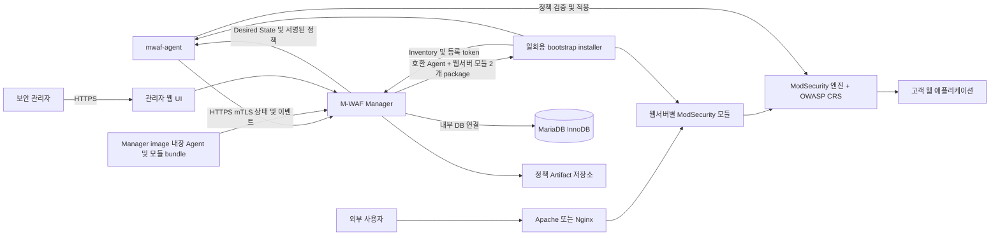

# M-WAF 통합 웹방화벽 개발 계획서

## 문서 정보

| 항목 | 내용 |
|---|---|
| 문서명 | M-WAF 통합 웹방화벽 개발 계획서 |
| 문서 버전 | v0.5 |
| 작성일 | 2026-08-06 |
| 문서 상태 | 개발 착수 전 계획(TODO) |
| 대상 독자 | 제품 책임자, 보안 담당자, 백엔드 개발자, 시스템 개발자, 운영 담당자, QA 담당자 |
| 대상 저장소 | `m-waf` |
| 1차 지원 환경 | Linux, Apache HTTP Server, Nginx, ModSecurity, OWASP CRS 4.x |
| 배포 형태 | 보호 서버 설치형 에이전트 및 모듈 + 별도 중앙 관리자 서버 Docker Compose 배포 |

## 1. 문서 목적

본 문서는 호스팅사가 다수의 웹 서버에 설치하여 운영할 수 있는 ModSecurity 기반 통합 웹방화벽 M-WAF의 개발 범위, 기술 스택, 설치 구조, 중앙 정책관리 구조, 보안 요구사항, 데이터 구조, 개발 단계 및 검증 기준을 정의한다.

본 계획의 핵심 조건은 다음과 같다.

1. 보호 대상인 고객 웹 서버에는 두 가지 설치 단위만 설치한다.
   - 정책관리 에이전트 패키지: `mwaf-agent`
   - 해당 웹서버용 ModSecurity 모듈 패키지: `mwaf-modsecurity-apache` 또는 `mwaf-modsecurity-nginx`
2. 정책 작성, 정책 버전 관리, 서버 그룹 관리, 정책 배포, 이벤트 조회는 별도의 관리자 서버에서 수행한다.
3. 관리자 서버 한 대가 여러 보호 서버를 중앙 관리한다.
4. 관리자 서버 장애가 웹 트래픽 처리나 기존 WAF 차단 기능에 영향을 주지 않아야 한다.
5. 보호 서버에 대한 외부 인바운드 관리 포트를 추가하지 않고 에이전트가 관리자 서버로 아웃바운드 연결한다.
6. 정책은 검증, 승인, 카나리 배포, 순차 배포, 자동 롤백이 가능한 불변 버전으로 관리한다.
7. ModSecurity, Connector, CRS와 테스트 도구는 공식 오픈소스 upstream을 그대로 가져와 검증 후 빌드한다.
8. upstream 소스는 기본적으로 수정하지 않고 M-WAF는 빌드·패키징·중앙관리에 필요한 최소 코드만 추가한다.
9. 관리자 서버는 `mwaf-manager`와 MariaDB를 Docker Compose로 배포하며 고객 웹 서버에는 Docker를 요구하지 않는다.
10. `dev` 브랜치의 검증된 빌드는 공개 GHCR Manager image로 게시하고, 같은 빌드에서 생성한 Agent와 웹서버별 모듈 패키지를 Manager image 안에 포함한다.

## 2. 제품 정의

### 2.1 제품 개요

M-WAF는 Apache HTTP Server 또는 Nginx에 ModSecurity 엔진과 OWASP Core Rule Set(CRS)을 모듈 형태로 결합하고, 각 서버의 Go 기반 공통 정책관리 에이전트를 통해 별도 관리자 서버에서 중앙 관리하는 호스팅사용 웹방화벽 제품이다.

웹 요청 차단은 각 보호 서버 안에서 수행한다. 관리자 서버는 실제 웹 요청 경로에 참여하지 않고 정책과 상태만 관리한다. 따라서 관리자 서버 또는 관리 네트워크가 중단되어도 보호 서버는 마지막으로 정상 적용된 정책을 사용해 계속 동작해야 한다.

### 2.2 주요 사용자

- 호스팅사 보안 관리자
- 호스팅사 시스템 운영자
- 고객 웹 서비스 운영 담당자
- 침해사고 대응 담당자
- 정책 검토 및 승인 담당자

### 2.3 주요 사용 시나리오

- 여러 웹 서버에 공통 CRS 정책을 배포한다.
- 서비스 그룹별로 서로 다른 보안 수준을 적용한다.
- 신규 서비스에는 탐지 전용 정책을 적용하고 오탐 조정 후 차단 모드로 전환한다.
- 특정 URL 또는 요청 변수에서 발생한 오탐에 기간 제한 예외를 적용한다.
- 긴급 취약점에 대한 가상 패치 규칙을 전체 또는 선택 서버에 배포한다.
- 정책 배포 실패 시 이전 정책으로 자동 복원한다.
- 여러 서버의 WAF 탐지 및 차단 이벤트를 중앙 관리자 화면에서 조회한다.
- 서버별 ModSecurity, CRS 및 정책 버전 불일치를 확인한다.

## 3. 목표와 제외 범위

### 3.1 1차 목표

- Apache HTTP Server와 Nginx에 각각 검증된 ModSecurity 모듈을 설치한다.
- 보호 서버당 설치 단위를 정확히 두 개로 제한한다.
- Go 기반 에이전트가 정책 수신, 검증, 적용, 롤백 및 상태 보고를 수행한다.
- 별도 관리자 서버 한 대가 초기 기준 최대 100대의 보호 서버를 관리한다.
- 전역, 서버 그룹, 서비스, 임시 예외 정책을 지원한다.
- 정책 Revision과 배포 이력을 변경 불가능한 감사 기록으로 보존한다.
- DetectionOnly와 차단 모드를 지원한다.
- 보안 이벤트의 요약 정보를 중앙에 수집한다.
- 관리자 역할 기반 권한 제어와 모든 변경 작업 감사를 지원한다.
- 중앙 이벤트 저장소는 MariaDB InnoDB를 사용하고 Agent 배치 단위로 트랜잭션 처리한다.
- 별도 관리자 서버에서 공식 MariaDB 이미지와 M-WAF Manager 이미지를 Docker Compose로 배포한다.
- 공개 저장소를 clone한 뒤 제공된 준비 명령과 Docker Compose로 Manager/DB를 즉시 기동할 수 있게 한다.
- `dev` 브랜치 push 시 Agent/모듈 패키지, Manager를 같은 source revision으로 빌드하여 `ghcr.io/fhwang0926/m-waf-manager`에 게시한다.
- Manager image에 지원 환경별 `mwaf-agent`와 `mwaf-modsecurity-*` 서명 패키지, 호환성 manifest, checksum, SBOM과 라이선스를 포함한다.
- 고객은 외부 임의 URL이 아니라 자신이 운영하는 Manager에 포함된 패키지만 선택·다운로드·설치한다.
- 공식 upstream 릴리스와 commit을 고정하여 재현 가능한 패키지를 빌드한다.
- upstream 원본 변경 없이 설정 overlay와 패키징만으로 제품 요구사항을 구현한다.

### 3.2 1차 제외 범위

- IIS 커넥터
- Kubernetes Ingress Controller
- 관리자 서버 이중화 및 자동 장애조치
- Redis, Kafka, Elasticsearch 기반 분산 구조
- 고객별 과금 및 사용량 청구
- 호스팅 고객이 직접 사용하는 셀프서비스 포털
- AI 기반 자동 룰 작성 및 자동 승인
- L3/L4 DDoS 방어
- CAPTCHA, 브라우저 핑거프린팅 등의 고급 봇 방어
- 요청 및 응답 본문의 장기 중앙 보관
- Manager 내장 카탈로그 밖의 URL, 임의 바이너리 또는 동적 source build를 통한 패키지 설치
- 자체 WAF 엔진 또는 자체 CRS 개발
- ModSecurity SecRules 문법 Parser 재개발
- OWASP CRS 원본 규칙의 fork 또는 직접 수정
- Apache, Nginx 또는 ModSecurity upstream 소스의 상시 자체 fork 운영

### 3.3 후속 확장 후보

- MariaDB 복제 또는 Galera 기반 관리자 서버 HA 지원
- 관리자 서버 Active/Standby 구성
- 1,000대 이상 서버 관리를 위한 작업 큐 분리
- ClickHouse 또는 외부 SIEM 이벤트 연동
- OIDC/SAML 기업 인증 연동
- 고객 조직별 테넌트 분리
- API 토큰 및 외부 자동화 API
- 별도 전역 패키지 CDN과 대규모 edge cache
- Kubernetes 기반 Manager 오케스트레이션

## 4. 핵심 설계 원칙

### 4.1 데이터 플레인과 컨트롤 플레인 분리

- 데이터 플레인은 보호 서버의 Apache 또는 Nginx, 해당 ModSecurity 모듈 및 CRS다.
- 컨트롤 플레인은 별도 관리자 서버의 Manager, 내장 관리 UI 및 MariaDB다.
- 관리자 서버는 실제 고객 HTTP 요청을 프록시하지 않는다.
- 정책관리 장애가 웹 요청 처리 장애로 전파되지 않아야 한다.

### 4.2 마지막 정상 정책 유지

- 보호 서버에는 현재 정책과 직전 정상 정책을 항상 보관한다.
- 관리자 서버에 연결할 수 없더라도 현재 정책을 계속 사용한다.
- 정책의 관리상 만료만으로 WAF를 자동 비활성화하지 않는다.
- 새로운 정책이 잘못되었을 경우 현재 실행 중인 웹서버에는 영향을 주지 않고 적용을 중단한다.

### 4.3 선언적 Desired State

- Manager는 보호 서버에서 실행할 셸 명령을 전송하지 않는다.
- Manager는 서버가 사용해야 할 정책 Revision, 동작 모드 및 대상 상태만 제공한다.
- Agent는 현재 상태와 Desired State를 비교해 필요한 작업만 수행한다.
- 동일 요청이 반복되어도 같은 결과를 만드는 멱등 처리를 적용한다.

### 4.4 불변 정책 Revision

- 활성화되었거나 배포된 정책 Revision은 직접 수정하지 않는다.
- 변경 시 반드시 새로운 Revision을 생성한다.
- 모든 Revision에는 콘텐츠 해시와 서명을 포함한다.
- 정책 삭제 대신 보관 상태로 전환해 감사 추적을 유지한다.

### 4.5 최소 설치와 최소 의존성

- 보호 서버의 고객 설치 명령은 두 패키지 설치로 끝나야 한다.
- Manager는 Go 단일 애플리케이션으로 구성한다.
- 관리자 서버의 런타임은 `mwaf-manager`와 `mariadb` 두 컨테이너로 제한한다.
- 관리자 UI는 Go 서버 렌더링 방식으로 구현하여 별도 Node.js 프론트엔드 빌드를 요구하지 않는다.
- 초기에는 메시지 브로커, 캐시 서버, 검색 클러스터를 도입하지 않는다.

### 4.6 Upstream-first 개발 원칙

M-WAF는 WAF 엔진, 웹서버 Connector, CRS 또는 WAF 회귀 테스트 도구를 새로 구현하지 않는다. 공식 upstream 프로젝트를 정확한 release tag와 commit으로 고정하고 upstream이 제공하는 빌드 방법을 우선 사용한다.

우선순위는 다음과 같다.

1. 운영체제 배포판이 제공하는 검증된 binary/development package를 그대로 사용할 수 있는지 확인한다.
2. 공식 upstream release asset을 내려받아 서명과 checksum을 검증한 뒤 빌드한다.
3. release asset으로 재현할 수 없을 때만 공식 repository를 고정 commit으로 checkout한다.
4. upstream이 요구하는 submodule이 있으면 각 submodule commit까지 lock한다.
5. 설정 overlay와 패키징만으로 해결한다.
6. 그 방법으로 불가능할 때만 별도 patch 파일을 적용한다.
7. patch는 upstream issue 또는 pull request로 환원하고 제거 가능한 버전을 명시한다.

고객 운영 서버에서는 소스 다운로드나 컴파일을 수행하지 않는다. upstream 소스 fetch와 build는 격리된 빌드 환경에서만 수행하고 고객에게는 서명 완료된 DEB/RPM 패키지만 제공한다.

### 4.7 재사용할 공식 오픈소스

| 영역 | 공식 upstream | M-WAF 사용 범위 | 자체 구현 여부 |
|---|---|---|---|
| Apache WAF | `owasp-modsecurity/ModSecurity` v2.9.x release | Apache module과 권장 설정의 원본 | 엔진/룰 Parser 구현 금지 |
| Nginx WAF 엔진 | `owasp-modsecurity/ModSecurity` v3.0.x release | libmodsecurity 원본 빌드 | 엔진 구현 금지 |
| Nginx Connector | `owasp-modsecurity/ModSecurity-nginx` | 대상 Nginx용 dynamic module 빌드 | Connector 구현 금지 |
| 기본 룰 | `coreruleset/coreruleset` | 서명된 CRS release를 변경 없이 포함 | CRS fork 및 원본 편집 금지 |
| 빌드 참고 | `coreruleset/modsecurity-crs-docker` | 버전 변수, Apache/Nginx 조합, healthcheck와 빌드 패턴 참고·재사용 | 고객 WAF 런타임을 컨테이너 제품으로 전환하지 않음 |
| WAF 테스트 | `coreruleset/go-ftw`와 CRS regression tests | Apache/Nginx 실제 요청 회귀 테스트 | 별도 WAF 테스트 러너 구현 금지 |
| 웹서버 | Apache HTTP Server, Nginx 공식/배포판 소스 | 설치된 웹서버와 동일 버전의 header/source 사용 | 웹서버 fork 및 대체 금지 |
| Go 런타임 기능 | Go 표준 라이브러리 | HTTP, TLS, X.509, Ed25519, JSON, template, logging | 자체 암호화/HTTP 구현 금지 |
| Manager DB | MariaDB Community Server LTS와 `go-sql-driver/mysql` | InnoDB 기반 동시 쓰기, 트랜잭션, crash recovery | 자체 DB 엔진 구현 금지 |

`modsecurity-crs-docker`는 공식 Apache/Nginx 통합의 검증된 참고 구현으로 사용하되 고객 서버에 컨테이너를 설치하는 방식으로 변경하지 않는다. 필요한 빌드 변수와 설정 패턴은 라이선스와 출처를 보존한 상태로 최소한만 재사용한다.

### 4.8 M-WAF가 새로 작성하는 최소 범위

새 코드는 기존 upstream에서 제공하지 않는 중앙관리 기능으로 제한한다.

- Agent 등록, mTLS 인증서 수명주기와 heartbeat
- Desired State 조회와 서명된 정책 Artifact 다운로드
- Apache/Nginx 공통 WebServer Driver의 얇은 호출 계층
- 활성 정책 symlink 전환, 설정 검사, reload와 롤백 orchestration
- Manager의 서버/정책/배포 메타데이터 관리 API
- 내장 관리자 UI
- 정책 Revision, 승인, 대상 선택과 배포 상태 머신
- 공통 정책 값을 upstream 설정 파일에 주입하는 최소 template Renderer
- upstream 소스 fetch, 검증, 빌드와 DEB/RPM 패키징 wrapper

다음 기능은 새로 만들지 않는다.

- HTTP reverse proxy 또는 request inspection engine
- SecRules lexer/parser/compiler
- 공격 탐지 정규식과 CRS 대체 규칙
- Apache/Nginx process supervisor
- 자체 암호화 알고리즘 또는 인증서 형식
- 범용 로그 수집 플랫폼
- 범용 패키지 관리자
- 자체 frontend framework
- 자체 database engine

Policy Renderer는 SecRules를 해석하거나 CRS 파일을 수정하는 컴파일러가 아니다. 검증된 upstream 설정 template과 M-WAF 소유의 before/after exclusion 파일을 정해진 순서로 조합하는 구성 생성기다. 최종 문법 검증은 실제 Apache/ModSecurity2 또는 Nginx/libmodsecurity3가 수행한다.

### 4.9 Upstream patch 정책

기본 patch 수는 0개를 목표로 한다. 불가피한 patch는 upstream 소스 안에서 직접 수정하지 않고 다음 경로의 독립 파일로 관리한다.

```text
packaging/patches/<component>/<version>/<sequence>-<description>.patch
```

각 patch에는 다음 메타데이터를 요구한다.

- 적용 component와 upstream 버전
- 필요한 이유와 사용자 영향
- upstream issue 또는 pull request URL
- patch 작성자와 작성일
- 적용 및 제거 조건
- patch가 제거될 예정인 upstream 버전
- 관련 회귀 테스트
- 라이선스 및 저작권 확인

patch 적용 순서는 명시적으로 고정한다. patch 적용 실패, fuzz 적용 또는 예상 파일 hash 불일치가 발생하면 빌드를 중단한다. upstream에 수정이 반영된 버전으로 올릴 수 있게 되면 자체 patch를 먼저 제거한다.

### 4.10 Upstream 소스 잠금과 추적

모든 외부 소스는 `upstream/sources.lock.yaml`에서 추적한다.

```yaml
components:
  - name: modsecurity-v3
    repository: https://github.com/owasp-modsecurity/ModSecurity
    tag: <release-tag>
    commit: <full-commit-sha>
    archive_sha256: <sha256>
    signature: <signature-url-or-null>
    license: <spdx-id>
    build_profile: nginx
```

실제 lock 항목에는 다음을 포함한다.

- component 이름과 용도
- 공식 repository 및 release URL
- release tag와 전체 commit SHA
- archive SHA-256
- upstream signature URL과 공개키 fingerprint
- submodule별 전체 commit SHA
- SPDX license 식별자
- 빌드 대상 OS/아키텍처/웹서버
- 적용 patch 목록
- 마지막 검토 일자

Git branch 이름, `latest`, 움직이는 nightly URL 또는 축약 commit만으로 production build하지 않는다. upstream 소스 전체를 M-WAF 저장소에 복사해 vendor fork로 관리하지 않으며 build cache는 source of truth로 취급하지 않는다.

### 4.11 Manager release bundle 일치 원칙

Manager, Agent와 ModSecurity 모듈을 서로 독립적으로 최신 버전으로 조합하지 않는다. 한 번의 release build가 다음을 하나의 `bundle_version`으로 묶는다.

- Manager source 전체 commit SHA와 OCI image digest
- Agent version, API protocol range, DEB/RPM checksum과 서명
- Apache 배포판/ABI별 모듈 package version과 checksum
- Nginx 배포판/version/configure hash별 dynamic module package version과 checksum
- ModSecurity, Connector와 CRS source lock
- package별 SBOM, license, build-info와 provenance

Manager는 시작할 때 image 내부 bundle manifest와 자신의 build metadata가 같은 source revision인지 검증한다. 불일치하거나 signature/checksum 검증에 실패하면 package download API readiness를 열지 않는다. 고객 서버에는 Manager가 자신의 catalog에서 호환 가능하다고 판정한 package만 배포한다.

## 5. 전체 시스템 아키텍처



### 5.1 물리 배치

```text
[별도 관리자 서버]
  - Docker Engine 및 Docker Compose plugin
  - mwaf-manager 컨테이너
    · 관리자 웹 UI(Manager 바이너리에 포함)
    · Agent API와 Admin API
    · 정책 Artifact 저장소
    · 지원 환경별 Agent/Apache/Nginx package bundle
    · bootstrap installer 및 서명 package repository
  - mariadb 컨테이너
    · InnoDB 관리 데이터와 이벤트 저장소
  - 영속 Volume, 감사 로그 및 외부 백업

             HTTPS/mTLS 아웃바운드 연결
                        ▲
                        │
  ┌─────────────────────┼─────────────────────┐
  │                     │                     │
[Apache 서버 A]              [Nginx 서버 B]             [Apache 서버 C]
  1. mwaf-agent                1. mwaf-agent               1. mwaf-agent
  2. mwaf-modsecurity-apache   2. mwaf-modsecurity-nginx   2. mwaf-modsecurity-apache
  기존 Apache                  기존 Nginx                  기존 Apache
```

### 5.2 네트워크 포트

| 출발지 | 목적지 | 포트 | 용도 | 비고 |
|---|---|---:|---|---|
| 보호 서버 bootstrap/Agent | Manager Agent API | TCP 9443 | 등록, package resolve/download, heartbeat, 정책과 이벤트 | 최초 bootstrap은 일회용 token, 등록 후 mTLS |
| 관리자 브라우저 | Manager Admin UI/API | TCP 8443 | 정책 및 서버 관리 | HTTPS, 관리망 접근 제한 |
| Manager 컨테이너 | MariaDB 컨테이너 | TCP 3306 | 관리 데이터와 이벤트 저장 | Compose 내부 network 전용, host port 공개 금지 |
| 외부 사용자 | 보호 서버 Apache/Nginx | 기존 80/443 | 고객 웹 트래픽 | M-WAF 관리 통신과 분리 |

Manager가 보호 서버에 직접 접속하는 인바운드 관리 포트는 사용하지 않는다.

## 6. 고객 보호 서버 설치 모델

### 6.1 설치 단위 1: 정책관리 에이전트

패키지명은 `mwaf-agent`로 한다.

포함 항목은 다음과 같다.

- Go로 빌드된 단일 Agent 실행 파일
- 제한된 정책 적용 서브커맨드 또는 `mwaf-apply` 헬퍼
- systemd 서비스 및 timer 정의
- 기본 설정 파일
- 전용 시스템 사용자와 그룹
- Agent 상태 및 정책 저장 디렉터리
- 로그 로테이션 설정
- 등록 및 상태 확인용 `mwafctl` 최소 명령

Agent의 책임은 다음과 같다.

- Manager 등록
- Agent 인증서 생성 및 갱신
- 서버, OS, 웹서버, ModSecurity 및 CRS 버전 수집
- Apache/Nginx 자동 탐지와 웹서버 드라이버 선택
- 보호 서비스 메타데이터 수집
- heartbeat 전송
- Desired State 확인
- 정책 Artifact 다운로드
- 정책 서명, 체크섬 및 호환성 검증
- 정책 적용 전 대상 웹서버 설정 검사
- 정책의 원자적 전환
- 대상 웹서버 graceful reload 요청
- 적용 후 상태 확인
- 실패 시 자동 롤백
- WAF 이벤트 요약 수집 및 배치 전송
- 연결 장애 시 제한된 로컬 디스크 큐 운영

### 6.2 설치 단위 2: ModSecurity 모듈 패키지

웹서버에 따라 다음 패키지 중 정확히 하나만 설치한다.

| 웹서버 | 설치 패키지 | 엔진 기준 |
|---|---|---|
| Apache HTTP Server | `mwaf-modsecurity-apache` | 운영 안정성이 검증된 ModSecurity v2.9.x 최신 지원 유지보수 릴리스 |
| Nginx | `mwaf-modsecurity-nginx` | libmodsecurity v3.0.x 최신 지원 유지보수 릴리스 + 공식 Nginx Connector |

Apache용 libmodsecurity v3 Connector는 공식 프로젝트가 production-ready가 아니라고 명시하므로 MVP에서 사용하지 않는다. Apache는 공식 권장에 따라 ModSecurity v2.9.x를 사용하고 Nginx는 ModSecurity v3.0.x를 사용한다.

고객 보호 서버의 설치 단위는 어느 웹서버를 사용하더라도 다음 두 개다.

```text
Apache 서버: mwaf-agent + mwaf-modsecurity-apache
Nginx 서버:  mwaf-agent + mwaf-modsecurity-nginx
```

`mwaf-modsecurity-apache`에는 다음을 포함한다.

- Apache용 ModSecurity v2.9.x 모듈
- OWASP CRS 4.x의 승인된 고정 버전
- Apache용 ModSecurity 기본 설정과 include 파일
- YAJL 지원으로 빌드된 upstream JSON 감사 로그 설정
- 설치 전 검사 및 제거 스크립트

`mwaf-modsecurity-nginx`에는 다음을 포함한다.

- 대상 Nginx 버전과 호환되는 ModSecurity Nginx 동적 커넥터
- libmodsecurity v3 런타임
- OWASP CRS 4.x의 승인된 고정 버전
- ModSecurity 권장 기본 설정
- Unicode mapping 및 필요한 데이터 파일
- JSON 감사 로그 사용에 필요한 빌드 기능
- Nginx `load_module` 설정 파일
- M-WAF 활성 정책을 참조하는 Nginx 설정 파일
- 설치 전 검사 및 제거 스크립트

ModSecurity 엔진, 웹서버 Connector와 CRS는 고객이 별도로 설치하는 제품 항목이 아니다. 선택한 `mwaf-modsecurity-*` 패키지에 포함되는 내부 구성으로 취급한다.

Agent와 두 웹서버용 module package는 Manager image의 read-only release bundle에 포함한다. 고객은 GitHub Release, 임의 외부 package repository 또는 운영 서버 source build로 설치하지 않고 자신이 운영하는 Manager의 bootstrap/package API에서 내려받는다.

### 6.3 기존 웹서버 전제

- 보호 서버에는 Apache HTTP Server 또는 Nginx 중 하나가 이미 설치되어 있어야 한다.
- M-WAF는 기존 웹서버를 대체하는 Reverse Proxy 제품이 아니다.
- 설치 프로그램은 기존 웹서버 종류, 버전과 빌드 정보를 확인한다.
- 지원하지 않는 웹서버 또는 버전이면 기존 설정을 수정하지 않고 설치를 중단한다.
- 지원 웹서버가 없다면 자동 설치하지 않고 명확한 오류를 반환한다.
- Apache와 Nginx가 동시에 설치된 서버는 운영자가 보호 대상을 명시하지 않으면 설치를 중단한다.
- MVP에서는 Agent 하나가 한 종류의 활성 웹서버만 관리한다.

### 6.4 웹서버 버전 호환 전략

Nginx 동적 모듈은 대상 Nginx 버전 및 빌드 옵션과 호환되어야 한다. 운영 서버에서 소스를 내려받아 즉석 컴파일하지 않고 사전에 검증된 패키지를 제공한다. Apache도 배포판의 Apache ABI와 모듈 호환성을 확인한 패키지만 제공한다.

패키지 식별 기준은 다음과 같다.

- 배포판 및 버전
- CPU 아키텍처
- 웹서버 종류와 버전
- Nginx 빌드 옵션 해시 또는 Apache 모듈 ABI 정보
- ModSecurity 버전
- Connector 버전
- CRS 버전
- package bundle version과 Manager API 호환 범위

MVP 지원 후보는 다음과 같다.

- Ubuntu 24.04 LTS의 배포판 기본 Apache 및 Nginx
- Rocky Linux 9의 배포판 기본 Apache 및 Nginx
- x86_64

ARM64와 사용자가 직접 빌드한 Apache/Nginx는 후속 지원으로 둔다.

### 6.5 설치 전 검사

- OS 및 아키텍처 확인
- Apache/Nginx 설치 및 실행 여부 확인
- Nginx는 `nginx -V`, Apache는 `apachectl -V` 또는 `httpd -V` 결과 확인
- 기존 ModSecurity 모듈 중복 확인
- 현재 웹서버 설정 정상 여부 확인
- 설정 파일과 모듈 디렉터리 권한 확인
- 정책 및 감사 로그 디스크 여유 공간 확인
- Manager 주소에 대한 DNS 및 TCP 연결 확인
- 시간 동기화 상태 확인
- 기존 M-WAF 설치 및 업그레이드 여부 확인

### 6.6 Manager 내장 package 선택과 bootstrap

관리자가 Manager UI에서 서버 등록을 생성하면 1회용 bootstrap URL과 짧은 만료시간의 enrollment token을 발급한다. bootstrap installer는 저장소에 공개된 검토 가능한 script와 동일한 내용이며 설치 후 서버에 상주하지 않는다.

bootstrap 흐름은 다음과 같다.

1. `/etc/os-release`, CPU architecture, 설치된 Apache/Nginx 종류와 version을 읽는다.
2. Nginx는 전체 `nginx -V`, Apache는 `apachectl -V` 또는 `httpd -V`를 수집하고 정규화한 build/ABI hash를 계산한다.
3. enrollment token과 inventory를 Manager `/bootstrap/v1/packages/resolve`에 제출한다.
4. Manager는 자신의 image에 포함된 package catalog에서 정확히 호환되는 Agent 1개와 module 1개를 선택한다.
5. 응답에는 `bundle_version`, package ID/version, URL, size, SHA-256, signature, 대상 조건과 만료시간을 포함한다.
6. installer는 Manager `/bootstrap/v1/packages/{package_id}`에서 두 package를 임시 경로에 모두 내려받는다.
7. 두 package의 catalog signature, package signature, checksum과 대상 조건을 모두 검증한 뒤에만 설치를 시작한다.
8. 호환 항목이 없거나 하나라도 검증에 실패하면 웹서버 설정을 변경하지 않고 종료한다.

Manager가 제공하는 package repository는 image 안의 read-only OCI layer를 Go `net/http`로 전달하는 얇은 static download handler다. 대용량 binary를 Go `go:embed`로 실행 파일 안에 넣거나 별도 artifact server를 추가하지 않는다.

### 6.7 설치 순서

1. 운영자가 Manager UI에서 1회용 bootstrap 명령을 생성한다.
2. bootstrap installer가 서버 inventory를 수집하고 Manager에서 Agent와 module package를 resolve한다.
3. 두 package를 모두 다운로드하여 서명, checksum과 호환 조건을 검증한다.
4. 웹서버에 맞는 `mwaf-modsecurity-apache` 또는 `mwaf-modsecurity-nginx` package를 먼저 설치한다.
5. package script가 변경 전 웹서버 상태를 기록하고 모듈과 전용 include를 설치한다.
6. Nginx는 `nginx -t`, Apache는 `apachectl configtest` 또는 `httpd -t`를 수행한다.
7. 실패 시 신규 파일을 제거하고 기존 상태로 복구한다.
8. 성공 시 대상 웹서버를 graceful reload한다.
9. 같은 bundle의 `mwaf-agent` package를 설치한다.
10. Agent가 enrollment token으로 Manager에 등록하고 mTLS 인증서를 발급받는다.
11. Agent가 초기 DetectionOnly 정책을 수신·적용하고 package/정책 상태를 보고한다.

### 6.8 제거 원칙

- M-WAF가 소유한 파일만 제거한다.
- 기존 Apache/Nginx 주 설정 파일을 덮어쓰거나 삭제하지 않는다.
- 제거 전 대상 웹서버 설정 검사를 수행한다.
- M-WAF include와 모듈 로드 파일을 제거한 후 다시 설정 검사한다.
- 제거 실패 시 기존 활성 정책과 모듈을 유지한다.
- 감사 및 정책 데이터 삭제 여부는 운영자가 명시적으로 선택한다.

## 7. 관리자 서버 구성

### 7.1 관리자 서버 역할

관리자 서버는 보호 서버와 분리된 별도 서버로 구축한다. 관리자 서버에는 고객 웹 트래픽이 유입되지 않는다.

관리자 서버의 책임은 다음과 같다.

- 보호 서버 등록 및 인증서 관리
- 서버 그룹과 보호 서비스 관리
- 정책 작성 및 검증
- 정책 Revision 생성
- 정책 검토 및 승인
- 정책 Artifact 생성 및 서명
- 카나리 및 순차 배포 관리
- 배포 중지 및 롤백
- Desired State와 Observed State 비교
- WAF 이벤트 수집 및 검색
- 예외 정책 생성 및 만료 관리
- 사용자, 역할 및 세션 관리
- 모든 관리자 작업 감사
- 백업과 복구 지원

### 7.2 관리자 서버 구성요소

| 구성요소 | 설명 |
|---|---|
| `mwaf-manager` | Go 기반 단일 Manager 애플리케이션 컨테이너 |
| Admin UI | Manager 바이너리에 포함되는 서버 렌더링 웹 UI |
| Agent API | 에이전트 등록, 상태, 정책, 이벤트 API |
| Policy Composer | upstream template, CRS와 M-WAF overlay를 대상별 순서로 조합 |
| Artifact Signer | 정책 번들 해시 및 Ed25519 서명 |
| Deployment Controller | 서버별 Desired State 및 배포 상태 관리 |
| Embedded Package Catalog | 동일 release의 Agent/Apache/Nginx package manifest와 compatibility matrix |
| Package Resolver/Repository | Inventory에 맞는 두 package 선택과 token 기반 static download |
| MariaDB InnoDB | 서버, 정책, 배포, 이벤트 요약, 감사 데이터의 트랜잭션 저장 |
| Artifact Storage | 서명된 정책 번들 파일 저장 |
| Backup Job | DB 및 Artifact 백업 |

관리자 서버에는 Docker Engine과 Docker Compose plugin을 설치하고 배포 Artifact가 제공하는 `compose.yaml`, 환경 파일, 설정 파일과 secret 파일을 사용한다. 상시 실행 서비스는 `mwaf-manager`와 `mariadb` 두 컨테이너뿐이다. Node.js, Redis, Kafka, Elasticsearch 또는 별도 메시지 브로커를 설치하지 않는다.

Docker Compose는 관리자 서버에만 사용한다. Apache/Nginx 보호 서버의 설치 방식은 기존과 동일하게 DEB/RPM 두 패키지이며 Docker Engine이나 컨테이너 런타임을 요구하지 않는다.

### 7.3 Manager 단일 서버 원칙

- MVP에서는 Manager 인스턴스 한 개만 실행한다.
- MariaDB Community Server LTS의 InnoDB를 유일한 운영 DB로 사용한다.
- MariaDB 3306 포트는 Compose 내부 network에만 노출하고 관리자 서버 host port로 publish하지 않는다.
- SQLite와 MariaDB를 동시에 지원하는 DB 추상화 계층을 만들지 않는다.
- 정책 Artifact는 Manager 로컬의 콘텐츠 주소형 디렉터리에 저장한다.
- Manager 프로세스 재시작 후 DB 상태를 기준으로 배포 작업을 복구한다.
- 배포 작업은 DB 기반 상태 머신으로 처리하고 별도 메시지 브로커를 사용하지 않는다.
- Manager 장애 중에는 신규 정책 배포와 중앙 이벤트 조회만 중단된다.
- 보호 서버의 기존 WAF 기능은 계속 동작한다.

다음 조건이 실제 측정으로 확인될 때만 MariaDB 단일 인스턴스 이후의 확장 구조를 별도 설계한다.

- Manager 다중 인스턴스 또는 자동 HA가 필요함
- 관리 서버가 1,000대 이상으로 증가함
- 배치 적용 후에도 DB write latency가 운영 기준을 지속 초과함
- 보존 정책상 중앙 이벤트 DB가 단일 노드 용량을 지속 초과함
- 외부 분석 시스템이 직접 동시 조회해야 함

확장 후보는 MariaDB 복제/HA와 ClickHouse 또는 외부 SIEM 이벤트 연동이다. 이를 이유로 MVP부터 DB 이중화, 범용 큐 또는 분석 DB를 추가하지 않는다.

### 7.4 MariaDB 쓰기 및 과부하 제어

- heartbeat와 이벤트는 서로 다른 API로 받되 각 요청을 짧은 트랜잭션으로 처리한다.
- Agent는 이벤트를 기본 1~5초 또는 최대 500건 중 먼저 도달한 조건으로 gzip 배치 전송한다. 정확한 값은 부하 테스트 후 고정한다.
- 이벤트 배치 한 개는 MariaDB multi-row INSERT 한 번과 단일 commit으로 저장한다.
- `(agent_id, batch_id)`를 유일 키로 관리하여 Agent 재전송을 중복 저장하지 않는다.
- Manager는 DB commit에 성공한 뒤에만 해당 배치의 ACK를 반환한다.
- DB 연결 실패, pool 포화 또는 저장 지연 시 `429` 또는 `503`과 `Retry-After`를 반환하고 Agent는 로컬 스풀에 유지한 뒤 지수 backoff로 재시도한다.
- Go DB pool 시작값은 `MaxOpenConns=32`, `MaxIdleConns=16`, connection lifetime 5분으로 제한하고 MariaDB `max_connections`와 함께 부하 테스트로 조정한다.
- `security_events`의 인덱스는 시간, 서버, 서비스, Rule ID 검색에 필요한 최소 복합 인덱스로 제한한다.
- 대시보드 통계는 `event_aggregates`를 우선 조회하고 원본 이벤트 전체 스캔을 반복하지 않는다.
- 개별 이벤트 30일 보존은 작은 batch delete로 시작하고, 정리 지연이나 table 크기가 운영 기준을 넘을 때만 시간 RANGE partition을 적용한다.
- 요청/응답 본문과 전체 ModSecurity 감사 로그는 MariaDB에 저장하지 않는다.

### 7.5 Docker Compose 배포

배포 스택은 사용자가 요구한 네 구성요소를 모두 포함하되 실행 위치를 혼동하지 않는다.

| 구성요소 | 스택 포함 방식 | 실제 실행 위치 |
|---|---|---|
| DB | 공식 MariaDB image/Compose service | 별도 Manager 서버 |
| Manager | GHCR `mwaf-manager` image/Compose service | 별도 Manager 서버 |
| Agent | Manager image 내부 signed DEB/RPM bundle | 각 고객 Apache/Nginx 서버 |
| Module | Manager image 내부 Apache/Nginx별 signed DEB/RPM bundle | 각 고객 Apache/Nginx 서버의 기존 웹서버 process |

따라서 Compose runtime service는 DB와 Manager 두 개지만 clone한 배포 stack에는 Agent와 module 설치 payload까지 들어 있다. Agent와 module을 Manager 서버의 별도 container로 실행하면 실제 고객 웹서버를 보호할 수 없으므로 그렇게 구성하지 않는다.

릴리스 Artifact는 다음 파일을 제공한다.

```text
deploy/compose/
  compose.yaml
  .env.example
  images.lock.yaml
  prepare.sh
  config/
    manager.yaml
    mariadb.cnf
  secrets/
    README.md
```

운영자가 실제 비밀번호, 인증서와 서명키를 저장하는 `secrets/` 내용과 운영 `.env`는 Git 및 배포 패키지에 포함하지 않는다. secret 파일은 관리자 서버에서 소유자를 제한하고 mode `0600`으로 관리한다.

`images.lock.yaml`에는 Manager와 MariaDB image의 registry, 전체 version, multi-architecture별 digest, source repository, license, SBOM 위치와 검증 일자를 기록한다. Compose 기준 구성은 다음과 같다. 릴리스 과정에서 두 이미지 변수를 정확한 version과 digest로 채우며 `latest` 또는 움직이는 `lts` tag만 사용하지 않는다.

공개 저장소 clone 직후의 개발 배포 진입점은 다음 하나로 통일한다.

```text
git clone https://github.com/Fhwang0926/m-waf.git
cd m-waf
make deploy-dev
```

`make deploy-dev`는 `deploy/compose/prepare.sh`를 호출해 Docker/Compose version을 확인하고, 없는 `.env`와 random secret file만 새로 생성하고, 공개 GHCR image를 pull한 뒤 `docker compose up -d`를 실행한다. 기존 `.env`, secret 또는 volume은 절대 덮어쓰거나 초기화하지 않는다. 기본 개발 image는 `ghcr.io/fhwang0926/m-waf-manager:dev`이며 실제 pull digest를 배포 기록에 남긴다. 운영 배포는 mutable `:dev`가 아니라 승인된 `dev-<full-commit-sha>` 또는 release digest를 `.env`에 고정한다.

```yaml
name: mwaf

services:
  mariadb:
    image: ${MARIADB_IMAGE:?set an exact version and digest}
    restart: unless-stopped
    environment:
      MARIADB_DATABASE: ${MWAF_DB_NAME:-mwaf}
      MARIADB_USER: ${MWAF_DB_USER:-mwaf}
      MARIADB_PASSWORD_FILE: /run/secrets/mariadb_app_password
      MARIADB_ROOT_PASSWORD_FILE: /run/secrets/mariadb_root_password
      MARIADB_ROOT_HOST: localhost
    secrets:
      - mariadb_app_password
      - mariadb_root_password
    volumes:
      - mariadb_data:/var/lib/mysql
      - ./config/mariadb.cnf:/etc/mysql/conf.d/mwaf.cnf:ro
    expose:
      - "3306"
    networks:
      - db_net
    healthcheck:
      test: ["CMD", "healthcheck.sh", "--connect", "--innodb_initialized"]
      start_period: 30s
      interval: 10s
      timeout: 5s
      retries: 5

  manager:
    image: ${MWAF_MANAGER_IMAGE:-ghcr.io/fhwang0926/m-waf-manager:dev}
    restart: unless-stopped
    depends_on:
      mariadb:
        condition: service_healthy
    environment:
      MWAF_CONFIG_FILE: /etc/mwaf-manager/manager.yaml
      MWAF_DB_HOST: mariadb
      MWAF_DB_PORT: "3306"
      MWAF_DB_NAME: ${MWAF_DB_NAME:-mwaf}
      MWAF_DB_USER: ${MWAF_DB_USER:-mwaf}
      MWAF_DB_PASSWORD_FILE: /run/secrets/mariadb_app_password
    secrets:
      - mariadb_app_password
    volumes:
      - ./config/manager.yaml:/etc/mwaf-manager/manager.yaml:ro
      - mwaf_data:/var/lib/mwaf-manager
      - mwaf_logs:/var/log/mwaf-manager
    ports:
      - "${MWAF_ADMIN_BIND:-127.0.0.1}:8443:8443"
      - "${MWAF_AGENT_BIND:-0.0.0.0}:9443:9443"
    networks:
      - manager_net
      - db_net
    read_only: true
    tmpfs:
      - /tmp:size=64m,mode=1770
    cap_drop:
      - ALL
    security_opt:
      - no-new-privileges:true

secrets:
  mariadb_app_password:
    file: ./secrets/mariadb_app_password
  mariadb_root_password:
    file: ./secrets/mariadb_root_password

volumes:
  mariadb_data:
  mwaf_data:
  mwaf_logs:

networks:
  manager_net:
  db_net:
    internal: true
```

배포 원칙은 다음과 같다.

- 최초 기동은 검증된 릴리스 디렉터리에서 `docker compose up -d` 한 번으로 완료되어야 한다.
- public GHCR package는 인증 없이 pull할 수 있어야 하며 OCI `org.opencontainers.image.source` label로 공개 source repository에 연결한다.
- Manager image는 `/opt/mwaf/bundles/<bundle_version>/`의 Agent/module package catalog를 read-only layer로 포함한다.
- Manager는 MariaDB healthcheck가 성공한 뒤 시작하고 버전 관리된 migration만 전진 적용한다.
- Manager OCI image는 non-root 사용자와 최소 base image를 사용하며 shell과 package manager를 포함하지 않는다.
- MariaDB 데이터, Manager 상태/Artifact와 로그는 컨테이너 교체와 무관한 named volume에 보존한다.
- Admin UI의 기본 bind는 `127.0.0.1`이며 원격 관리가 필요하면 관리망 IP를 명시한다.
- Agent API 9443만 보호 서버가 접근할 수 있도록 host firewall을 제한한다.
- 운영 절차에서 `docker compose down -v`, volume 삭제, DB reset을 사용하지 않는다.
- 이미지 upgrade 전 MariaDB와 `mwaf_data`를 백업하고 복원 가능성을 확인한다.
- production image digest 변경은 릴리스 승인과 rollback digest를 함께 기록한다.

### 7.6 관리자 서버 초기 권장 사양

초기 100대 Agent, 보안 이벤트 요약 30일 보관 기준의 시작 사양은 다음과 같다. 실제 운영 사양은 파일럿 이벤트 발생량과 보존 정책을 측정한 후 조정한다.

| 항목 | 개발/소규모 파일럿 | 100대 운영 시작값 |
|---|---:|---:|
| CPU | 2 vCPU | 4 vCPU 이상 |
| 메모리 | 4 GB | 8 GB 이상 |
| 시스템 디스크 | 40 GB | 40 GB 이상 |
| DB/Artifact 디스크 | SSD 100 GB | SSD 200 GB 이상 |
| 운영체제 | 지원되는 64-bit Linux LTS | 지원되는 64-bit Linux LTS |
| 네트워크 | TCP 9443/8443 제한 접근 | 보호 서버에서 TCP 9443, 관리망에서 TCP 8443 접근 |
| 시간 동기화 | NTP 또는 동등 기능 | NTP 또는 동등한 시간 동기화 필수 |
| 백업 | 외부 암호화 백업 저장소 | 관리자 서버와 분리된 암호화 백업 저장소 |

이 사양은 보장 성능이 아니라 MVP 용량 산정을 위한 기준값이다. 요청/응답 본문을 수집하거나 이벤트 보존 기간을 늘리면 저장 공간 요구량이 크게 달라진다.

### 7.7 관리자 서버 파일 및 서비스 배치

```text
/opt/mwaf/
  compose.yaml
  .env
  config/
    manager.yaml
    mariadb.cnf
  secrets/
    mariadb_app_password
    mariadb_root_password

[Docker named volumes]
  mwaf_mariadb_data     MariaDB InnoDB data
  mwaf_mwaf_data        PKI, signing key, Artifact와 Manager 상태
  mwaf_mwaf_logs        manager.log와 audit.log
```

- `mwaf-manager` 컨테이너는 고정된 non-root UID/GID로 실행한다.
- Agent API와 Admin UI는 서로 다른 listener와 TLS 정책을 사용한다.
- MariaDB data volume은 `mariadb` 컨테이너만 접근한다.
- Manager data와 Artifact volume은 Manager 전용 UID/GID만 접근한다.
- 정책 서명키 및 Agent CA 키는 일반 설정 파일과 분리한다.
- MariaDB의 일관된 logical/physical backup과 `mwaf_data` volume 백업을 동일 복구 지점 단위로 생성하고 다른 장애 영역으로 복제한다.

## 8. 개발 스택

### 8.1 핵심 기술 스택

| 영역 | 선택 기술 | 선택 이유 |
|---|---|---|
| Agent 언어 | Go 1.26.x | 단일 바이너리, 낮은 메모리 사용, 우수한 네트워크 및 동시성 지원 |
| Manager 언어 | Go 1.26.x | Agent와 모델 공유, 운영 단순화, 표준 라이브러리 활용 |
| HTTP 서버/클라이언트 | Go `net/http` | 별도 웹 프레임워크 없이 구현 가능 |
| TLS 및 인증서 | Go `crypto/tls`, `crypto/x509` | mTLS와 인증서 수명주기 구현 |
| Artifact 서명 | Go `crypto/ed25519` | 표준 라이브러리 기반 정책 서명 |
| 콘텐츠 해시 | SHA-256 | 정책 및 파일 무결성 검증 |
| 직렬화 | JSON | API, Manifest 및 이벤트 형식 통일 |
| 구조화 로그 | Go `log/slog`, JSON | 별도 로깅 프레임워크 최소화 |
| DB | MariaDB Community Server LTS, InnoDB | 동시 이벤트 쓰기, 트랜잭션, crash recovery |
| Go DB 드라이버 | `go-sql-driver/mysql` | `database/sql` 기반의 검증된 MariaDB/MySQL protocol driver |
| DB 마이그레이션 | `go:embed` SQL 파일 + 최소 migration runner | 스키마 버전 추적과 의존성 최소화 |
| Admin UI | Go `html/template`, CSS, 최소 Vanilla JavaScript | Node.js 및 별도 프론트 빌드 제거 |
| API 명세 | OpenAPI 3.1 | Agent API와 Admin API 계약 관리 |
| 웹 서버 | 기존 Apache HTTP Server 또는 Nginx | 고객 서버의 기존 트래픽 경로 유지 |
| Apache WAF 엔진 | ModSecurity v2.9.x 최신 지원 유지보수 릴리스 | Apache 공식 권장 production 구성 |
| Nginx WAF 엔진 | ModSecurity v3.0.x 최신 지원 유지보수 릴리스 | Nginx용 libmodsecurity 구조 사용 |
| Nginx 연결 | ModSecurity-nginx Connector | 공식 Nginx 커넥터 |
| 기본 정책 | OWASP CRS 4.x LTS 계열 고정 버전 | 표준 공격 탐지 규칙과 업그레이드 경로 확보 |
| Upstream 잠금 | `upstream/sources.lock.yaml` | tag, commit, checksum, signature, license와 patch 추적 |
| 소스 검증 | Git, SHA-256, GPG | 공식 release와 commit 무결성 검증 |
| 빌드 orchestration | GNU Make 최소 wrapper | upstream configure/make/build 절차를 순서대로 호출 |
| 빌드 참고 | `coreruleset/modsecurity-crs-docker` | 공식 Apache/Nginx 조합과 build 설정 재사용 |
| 서비스 관리 | systemd | Linux 기본 서비스 수명주기 관리 |
| 패키지 | DEB, RPM | 호스팅 서버의 표준 설치/업그레이드 방식 |
| WAF 회귀 테스트 | go-ftw | OWASP CRS 공식 WAF 테스트 도구 |
| Go 테스트 | 표준 `testing`, `httptest` | 단위 및 API 테스트 의존성 최소화 |
| 통합 환경 | Docker Compose 또는 격리 VM | Manager-Agent-Apache/Nginx 통합 검증 |
| Manager 배포 | Docker Engine + Docker Compose plugin | Manager와 MariaDB의 버전 고정 및 단일 명령 배포 |
| Container image | M-WAF Manager OCI image + MariaDB 공식 image | 검증된 runtime과 영속 volume 분리 |
| CI/CD | GitHub Actions | `dev` push 검증, package matrix build, Manager image 게시 |
| Container registry | GitHub Container Registry | 공개 `ghcr.io/fhwang0926/m-waf-manager` 배포 |
| Package 배포 | Manager image 내장 DEB/RPM repository | Manager release와 Agent/module version을 한 bundle로 고정 |
| 취약점 검사 | `govulncheck`, `gosec`, Trivy | Go 의존성 및 배포 Artifact 검사 |
| SBOM | Syft 또는 동등 도구 | 모듈 패키지 구성 추적 |
| 릴리스 서명 | OS 패키지 서명 + 정책 Ed25519 서명 | 바이너리와 정책 공급망 분리 보호 |

Go, ModSecurity 및 CRS는 문서 기준 버전을 시작점으로 사용하되 구현 착수 시 지원되는 최신 보안 patch 버전을 정확히 고정한다. major 또는 minor 버전을 자동 추종하지 않는다.

### 8.2 의존성 사용 원칙

- Go 표준 라이브러리로 가능한 기능은 표준 라이브러리를 우선한다.
- 라우팅은 Go 최신 `net/http` 패턴으로 먼저 구현한다.
- ORM을 사용하지 않고 명시적인 SQL과 Repository 계층을 사용한다.
- DB 드라이버는 `go-sql-driver/mysql` 하나로 제한하고 SQLite 호환 계층을 만들지 않는다.
- 별도 SPA 프레임워크를 초기 도입하지 않는다.
- Redis, Kafka, Elasticsearch는 MVP에 포함하지 않는다.
- MariaDB 단일 인스턴스 구조를 우선하고 복제, cluster 또는 분석 DB 연동은 실측 한계가 확인될 때 설계한다.
- upstream source tree를 저장소에 복사하거나 수정본 전체를 vendor하지 않는다.
- 공식 upstream의 configure, make, module build와 go-ftw를 작은 wrapper에서 그대로 호출한다.
- GitHub Actions의 third-party action은 공식 또는 검토된 action만 전체 commit SHA로 고정한다.
- GHCR push는 별도 PAT 대신 repository `GITHUB_TOKEN`의 최소 `contents: read`, `packages: write` 권한을 사용한다.
- patch 없이 해결 가능한 설정 overlay를 항상 우선한다.
- Go 외부 module은 `go.mod`, `go.sum`과 정확한 버전으로 고정한다.
- 신규 라이브러리는 유지보수 상태, 라이선스, 보안 이력 및 대체 가능성을 검토한다.

### 8.3 경량화 목표

아래 값은 설계 목표이며 릴리스 전 실제 지원 OS에서 측정한다.

| 항목 | MVP 목표 |
|---|---|
| Agent 프로세스 | 유휴 RSS 30 MiB 이하, 유휴 평균 CPU 0.5% 이하 |
| Agent 설치 | 단일 Go 바이너리와 최소 systemd/config 파일, 인바운드 listen port 없음 |
| Manager 프로세스 | Agent 100대 연결 전 유휴 RSS 256 MiB 이하, MariaDB 제외 |
| Manager 설치 | Compose runtime 서비스 2개(`mwaf-manager`, `mariadb`), Node.js/Redis/메시지 브로커 없음 |
| 관리자 UI | 서버 렌더링 HTML, 최소 CSS/JavaScript, 별도 프론트 빌드 없음 |
| 이벤트 전송 | RelevantOnly, 배치, gzip, 제한된 로컬 스풀 |
| 정책 적용 | 변경이 있을 때만 검증/reload하며 주기적 불필요 reload 금지 |

ModSecurity 자체 처리 비용은 웹서버, 트래픽, 본문 크기와 CRS 보안 수준에 따라 달라지므로 Apache/Nginx별 기준 성능을 파일럿에서 측정한다. 새 릴리스는 직전 승인 릴리스 대비 유의한 성능 회귀가 있으면 배포하지 않는다.

## 9. 정책관리 에이전트 상세 설계

### 9.1 Agent 프로세스 구성

```text
mwaf-agent
  ├─ Enrollment Client
  ├─ Certificate Manager
  ├─ Inventory Collector
  ├─ Desired State Poller
  ├─ Artifact Downloader
  ├─ Artifact Verifier
  ├─ Policy Applier
  ├─ WebServer Driver
  │   ├─ Apache Driver
  │   └─ Nginx Driver
  ├─ Health Checker
  ├─ Rollback Controller
  ├─ Audit Event Reader
  ├─ Local Spool
  └─ Heartbeat Reporter
```

### 9.2 Agent 상태 머신

```text
UNREGISTERED
  → ENROLLING
  → REGISTERED
  → SYNCHRONIZING
  → READY
  → DOWNLOADING
  → VERIFYING
  → APPLYING
  → RELOADING
  → HEALTH_CHECKING
  → READY

실패 분기:
  VERIFY_FAILED
  APPLY_FAILED
  RELOAD_FAILED
  HEALTH_CHECK_FAILED
  ROLLING_BACK
  DEGRADED
```

각 상태 전환은 로컬 상태 파일과 Manager 배포 대상 상태에 함께 기록한다. Agent 재시작 시 마지막 완료 체크포인트에서 복구한다.

### 9.3 Agent 로컬 경로 예시

```text
/etc/mwaf/
  agent.yaml
  pki/
    agent.key
    agent.crt
    ca.crt
  active -> /var/lib/mwaf/policies/<revision-id>

/var/lib/mwaf/
  state.json
  policies/
    <revision-id>/
  inbox/
  spool/events/
  rollback/

/var/log/mwaf/
  agent.log
  apply.log
```

개인키는 전용 사용자만 읽을 수 있도록 하고 정책 적용 헬퍼는 허용된 경로 밖의 입력을 거부한다.

### 9.4 Inventory 수집

Agent가 보고할 항목은 다음과 같다.

- Agent ID와 Agent 버전
- 호스트명과 내부 관리 IP
- OS 배포판과 버전
- CPU 아키텍처
- 웹서버 종류와 버전
- Nginx 빌드 옵션 해시 또는 Apache 모듈 ABI 정보
- ModSecurity 버전
- Connector 버전
- CRS 버전
- 활성 정책 Revision과 SHA-256
- 웹서버 프로세스 상태
- 마지막 reload 시각과 결과
- 정책 디렉터리 여유 공간
- Agent 인증서 만료 시각
- 마지막 이벤트 전송 위치

가상호스트 자동 검색이 필요한 경우 Agent가 Nginx에서는 `nginx -T`, Apache에서는 `apachectl -S`와 필요한 읽기 전용 설정 조회를 실행한다. 전체 설정 원문은 Manager에 전송하지 않고 가상호스트 이름, listen 메타데이터, 설정 해시 등 승인된 필드만 추출한다.

### 9.5 WebServer Driver

Agent 공통 로직과 웹서버별 차이를 다음 최소 인터페이스로 분리한다.

```text
Detect()          웹서버 종류와 버전 확인
Preflight()       모듈, 경로, 권한과 호환성 확인
ConfigTest()      전체 설정 문법 검사
GracefulReload()  무중단 설정 재적용
Status()          프로세스와 모듈 상태 확인
DiscoverSites()   가상호스트 메타데이터 추출
AuditSource()     감사 로그 위치와 형식 반환
```

| 기능 | Apache Driver | Nginx Driver |
|---|---|---|
| 버전 확인 | `apachectl -V` 또는 `httpd -V` | `nginx -V` |
| 설정 검사 | `apachectl configtest` 또는 `httpd -t` | `nginx -t` |
| 가상호스트 확인 | `apachectl -S` | 로컬 `nginx -T` 결과에서 승인 필드만 추출 |
| Reload | Apache graceful reload | Nginx graceful reload |
| 엔진 | ModSecurity v2.9.x | libmodsecurity v3.0.x |

공통 Agent를 유지하고 별도 Apache Agent나 Nginx Agent 바이너리를 만들지 않는다.

### 9.6 Heartbeat

- 기본 주기: 30초
- Manager long poll 최대 대기: 30초
- 오프라인 판정 기본값: 마지막 heartbeat 후 120초
- 재연결: 지수 백오프와 무작위 지연 적용
- heartbeat에는 민감한 웹서버 설정 원문을 포함하지 않는다.

### 9.7 Agent 업그레이드

Manager는 image에 내장된 release bundle 안에서만 Agent와 module의 목표 package version을 지정할 수 있다. Agent는 자신의 inventory와 현재 package version을 보고하고 Manager는 호환 catalog에서 `DesiredPackageSet`을 생성한다.

- 최초 설치와 upgrade 모두 Manager가 내장한 signed package만 사용한다.
- Manager는 현재 bundle에서 지원하는 Agent API protocol range를 확인하고 비호환 Agent upgrade를 할당하지 않는다.
- Agent와 module upgrade는 관리자 승인, canary, 순차 배포와 유지보수 시간 설정을 지원한다.
- Agent는 package를 로컬 staging에 내려받고 bundle signature, OS package signature, checksum, 대상 조건을 다시 검증한다.
- 제한된 root updater는 signed manifest에 명시된 package ID/version과 고정된 native package manager 동작만 허용한다.
- Agent self-upgrade 후 systemd가 프로세스를 다시 시작하고 새 version과 health를 Manager에 보고한다.
- module upgrade는 웹서버 설정 백업, preflight, package 설치, configtest, graceful reload와 health 확인을 거친다.
- module 적용 실패 시 Manager bundle에 포함된 직전 승인 package로 rollback하고 실패 상태를 보고한다.
- upgrade 전 현재 정책, 인증서, 로컬 spool과 Agent 상태를 보존한다.
- 새 Agent가 기존 상태 형식을 읽을 수 있어야 하며 DB/API/정책 형식 호환성을 release note에 명시한다.
- 임의 URL, shell command, source build, package name 또는 manager catalog 밖 version을 전달할 수 없다.

## 10. ModSecurity 모듈 패키지 상세 설계

### 10.1 패키지 구성

```text
mwaf-modsecurity-apache
  ├─ mod_security2.so
  ├─ OWASP CRS
  ├─ modsecurity.conf
  ├─ Apache module load/include file
  ├─ package manifest
  └─ install/remove verification scripts

mwaf-modsecurity-nginx
  ├─ ngx_http_modsecurity_module.so
  ├─ libmodsecurity.so
  ├─ OWASP CRS
  ├─ modsecurity.conf
  ├─ unicode.mapping
  ├─ Nginx module load/include file
  ├─ package manifest
  └─ install/remove verification scripts
```

### 10.2 설정 파일 소유권

- 패키지 소유 기본 설정과 Agent 소유 정책 파일을 분리한다.
- Agent는 패키지 소유의 모듈 파일과 공유 라이브러리를 변경하지 않는다.
- Agent는 `/var/lib/mwaf/policies` 아래의 정책 Revision만 생성한다.
- Apache와 Nginx 모두 `/etc/mwaf/active/main.conf`와 같은 안정된 경로만 참조한다.
- Agent는 활성 심볼릭 링크를 원자적으로 교체한다.

### 10.3 활성화 방식

Nginx 패키지는 `http` 컨텍스트에서 ModSecurity를 활성화하는 전용 include를 설치한다. Apache 패키지는 배포판 표준 modules-enabled 또는 conf.d 구조에 전용 module load/include 파일을 설치한다. 여러 가상호스트에 대한 정책은 서버별 최종 정책 번들 안에서 Host, URI, Method 등의 조건으로 구분한다.

기존 Nginx server block이나 Apache VirtualHost를 Agent가 직접 반복 수정하지 않는다. 각 패키지가 소유하는 하나의 include 지점을 사용한다.

### 10.4 엔진 기본 설정

- 최초 설치 기본값: `SecRuleEngine DetectionOnly`
- 요청 본문 검사: 활성화
- 응답 본문 검사: 제한된 MIME 유형만 활성화
- 감사 로그: `RelevantOnly`
- 감사 로그 형식: Apache v2.9.1+와 Nginx v3 모두 YAJL 지원 JSON으로 고정
- 요청 및 응답 본문 중앙 전송: 비활성화
- CRS 기본 Paranoia Level: PL1
- 이상 점수: CRS 권장값을 기준으로 하되 서비스별 Revision에서 관리

신규 설치는 오탐 검토 전까지 DetectionOnly를 유지한다. 차단 모드 전환은 Manager의 승인된 정책 Revision을 통해서만 수행한다.

Apache ModSecurity v2.9와 Nginx ModSecurity v3의 지원 지시어가 완전히 같다고 가정하지 않는다. 공통 기본 설정은 두 엔진 모두에서 검증된 최소 교집합을 사용하고 엔진별 설정은 각 Renderer와 모듈 패키지에 둔다.

Native 감사 로그를 지원하기 위한 별도 Parser는 MVP에서 만들지 않는다. YAJL이 빠진 upstream/배포판 build는 지원 대상에서 제외하거나 M-WAF 빌드 환경에서 공식 소스를 YAJL 지원으로 다시 빌드한다.

### 10.5 Upstream fetch 및 빌드 절차

M-WAF 저장소에는 upstream 원본 전체를 복사하지 않고 lock, 공개키, packaging metadata와 필요한 patch만 둔다. 기본 빌드 진입점은 작은 Makefile wrapper로 통일한다.

```text
make fetch                 sources.lock.yaml에 고정된 공식 소스 다운로드
make verify-sources        signature, SHA-256, commit, submodule 검증
make build-apache          공식 ModSecurity v2.9.x 절차로 Apache module 빌드
make build-nginx           공식 libmodsecurity와 Nginx Connector 절차로 dynamic module 빌드
make stage-crs             서명 검증된 CRS release를 수정 없이 staging
make package               DEB/RPM 생성
make verify-packages       설치, 설정 검사, 회귀 테스트, SBOM 확인
```

Makefile은 upstream 빌드 도구를 대체하지 않고 고정된 순서로 호출하는 얇은 orchestration 역할만 수행한다.

#### Apache 패키지 빌드

1. `sources.lock.yaml`에 고정된 `owasp-modsecurity/ModSecurity` v2.9.x 공식 release를 가져온다.
2. release signature 또는 archive SHA-256과 commit을 검증한다.
3. 대상 배포판의 Apache development package와 `apxs`를 사용한다.
4. upstream이 제공하는 configure/make 절차와 권장 의존성을 그대로 사용한다.
5. JSON 감사 로그를 위해 YAJL 지원 여부를 configure 결과에서 확인한다.
6. 허용된 patch series가 있으면 별도 patch 파일로 순서대로 적용한다.
7. 생성된 Apache module, upstream 권장 설정, 원본 CRS와 M-WAF overlay만 staging한다.
8. DEB/RPM 설치 후 실제 `apachectl configtest` 또는 `httpd -t`와 go-ftw를 실행한다.

#### Nginx 패키지 빌드

1. 대상 서버의 Nginx 패키지 버전과 `nginx -V` configure arguments를 build matrix에서 선택한다.
2. 동일 Nginx 버전의 공식 source archive와 checksum을 가져온다.
3. `owasp-modsecurity/ModSecurity` v3.0.x release를 공식 절차로 빌드한다.
4. upstream이 요구하는 submodule commit까지 lock하고 초기화 상태를 검증한다.
5. `owasp-modsecurity/ModSecurity-nginx`의 고정 release를 가져온다.
6. Nginx 공식 module 빌드 방식과 upstream Connector 안내에 따라 `--add-dynamic-module` 및 호환 옵션으로 module을 빌드한다.
7. 운영 Nginx 바이너리를 자체 빌드본으로 교체하지 않고 호환되는 dynamic module만 패키징한다.
8. DEB/RPM 설치 후 실제 `nginx -t`, module load, reload와 go-ftw를 실행한다.

#### CRS staging

1. `coreruleset/coreruleset` 공식 release archive와 `.asc` 서명을 가져온다.
2. CRS 공식 공개키 fingerprint와 GPG 서명을 검증한다.
3. 검증된 CRS 원본 디렉터리를 읽기 전용 staging 영역에 그대로 둔다.
4. `crs-setup.conf`은 upstream example을 기반으로 별도 생성하며 원본 rules 파일을 수정하지 않는다.
5. M-WAF 예외와 가상 패치는 CRS 밖의 before/after/custom overlay 파일에 둔다.
6. 최종 package manifest에 CRS release, commit, archive hash와 서명 검증 결과를 기록한다.

### 10.6 재현 가능한 빌드와 출처 증명

- 빌드 컨테이너 또는 chroot base image는 tag가 아니라 image digest로 고정한다.
- compiler, linker, Go, Apache/Nginx development package 버전을 기록한다.
- `SOURCE_DATE_EPOCH`, locale과 timezone을 고정한다.
- fetch 단계 이후 build 단계의 외부 네트워크 접근을 차단한다.
- lock에 없는 source URL 또는 dependency 다운로드가 발생하면 빌드를 실패시킨다.
- 결과물마다 `build-info.json`, SHA-256, SBOM과 third-party notices를 생성한다.
- `build-info.json`에는 source commit, submodule, patch, compiler flags와 build environment digest를 기록한다.
- 동일 lock과 build environment로 다시 만든 결과의 차이를 검사한다.
- upstream 라이선스, NOTICE, 저작권 문구와 소스 제공 의무를 패키지에 포함한다.
- 최종 DEB/RPM과 repository metadata를 서명한 뒤에만 Manager release bundle staging에 포함한다.

### 10.7 Manager 내장 release bundle

Package build 결과는 Manager image build 전에 다음 구조로 모은다.

```text
/opt/mwaf/bundles/<bundle_version>/
  bundle-manifest.json
  bundle-manifest.sig
  agents/
    ubuntu/24.04/amd64/
    rocky/9/amd64/
  modules/
    apache/<os>/<version>/<arch>/<abi-hash>/
    nginx/<os>/<version>/<arch>/<nginx-build-hash>/
  repositories/
    apt/
    rpm/
  checksums/
    SHA256SUMS
    SHA256SUMS.sig
  sbom/
  build-info/
  licenses/
    THIRD_PARTY_NOTICES.md
```

- `bundle_version`은 제품 version, source 전체 commit SHA와 build run을 식별한다.
- Manager Dockerfile은 별도 package-build stage 결과를 최종 image의 read-only OCI layer로 `COPY`한다.
- Manager Go binary에 대용량 package를 `go:embed`하지 않는다.
- `bundle-manifest.json`은 각 package의 대상 조건, version, size, SHA-256, signature, API 호환 범위와 rollback package ID를 가진다.
- Manager는 manifest를 읽어 package catalog를 구성할 뿐 DEB/RPM을 변환하거나 다시 패키징하지 않는다.
- 동일 지원 matrix의 현재 승인 version과 `images.lock.yaml`에 기록된 직전 승인 Manager digest에서 검증해 추출한 rollback version만 포함하고 더 오래된 bundle은 이전 Manager image digest로 보존한다.
- 최초 bootstrap release에는 rollback package가 없음을 manifest에 명시하고 두 번째 승인 release 전에는 중앙 package upgrade 기능을 활성화하지 않는다.
- Manager image 크기는 릴리스 지표로 측정하며 지원 matrix 밖 package를 임의로 누적하지 않는다.
- Manager UI와 API는 자신의 image에 없는 package version을 선택할 수 없다.

### 10.8 `dev` 브랜치 GitHub Actions 및 GHCR 게시

본 계획에서 백엔드 Docker image는 Admin API, Agent API, 내장 UI와 package repository를 함께 제공하는 `mwaf-manager` image를 의미한다. Workflow 파일은 `.github/workflows/dev-manager-image.yml`로 한다. `dev` 브랜치 push와 수동 `workflow_dispatch`에서만 publish job을 실행하고 pull request 및 fork workflow에서는 검증 build만 허용한다.

```yaml
name: dev-manager-image

on:
  push:
    branches: [dev]
  workflow_dispatch:

permissions:
  contents: read
  packages: write
  attestations: write
  id-token: write

concurrency:
  group: dev-manager-image
  cancel-in-progress: false
```

Workflow job 순서는 다음과 같다.

1. `source-verify`: repository checkout 후 `sources.lock.yaml`, submodule, checksum, signature와 license를 검증한다.
2. `build-agent`: 지원 OS/architecture용 `mwaf-agent` DEB/RPM을 빌드하고 package test, checksum, SBOM과 build-info를 생성한다.
3. `build-modules`: Apache/Nginx build matrix별 module DEB/RPM을 공식 upstream 절차로 빌드하고 configtest/go-ftw 결과를 생성한다.
4. `assemble-bundle`: 모든 matrix artifact가 성공한 경우에만 직전 승인 Manager digest의 rollback package를 검증해 결합하고 repository metadata, compatibility manifest와 bundle signature를 생성한다.
5. `build-manager`: Go Manager binary와 UI를 빌드하고 release bundle을 OCI layer에 복사한다.
6. `image-verify`: image를 실행하여 bundle signature, package catalog, MariaDB readiness와 최소 bootstrap resolve를 검증한다.
7. `publish-ghcr`: GitHub `GITHUB_TOKEN`으로 GHCR에 로그인하여 image를 push한다.
8. `attest`: image digest에 build provenance와 SBOM attestation을 연결하고 최종 digest를 workflow summary에 기록한다.

게시 대상과 tag 정책은 다음과 같다.

```text
ghcr.io/fhwang0926/m-waf-manager:dev                 개발 최신 mutable tag
ghcr.io/fhwang0926/m-waf-manager:dev-<full-sha>      commit 고정 immutable tag
ghcr.io/fhwang0926/m-waf-manager@sha256:<digest>     배포 및 감사 기준
```

- `dev` tag는 clone 후 빠른 시험 배포 용도로만 사용한다.
- 운영 또는 장기 파일럿은 full commit tag 또는 digest로 고정한다.
- package matrix 중 하나라도 실패하거나 bundle/image 검증이 실패하면 어떤 tag도 push하지 않는다.
- OCI label `org.opencontainers.image.source=https://github.com/Fhwang0926/m-waf`를 포함해 GHCR package와 source repository를 연결한다.
- GHCR package visibility는 public으로 설정하고 익명 pull을 배포 인수 시험으로 확인한다.
- workflow는 장기 credential/PAT를 사용하지 않고 `GITHUB_TOKEN` 최소 권한을 사용한다.
- DEB/RPM 및 bundle signing private key는 보호된 `dev-publish` GitHub Environment secret으로만 주입하며 Manager image에는 verification public key만 포함한다.
- 공식/외부 GitHub Action은 tag가 아닌 검토된 전체 commit SHA로 고정한다.
- fork pull request에는 package write, signing secret과 id-token publish 권한을 제공하지 않는다.
- 중간 DEB/RPM은 짧은 보존기간의 CI artifact로만 전달하며 고객 설치 source는 최종 Manager image로 제한한다.

## 11. 정책 모델 상세

### 11.1 정책 계층

```text
Global Baseline
  └─ Server Group Policy
      └─ Service Policy
          └─ Temporary Exception
```

병합 우선순위는 다음과 같다.

1. 엔진 안전 기본값
2. 전역 최소 보안 정책
3. 서버 그룹 정책
4. 서비스 정책
5. 기간 제한 예외

하위 정책이 전역 최소 보안선을 낮추려면 별도 권한과 승인 기록이 필요하다.

### 11.2 정책 포함 항목

- 정책 이름과 설명
- 정책 적용 대상
- 엔진 모드
- CRS 버전
- Paranoia Level
- Executing Paranoia Level
- 요청 이상 점수 기준
- 응답 이상 점수 기준
- 요청 본문 검사 설정
- 응답 본문 검사 설정
- 본문 크기 제한
- 허용 HTTP 메서드
- 허용 Content-Type
- 응답 검사 MIME 유형
- IP 허용 및 차단 목록
- CRS rule ID 제외
- rule target 제외
- URI, Method, Host 조건
- 사용자 정의 가상 패치 규칙
- 이벤트 로깅 수준
- 정책 소유자와 승인자

### 11.3 정책 파일 로딩 순서

```text
00-engine.conf
10-global-baseline.conf
20-crs-setup.conf
30-before-crs-exclusions.conf
40-crs-rules.conf
50-after-crs-exclusions.conf
60-service-rules.conf
70-temporary-exceptions.conf
90-audit-policy.conf
```

CRS 원본 파일은 직접 수정하지 않는다. CRS 실행 전 및 실행 후 예외 파일을 별도로 생성하여 CRS 업그레이드 가능성을 유지한다.

### 11.4 엔진 호환성과 Policy Renderer

관리 화면과 저장 모델은 공통 정책 하나를 사용하고 최종 Artifact 생성 단계만 웹서버별 Renderer로 분리한다.

```text
공통 Policy Revision
  ├─ Apache v2 Renderer → Apache용 Artifact
  └─ Nginx v3 Renderer  → Nginx용 Artifact
```

- 공통 정책은 두 엔진에서 검증된 SecRules 교집합을 우선 사용한다.
- Manager는 버전 관리되는 엔진 Capability Matrix를 가진다.
- 대상 그룹에 Apache와 Nginx가 함께 있으면 동일 Revision에서 엔진별 Artifact 두 개를 생성한다.
- 엔진에서 지원하지 않는 설정은 조용히 무시하지 않고 승인 전에 검증 오류로 표시한다.
- 엔진별 고급 설정은 공통 정책과 분리된 제한 영역에 둔다.
- 원시 사용자 정의 규칙은 지원 대상 `apache-v2`, `nginx-v3` 또는 `both`를 명시한다.
- 각 Renderer의 출력은 해당 웹서버 통합 환경에서 별도로 검증한다.

### 11.5 예외 정책

예외에는 다음 필드를 필수로 둔다.

- 대상 서버 그룹 또는 서비스
- CRS Rule ID
- 제외 대상 변수
- Host 조건
- URI 또는 URI 정규식
- HTTP Method
- 생성 사유
- 담당자
- 관련 작업 또는 장애 티켓
- 시작 시각
- 만료 시각
- 승인자
- 검증 결과

기본 UI는 전체 Rule ID의 전역 해제를 허용하지 않고 서비스 및 변수 범위를 제한하도록 유도한다. 광범위한 예외는 Security Admin만 승인할 수 있도록 한다.

### 11.6 사용자 정의 규칙

- 조직 전용 Rule ID 영역을 별도 Registry로 관리한다.
- Manager가 Rule ID 중복을 검사한다.
- 모든 규칙에 ID, phase, severity, msg, tag를 요구한다.
- 정규식 크기와 위험 연산자를 제한한다.
- 원시 SecRule 입력은 고급 관리자에게만 제공한다.
- 사용자 정의 규칙에는 정상 요청과 공격 요청 테스트 사례를 함께 요구한다.

### 11.7 정책 상태

```text
DRAFT
  → REVIEW
  → APPROVED
  → DEPLOYING
  → ACTIVE

실패 또는 종료 상태:
  REJECTED
  FAILED
  ROLLED_BACK
  ARCHIVED
```

## 12. 정책 Artifact 상세

### 12.1 번들 구조

```text
bundle.tar.gz
  manifest.json
  checksums.txt
  main.conf
  engine/
    modsecurity.conf
  crs/
    crs-setup.conf
    rules/
  custom/
    before-crs.conf
    service-rules.conf
    after-crs.conf
```

### 12.2 Manifest 필드

- Schema version
- Artifact ID
- Policy ID
- Policy Revision ID
- 대상 서버 또는 선택자
- 생성 시각
- 생성한 Manager ID
- 대상 웹서버 종류: `apache` 또는 `nginx`
- 엔진 계열: `modsecurity2` 또는 `libmodsecurity3`
- Policy Renderer 버전
- 요구 Agent 최소 버전
- 요구 ModSecurity 버전
- 요구 Connector 버전
- 요구 CRS 버전
- 엔진 모드
- 파일 목록과 SHA-256
- 압축 전/후 크기
- 서명 알고리즘
- 서명 키 ID
- Ed25519 서명

### 12.3 Artifact 보안 검사

- TLS 서버 및 클라이언트 인증
- 전체 Artifact 크기 제한
- 파일 수 제한
- 압축 해제 크기 제한
- 절대 경로 거부
- `..` 경로 거부
- 심볼릭 링크 포함 거부
- 허용된 파일 확장자 검사
- SHA-256 검증
- Ed25519 서명 검증
- 대상 서버 및 버전 일치 확인
- 재사용 공격 방지를 위한 Revision 및 배포 ID 확인

## 13. 정책 배포 절차

### 13.1 단일 서버 적용 알고리즘

1. Agent가 Manager에서 Desired State를 조회한다.
2. 현재 Revision과 Desired Revision이 같으면 작업하지 않는다.
3. Artifact를 임시 inbox에 다운로드한다.
4. TLS, 서명, 해시 및 Manifest를 검증한다.
5. 서버, Agent, 웹서버 종류, ModSecurity 엔진 및 CRS 호환성을 확인한다.
6. Artifact를 신규 Revision 디렉터리에 압축 해제한다.
7. 현재 활성 링크와 직전 정상 Revision을 기록한다.
8. 활성 정책 링크를 신규 Revision으로 원자적으로 변경한다.
9. 선택된 WebServer Driver로 전체 웹서버 설정 검사를 수행한다.
10. 설정 검사 실패 시 활성 링크를 즉시 원복하고 reload하지 않는다.
11. 설정 검사 성공 시 대상 웹서버의 graceful reload를 실행한다.
12. 웹서버 프로세스 상태와 로컬 health endpoint를 확인한다.
13. 전용 검증 가상호스트에 정상 요청을 전송한다.
14. 필요 시 공격 샘플이 DetectionOnly 또는 차단 모드에 맞게 동작하는지 확인한다.
15. 검증 실패 시 직전 정상 Revision으로 원복하고 다시 reload한다.
16. 적용 결과, 오류 코드 및 관찰된 상태를 Manager에 보고한다.

### 13.2 다중 서버 배포

기본 순차 배포 정책은 다음과 같다.

1. 선택한 카나리 서버 1대
2. 대상의 5%
3. 대상의 25%
4. 대상의 50%
5. 전체 대상

각 단계에는 최소 관찰 시간을 설정한다. 다음 조건이 발생하면 자동 중지한다.

- 설정 검사 실패
- reload 실패
- Agent 오프라인 증가
- HTTP 5xx 비율 증가
- 응답 지연 증가
- WAF 차단 이벤트 급증
- 정상 요청 검증 실패
- 롤백 실패

### 13.3 배포 작업 상태

```text
CREATED
  → SCHEDULED
  → CANARY
  → ROLLING_OUT
  → COMPLETED

제어 및 실패 상태:
  PAUSED
  CANCELLED
  FAILED
  ROLLING_BACK
  ROLLED_BACK
```

### 13.4 롤백

- 수동 롤백과 자동 롤백을 모두 지원한다.
- 롤백도 새로운 배포 작업으로 기록한다.
- 정책 파일 삭제가 아닌 활성 링크 전환 방식으로 처리한다.
- 직전 정상 Revision이 없으면 현재 정책을 유지하고 관리자 개입을 요청한다.
- 롤백 실패 시 서버 상태를 `DEGRADED`로 표시한다.

## 14. Manager 상세 설계

### 14.1 내부 모듈

```text
mwaf-manager
  ├─ Admin HTTP Server
  ├─ Agent mTLS HTTP Server
  ├─ Authentication/RBAC
  ├─ Server Inventory
  ├─ Policy Service
  ├─ Policy Composer
  ├─ Artifact Store
  ├─ Artifact Signer
  ├─ Embedded Package Catalog
  ├─ Package Compatibility Resolver
  ├─ Bootstrap/Package Repository
  ├─ Package Deployment Controller
  ├─ Deployment Controller
  ├─ Event Ingestor
  ├─ Audit Logger
  ├─ Retention Job
  └─ Backup/Health Endpoints
```

### 14.2 Bootstrap 및 package API

| Method | 경로 | 용도 |
|---|---|---|
| GET | `/bootstrap/v1/install.sh` | 공개 저장소와 동일 hash의 검토 가능한 bootstrap installer |
| POST | `/bootstrap/v1/packages/resolve` | enrollment token과 inventory로 Agent/module package 2개 선택 |
| GET | `/bootstrap/v1/packages/{id}` | 만료 token으로 Manager 내장 signed package 다운로드 |
| GET | `/packages/v1/keys` | package/bundle 검증 공개키와 fingerprint 조회 |

Bootstrap API는 mTLS 발급 전 단계이므로 짧게 만료되는 1회용 enrollment token, 요청 횟수 제한, package ID allowlist와 감사 로그를 적용한다. Token은 지정 서버 등록 1건과 선택된 package 2개에만 사용할 수 있고 성공 등록 또는 만료 즉시 폐기한다. Installer 응답과 package download에는 cache 방지, 정확한 content length와 checksum header를 제공한다.

### 14.3 Agent API

| Method | 경로 | 용도 |
|---|---|---|
| POST | `/agent/v1/enroll` | 일회용 토큰 기반 Agent 등록 |
| POST | `/agent/v1/heartbeat` | 상태 및 인벤토리 보고 |
| GET | `/agent/v1/desired-state` | 적용해야 할 Revision 확인 |
| GET | `/agent/v1/artifacts/{id}` | 서명된 Artifact 다운로드 |
| GET | `/agent/v1/packages/desired` | 승인된 목표 Agent/module package set 조회 |
| GET | `/agent/v1/packages/{id}` | mTLS로 upgrade/rollback package 다운로드 |
| POST | `/agent/v1/package-deployments/{id}/status` | package 적용·재시작·rollback 상태 보고 |
| POST | `/agent/v1/deployments/{id}/status` | 배포 진행 및 결과 보고 |
| POST | `/agent/v1/events/batch` | WAF 이벤트 배치 전송 |
| POST | `/agent/v1/certificates/rotate` | Agent 인증서 갱신 |

Agent API는 mTLS 클라이언트 인증을 필수로 한다. 등록 API만 일회용 토큰과 초기 서버 인증 절차를 사용한다.

### 14.4 Admin API

| 영역 | 대표 경로 |
|---|---|
| 서버 | `/api/v1/servers` |
| 서버 그룹 | `/api/v1/server-groups` |
| 보호 서비스 | `/api/v1/services` |
| 정책 | `/api/v1/policies` |
| 정책 Revision | `/api/v1/policies/{id}/revisions` |
| 예외 | `/api/v1/exceptions` |
| 배포 | `/api/v1/deployments` |
| Package catalog | `/api/v1/package-bundles`, `/api/v1/packages` |
| Package 배포 | `/api/v1/package-deployments` |
| 이벤트 | `/api/v1/events` |
| 사용자/역할 | `/api/v1/users`, `/api/v1/roles` |
| 감사 | `/api/v1/audit-logs` |

모든 변경 API는 요청 ID, 관리자 ID, 변경 전후 요약 및 결과를 감사 로그에 기록한다.

### 14.5 관리자 역할

| 역할 | 권한 |
|---|---|
| Viewer | 서버, 정책, 배포 및 이벤트 조회 |
| Operator | 승인된 정책 배포, 일시중지 및 롤백 |
| Policy Editor | 정책 초안과 예외 초안 작성 |
| Security Admin | 정책 승인, 광범위 예외 승인, 사용자 및 보안 설정 관리 |
| Auditor | 감사 로그와 변경 이력 조회, 변경 권한 없음 |

MVP에서는 한 사용자가 여러 역할을 가질 수 있도록 한다. 2인 승인 정책은 설정으로 활성화할 수 있도록 데이터 모델을 준비하되 초기 기본값은 1인 승인으로 둔다.

## 15. 관리자 화면 명세

### 15.1 로그인

- 관리자 계정 로그인
- 로그인 실패 제한
- 세션 만료
- 비밀번호 변경
- 활성 세션 조회 및 종료
- 추후 OIDC 연결 지점 확보

### 15.2 대시보드

- 전체/정상/오프라인/오류 서버 수
- 정책 일치/불일치 서버 수
- DetectionOnly/차단 모드 서버 수
- 최근 배포 성공률
- 배포 중/중지/실패 건수
- 최근 탐지 및 차단 이벤트 수
- 상위 Rule ID
- 상위 공격 대상 서비스
- 인증서 만료 예정 Agent
- ModSecurity 및 CRS 구버전 서버

### 15.3 서버 관리

- 신규 서버 등록과 1회용 bootstrap 명령 생성
- 서버 검색과 필터
- 서버 그룹 지정
- OS, Apache/Nginx 종류와 버전, ModSecurity 엔진, Connector/모듈, CRS 버전
- 현재/지원/희망 Agent와 module package version
- package 호환성 판정과 미지원 사유
- Agent/module canary upgrade, 일시중지와 rollback
- 마지막 heartbeat
- 현재/희망 정책 Revision
- 설정 해시
- 보호 서비스 목록
- 최근 배포 및 롤백 결과
- Agent 인증서 상태
- 서버 등록 해제 및 인증서 폐기

### 15.4 정책 관리

- 정책 목록과 상태
- 정책 초안 생성
- 기존 Revision 복제
- 엔진 모드 설정
- CRS 보안 수준 설정
- 요청/응답 검사 설정
- 예외 편집
- 사용자 정의 규칙 편집
- 정책 정적 검증
- Apache v2/Nginx v3 호환성 결과
- 대상 서버별 최종 렌더링 미리보기
- Revision 간 diff
- 영향받는 서버와 서비스 수 표시
- 검토 요청 및 승인/반려

### 15.5 배포 관리

- 배포 대상 선택
- 카나리 서버 선택
- 단계별 비율과 관찰 시간 설정
- 배포 전 영향 요약
- 서버별 실시간 진행 상태
- 단계 일시중지/계속
- 실패 사유 확인
- 전체 또는 선택 대상 롤백
- 배포 결과 보고서

### 15.6 이벤트 관리

- 시간 범위
- 서버 및 서버 그룹
- 서비스
- 탐지/차단 상태
- Rule ID
- 공격 분류
- 위험도
- HTTP Method와 URI
- 이상 점수
- 정책 Revision
- 동일 이벤트 집계
- 이벤트에서 예외 초안 생성

### 15.7 예외 관리

- 활성/예정/만료 예외
- 대상 범위 표시
- Rule ID와 변수
- 적용 조건
- 사유와 담당자
- 승인 상태
- 만료 알림
- 연장 및 종료
- 예외 적용 전후 이벤트 변화

## 16. 데이터 모델

### 16.1 주요 테이블

| 테이블 | 주요 목적 |
|---|---|
| `servers` | 보호 서버, 웹서버 종류, 엔진 버전과 상태 |
| `server_groups` | 서버 그룹 |
| `server_group_members` | 서버-그룹 관계 |
| `services` | 보호 대상 가상호스트/서비스 |
| `server_services` | 서버-서비스 관계 |
| `agent_certificates` | Agent 인증서 일련번호 및 상태 |
| `enrollment_tokens` | 일회용 등록 토큰 해시 및 만료 |
| `policies` | 논리 정책 |
| `policy_revisions` | 불변 정책 Revision |
| `policy_bindings` | 정책과 대상의 연결 |
| `policy_exceptions` | 예외 정책 |
| `policy_approvals` | 승인 및 반려 기록 |
| `artifacts` | 생성된 정책 번들 메타데이터 |
| `deployments` | 배포 작업 |
| `deployment_targets` | 서버별 배포 상태 |
| `package_bundles` | Manager image 내장 bundle version, source commit과 signature 상태 |
| `package_artifacts` | Agent/module package ID, 대상 조건, version, hash와 image 내부 경로 |
| `package_deployments` | Agent/module 목표 package set과 승인·배포·rollback 상태 |
| `package_deployment_targets` | 서버별 package 적용 상태와 이전/현재/희망 version |
| `event_ingest_batches` | Agent별 이벤트 batch 멱등 키, 수신·commit 상태와 건수 |
| `security_events` | 개별 또는 요약 WAF 이벤트 |
| `event_aggregates` | 시간 단위 이벤트 집계 |
| `users` | 관리자 계정 |
| `roles` | 역할 |
| `user_roles` | 사용자-역할 관계 |
| `admin_sessions` | 관리자 세션 |
| `admin_audit_logs` | 관리자 변경 감사 |

### 16.2 데이터 원칙

- 정책 Revision과 감사 로그는 append-only 성격으로 관리한다.
- 등록 토큰 원문은 저장하지 않고 해시만 저장한다.
- Agent 개인키는 Manager에 저장하지 않는다.
- 이벤트에는 요청 및 응답 본문을 기본 저장하지 않는다.
- Cookie와 Authorization 헤더는 저장하지 않는다.
- DB 변경은 버전 관리된 migration으로만 수행한다.
- 모든 운영 테이블은 InnoDB와 명시적인 foreign key를 사용한다.
- MariaDB `sql_mode`, character set `utf8mb4`, time zone UTC와 migration version을 시작 시 검증한다.
- 이벤트는 Agent batch별 multi-row INSERT와 짧은 트랜잭션으로 처리한다.
- `(agent_id, batch_id)` 유일 키와 DB commit 후 ACK로 재전송 멱등성을 보장한다.
- DB 계정은 M-WAF Schema에 필요한 최소 권한만 가지며 원격 root 접속을 허용하지 않는다.
- Package binary는 DB나 writable volume에 복제하지 않고 Manager image의 read-only bundle에서 제공한다.
- `package_bundles`와 `package_artifacts`는 검증된 bundle manifest를 반영한 immutable catalog이며 DB에서 임의 경로나 외부 URL을 추가할 수 없다.
- 운영 DB에서 임의 init/reset 기능을 제공하지 않는다.
- 백업 복원 훈련 전까지 파괴적 DB 관리 기능을 UI에 제공하지 않는다.

## 17. 이벤트 수집 및 개인정보 보호

### 17.1 중앙 전송 기본 필드

- 이벤트 발생 시각
- Agent ID와 서버 ID
- 웹서버 종류와 ModSecurity 엔진 계열
- 서비스 ID
- ModSecurity transaction ID
- HTTP Method
- 정규화된 URI
- 응답 상태 코드
- Rule ID
- Rule 메시지와 태그
- 위험도
- 이상 점수
- DetectionOnly/차단 여부
- 정책 Revision
- CRS 버전
- 클라이언트 IP 또는 정책에 따른 비식별 값

### 17.2 기본 제외 필드

- 요청 본문
- 응답 본문
- Cookie 원문
- Authorization 헤더
- 세션 토큰
- 비밀번호 및 API Key로 판단되는 값
- 전체 Apache/Nginx 설정 원문

### 17.3 로컬 스풀

- 이벤트는 JSON Lines 또는 길이 프레임 형식으로 로컬 저장한다.
- 전송은 gzip 배치로 수행한다.
- 기본 최대 디스크 용량과 최대 보존 시간을 설정한다.
- 용량 초과 시 오래된 이벤트부터 제거한다.
- 정책, 인증서 및 현재 상태 파일은 이벤트 정리 대상에서 제외한다.
- 이벤트 유실 수를 Manager에 별도 카운터로 보고한다.

### 17.4 보존 정책 기본안

- 개별 보안 이벤트: 30일
- 시간/일 단위 집계: 1년
- 정책 및 배포 이력: 제품 운영 기간 전체
- 관리자 감사 로그: 최소 1년 또는 고객 규정에 따름
- 원본 ModSecurity 감사 로그: 보호 서버 로컬 정책에 따름

## 18. 보안 설계

### 18.1 통신 보안

- Agent API는 TLS 1.3 우선 설정을 사용한다.
- Agent마다 고유한 클라이언트 인증서를 발급한다.
- 인증서 폐기 상태를 Manager가 관리한다.
- 인증서 만료 전에 자동 회전한다.
- 관리자 UI와 Agent API listener를 분리한다.
- 관리자 UI는 관리망 또는 VPN 접근을 기본으로 한다.

### 18.2 공급망 및 Artifact 보안

- DEB/RPM 패키지 서명
- 릴리스 checksum 제공
- SBOM 생성
- Manager OCI image digest, SBOM과 build provenance attestation
- Manager source commit과 내장 package bundle source commit 일치 검증
- GHCR package를 공개 source repository에 OCI source label로 연결
- 공개 저장소에는 package/OCI signing private key, 운영 secret, enrollment token을 저장하지 않음
- `dev` publish는 보호된 branch push에서만 허용하고 fork/PR에는 package write와 signing secret을 제공하지 않음
- ModSecurity, Connector, CRS의 정확한 버전 기록
- 정책 Artifact Ed25519 서명
- Agent에 신뢰할 수 있는 정책 공개키 고정
- 서명키 파일은 Manager 전용 계정과 root만 접근
- 향후 HSM/TPM으로 이전 가능한 키 ID 구조
- Bootstrap package download는 1회용 token, package allowlist, 짧은 만료와 속도 제한 적용

### 18.3 Agent 권한 최소화

- 기본 Agent 프로세스는 전용 일반 사용자로 실행한다.
- 정책 적용 및 선택된 웹서버 reload만 제한된 root 헬퍼가 수행한다.
- 헬퍼는 고정된 경로의 서명 검증 완료 Artifact만 허용한다.
- 임의 명령, 임의 경로, 환경변수 기반 명령을 허용하지 않는다.
- systemd hardening 옵션을 적용한다.
- 불필요한 네트워크 및 파일시스템 접근을 제한한다.

### 18.4 관리자 웹 보안

- Secure, HttpOnly, SameSite Cookie
- CSRF 방어
- 로그인 실패 속도 제한
- Argon2id 비밀번호 해시 또는 OIDC
- 세션 만료 및 강제 종료
- RBAC 서버 측 검증
- 모든 변경 작업 감사
- 정책 diff와 영향 대상 표시
- 긴급 WAF 비활성화에 추가 확인과 사유 요구

## 19. 장애 처리

| 장애 상황 | 기대 동작 |
|---|---|
| Manager 프로세스 중단 | 보호 서버는 마지막 정상 정책으로 계속 동작 |
| MariaDB 중단 또는 쓰기 실패 | 신규 변경·배포를 중지하고 이벤트 API는 재시도 응답, Agent는 로컬 스풀 유지, 기존 보호 기능 유지 |
| DB connection pool 포화 | 요청 대기 상한 후 `429`/`503`과 `Retry-After` 반환, 무제한 goroutine/queue 생성 금지 |
| MariaDB data 손상 감지 | Manager 변경 기능을 중지하고 복구 절차 실행, 기존 보호 서버 정책은 유지 |
| Agent 중단 | Apache/Nginx와 현재 ModSecurity 정책 계속 동작 |
| 관리 네트워크 단절 | 현재 정책 유지, 이벤트 로컬 스풀 |
| Artifact 다운로드 중단 | 불완전 파일 폐기 또는 재개, 활성 정책 유지 |
| Artifact 서명 오류 | 적용 거부 및 보안 경고 |
| Manager 내장 bundle 검증 실패 | package API readiness 중지, 정책/이벤트 기능은 진단 상태로 유지, package 배포 금지 |
| 호환 Agent/module package 없음 | 설치·upgrade를 거부하고 대상 inventory와 미지원 조건 표시, source build 금지 |
| Package 다운로드/서명 실패 | staging 파일 폐기, 현재 Agent/module과 웹서버 상태 유지 |
| Agent/module upgrade 실패 | 직전 승인 package와 설정으로 rollback하고 server 상태를 `DEGRADED`로 보고 |
| 웹서버 설정 검사 실패 | reload 없이 이전 링크 복원 |
| Apache/Nginx reload 실패 | 직전 정상 Revision 복원 후 상태 보고 |
| 적용 후 health 실패 | 자동 롤백 |
| Agent 인증서 만료 | 기존 정책 유지, 관리 연결 실패 경고 |
| 이벤트 디스크 한도 초과 | 오래된 이벤트 제거, 유실량 보고 |
| Manager 디스크 부족 | Artifact 생성 및 신규 배포 중지, 읽기 기능 유지 |

## 20. 저장소 구조

```text
m-waf/
├── .github/
│   └── workflows/
│       └── dev-manager-image.yml
├── README.md
├── Makefile
├── go.mod
├── go.sum
├── upstream/
│   ├── sources.lock.yaml
│   ├── keys/
│   ├── licenses/
│   └── README.md
├── build/
│   ├── containers/
│   │   ├── ubuntu-24.04/
│   │   ├── rocky-9/
│   │   └── manager/
│   │       └── Dockerfile
│   └── scripts/
├── cmd/
│   ├── mwaf-agent/
│   ├── mwaf-manager/
│   └── mwafctl/
├── internal/
│   ├── agent/
│   │   └── webserver/
│   │       ├── apache/
│   │       └── nginx/
│   ├── manager/
│   ├── auth/
│   ├── inventory/
│   ├── policy/
│   │   └── renderer/
│   │       ├── apachev2/
│   │       └── nginxv3/
│   ├── artifact/
│   ├── packages/
│   │   ├── catalog/
│   │   ├── resolver/
│   │   └── repository/
│   ├── deployment/
│   ├── events/
│   ├── audit/
│   └── storage/
├── api/
│   └── openapi.yaml
├── web/
│   ├── templates/
│   └── static/
├── policies/
│   ├── templates/
│   │   ├── apachev2/
│   │   └── nginxv3/
│   └── overlays/
│       ├── before-crs/
│       ├── after-crs/
│       └── custom/
├── migrations/
├── deploy/
│   └── compose/
│       ├── compose.yaml
│       ├── .env.example
│       ├── images.lock.yaml
│       ├── prepare.sh
│       ├── config/
│       │   ├── manager.yaml
│       │   └── mariadb.cnf
│       └── secrets/
│           └── README.md
├── packaging/
│   ├── agent/
│   │   ├── deb/
│   │   ├── rpm/
│   │   └── systemd/
│   ├── modsecurity/
│       ├── apache/
│       │   ├── deb/
│       │   └── rpm/
│       └── nginx/
│           ├── deb/
│           ├── rpm/
│           └── build-matrix/
│   ├── bundle/
│   │   ├── manifest.schema.json
│   │   └── repository-metadata/
│   └── patches/
│       ├── modsecurity-v2/
│       ├── modsecurity-v3/
│       └── modsecurity-nginx/
├── tests/
│   ├── unit/
│   ├── integration/
│   ├── ftw/
│   ├── fixtures/
│   ├── upgrade/
│   └── provenance/
├── THIRD_PARTY_NOTICES.md
└── docs/
    ├── architecture/
    ├── operations/
    ├── security/
    ├── todo/
    └── complete/
```

Agent와 Manager는 하나의 Go module에서 공통 모델, Artifact 검증 및 오류 코드를 공유한다. 실제 필요가 확인되기 전까지 별도 저장소나 마이크로서비스로 분리하지 않는다. upstream 원본은 이 구조에 저장하지 않고 빌드 시 검증된 임시 staging 디렉터리에만 풀어 사용한다.

## 21. 개발 단계와 일정

아래 일정은 Go/시스템 개발자 2명, UI/QA 또는 보안 담당 1명이 참여하는 3명 기준의 초기 추정이다. Apache/Nginx package matrix, Manager embedded bundle과 GHCR 공개 배포까지 포함하며 병렬 작업을 고려한 전체 일정은 약 18~22주다.

### 단계 0. 요구사항 및 위협 모델 확정 — 1주

작업 항목:

- 초기 관리 서버 수와 보호 서버 수 확정
- 지원 OS/Apache/Nginx 버전 매트릭스 확정
- 관리망과 Agent 통신 경로 확정
- 이벤트 보존과 개인정보 정책 확정
- 관리자 권한 및 승인 흐름 확정
- Manager 백업 RPO/RTO 확정
- 공격자 모델과 신뢰 경계 작성
- 정책 Rule ID 관리 기준 확정
- 공식 upstream 목록, 라이선스와 허용 버전 확정
- upstream patch 0개 기준과 예외 승인 절차 확정

완료 기준:

- 아키텍처 결정 기록 승인
- 지원 환경 표 승인
- 보안 요구사항 승인
- MVP 범위 동결

### 단계 1. ModSecurity 모듈 설치 POC — 3주

작업 항목:

- Apache용 ModSecurity v2.9.x 모듈 패키지 구성
- 지원 Nginx용 ModSecurity v3 connector 빌드
- `upstream/sources.lock.yaml`과 공식 공개키 등록
- Makefile 기반 fetch/verify/build/package 최소 wrapper 작성
- upstream release, commit, submodule과 checksum 검증
- `mwaf-modsecurity-apache`, `mwaf-modsecurity-nginx` 시험 패키지 생성
- OS/architecture/웹서버 ABI별 package compatibility manifest 생성
- CRS 4.x 로딩
- Apache/Nginx 감사 로그와 공통 이벤트 변환 확인
- DetectionOnly 및 차단 모드 확인
- 기존 Apache/Nginx 설정 보존 방식 검증
- 설치 실패 원상복구 검증
- 제거 후 Apache/Nginx 정상 동작 검증

완료 기준:

- 정상 요청 통과
- 대표 SQLi/XSS/LFI 요청 탐지
- 차단 모드에서 예상 403 확인
- 지원하지 않는 Apache/Nginx 설치 거부
- 설정 검사 실패 시 기존 서비스 영향 없음
- upstream 원본 수정 없이 baseline package 빌드 성공
- package에서 source/commit/patch/SBOM 역추적 가능

### 단계 2. Agent 기반 기능 — 3~4주

작업 항목:

- Agent 프로세스와 설정 구조
- systemd 패키지
- 등록 및 인증서 발급
- heartbeat 및 inventory
- Desired State polling
- Artifact 다운로드와 검증
- WebServer Driver 기반 정책 적용과 Apache/Nginx reload
- 로컬 상태 저장
- 자동 롤백
- 이벤트 로컬 스풀
- Manager 내장 package catalog 조회와 `DesiredPackageSet`
- signed package staging, 제한된 root updater와 self-upgrade
- module package configtest, graceful reload와 rollback

완료 기준:

- Agent 재시작 후 상태 복구
- 중복 명령 멱등 처리
- 잘못된 서명 적용 거부
- Manager 단절 중 현재 정책 유지
- 설정 및 health 실패 자동 롤백
- catalog 밖 package/URL/command 적용 거부
- Agent와 module N/N-1 package upgrade 및 rollback

### 단계 3. Manager 핵심 기능 — 4주

작업 항목:

- MariaDB InnoDB Schema와 전진 migration
- `go-sql-driver/mysql` 연결 pool과 health/readiness 처리
- 이벤트 batch 멱등 저장과 DB commit 후 ACK
- Manager/MariaDB Docker Compose 배포 Artifact
- Embedded Package Catalog, compatibility resolver와 bootstrap/package API
- Agent/Apache/Nginx package bundle OCI layer 포함
- clone 후 `make deploy-dev` 단일 진입점
- Agent API
- 서버 및 그룹 관리
- 정책과 Revision 관리
- Policy Composer와 최소 template Renderer
- Apache v2/Nginx v3 Policy Renderer
- Artifact 생성과 서명
- Desired State 저장
- 관리자 로그인과 RBAC
- 기본 관리자 UI
- 관리자 감사 로그

완료 기준:

- `docker compose up -d`로 Manager와 MariaDB가 기동된다.
- Manager 재기동 및 container 교체 후 MariaDB, Artifact와 배포 상태가 유지된다.
- MariaDB 3306이 host network에 공개되지 않는다.
- Manager가 inventory에 맞는 Agent 1개와 module 1개만 resolve한다.
- 미지원 inventory에는 package를 반환하지 않고 명확한 사유를 제공한다.
- 서버 등록 및 폐기
- 정책 Draft/Review/Approved 흐름
- 불변 Revision 생성
- 대상 웹서버 엔진별 Artifact 생성
- 권한 없는 정책 승인 차단
- 모든 변경 작업 감사 기록

### 단계 4. 다중 서버 배포 — 2주

작업 항목:

- Deployment 상태 머신
- 서버별 Target 상태
- 카나리 선택
- 단계별 순차 배포
- 일시중지와 계속
- 실패 기준과 자동 중지
- 전체/선택 롤백
- Manager 재시작 후 작업 복구

완료 기준:

- 10대 이상의 시험 서버에 순차 배포
- 실패 서버와 성공 서버 분리 표시
- 배포 중 Manager 재시작 복구
- 카나리 실패 시 전체 배포 중단
- 선택 서버 롤백 성공

### 단계 5. 이벤트 및 예외 관리 — 2~3주

작업 항목:

- Apache v2/Nginx v3 감사 로그 파싱과 공통 Schema 변환
- 민감 필드 제거
- 배치 수집 API
- 이벤트 검색과 집계
- 정책 Revision 연결
- 이벤트 기반 예외 초안 생성
- 예외 승인 및 만료
- 대시보드 위젯

완료 기준:

- 다중 서버 이벤트 중앙 조회
- request/response body 미수집 확인
- 중복 이벤트 집계
- 예외 만료 후 자동 비활성화
- 예외 변경 감사 기록

### 단계 6. 보안 강화와 공개 패키징 — 3주

작업 항목:

- systemd hardening
- Agent root 권한 분리
- 인증서 자동 회전
- 패키지 서명
- SBOM 생성
- THIRD_PARTY_NOTICES와 upstream license 검증
- build-info와 재빌드 provenance 비교
- Go 및 OS 의존성 취약점 검사
- 설치/업그레이드/제거 검증
- Manager 백업 및 복원 스크립트
- `.github/workflows/dev-manager-image.yml`과 `dev` branch GHCR publish
- package matrix build, bundle assemble, Manager image build의 순차 gate
- OCI source label, public visibility, SBOM과 provenance attestation
- commit tag/digest 고정과 익명 pull 검증

완료 기준:

- 보안 검사 주요 항목 해소
- Agent 인증서 갱신
- 패키지 무결성 검증
- Manager 백업 복원 리허설
- 기존 정책을 유지한 Agent 업그레이드
- `dev` push에서 bundle을 포함한 Manager image가 GHCR에 게시됨
- public clone에서 registry 로그인 없이 `make deploy-dev` 기동
- package build 하나가 실패하면 Manager image가 게시되지 않음

### 단계 7. 파일럿 및 운영 전환 — 3주

작업 항목:

- 파일럿 서버 DetectionOnly 배포
- 정상 트래픽 오탐 분석
- 서비스별 예외 튜닝
- 카나리 차단 모드 전환
- 성능 및 안정성 확인
- 운영 매뉴얼과 장애 대응 절차 작성
- 관리자 및 운영자 교육

완료 기준:

- 1~2주 DetectionOnly 관찰
- 승인된 예외 목록 확보
- 차단 모드 카나리 정상 운영
- 장애 및 롤백 훈련 완료
- 운영 인수 승인

## 22. 테스트 및 검증 전략

### 22.1 단위 테스트

- 정책 계층 병합
- 정책 정규화와 해시
- Rule ID 중복 검사
- Manifest 생성과 파싱
- Ed25519 서명과 검증
- Artifact 경로 이탈 방지
- Agent 상태 머신
- 배포 상태 머신
- API 권한 검사
- 이벤트 민감정보 제거
- 로컬 스풀 용량 제한
- Package compatibility resolver와 미지원 조건
- Bundle manifest signature/checksum과 image build revision 일치 검사
- Bootstrap token 만료·1회 사용·package allowlist
- `DesiredPackageSet`과 package deployment 상태 머신
- sources.lock Schema와 hash 검증
- 허용 patch 목록과 적용 순서 검증

### 22.2 통합 테스트

- Manager-Agent 등록
- 인증서 발급과 갱신
- 정책 생성부터 적용까지 전체 흐름
- Apache/Nginx WebServer Driver별 설정 검사와 reload
- Manager 연결 단절과 재연결
- Agent 및 Manager 재시작 복구
- DB migration 전진 적용
- Docker Compose 최초 기동, 재기동과 image 교체 후 volume 보존
- MariaDB healthcheck 실패 시 Manager 시작 대기와 복구
- MariaDB 일시 중단 중 Agent spool 유지 및 복구 후 재전송
- 공개 저장소 clone 후 `make deploy-dev` 최초 기동
- GHCR 익명 pull과 OCI source label/repository 연결
- Manager image 내부 Agent/Apache/Nginx package catalog 완전성
- Bootstrap inventory별 정확한 Agent/module 두 package resolve
- 미지원 Nginx build hash, 만료 token과 변조 package 거부
- Agent self-upgrade와 Apache/Nginx module canary upgrade/rollback
- 잘못된 정책 자동 롤백
- 이벤트 배치 재전송과 중복 처리
- upstream archive 변조 및 잘못된 GPG 서명 거부
- lock과 다른 commit/submodule 다운로드 거부
- patch 0개 baseline과 허용 patch build 비교

### 22.3 WAF 회귀 테스트

최소 지원 매트릭스는 다음 네 조합으로 시작한다.

| 배포판 | 웹서버 | ModSecurity | 필수 검증 |
|---|---|---|---|
| Ubuntu 24.04 LTS | Apache 배포판 패키지 | v2.9.x 최신 지원 유지보수 릴리스 | 설치, configtest, reload, CRS 회귀, 제거 |
| Ubuntu 24.04 LTS | Nginx 배포판 패키지 | v3.0.x 최신 지원 유지보수 릴리스 | 모듈 호환, `nginx -t`, reload, CRS 회귀, 제거 |
| Rocky Linux 9 | Apache/httpd 배포판 패키지 | v2.9.x 최신 지원 유지보수 릴리스 | 설치, configtest, reload, CRS 회귀, 제거 |
| Rocky Linux 9 | Nginx 배포판 패키지 | v3.0.x 최신 지원 유지보수 릴리스 | 모듈 호환, `nginx -t`, reload, CRS 회귀, 제거 |

- OWASP CRS `go-ftw` 테스트
- SQL Injection
- XSS
- LFI/RFI
- RCE
- 프로토콜 위반
- JSON request body
- multipart request body
- 파일 업로드
- 인코딩 우회
- 정상 트래픽 오탐 회귀
- 사용자 정의 가상 패치 규칙

Nginx의 libmodsecurity3와 Apache ModSecurity2 사이에는 동작 차이가 있으므로 엔진별 결과와 알려진 차이 목록을 유지한다. 공통 정책은 두 환경에서 각각 회귀 테스트하고 엔진별 예외를 숨겨서 통과 처리하지 않는다.

### 22.4 성능 테스트

- WAF 비활성 기준 대비 요청 처리량
- PL1 DetectionOnly 성능
- PL1 차단 모드 성능
- 요청 본문 크기별 지연
- 동시 연결 증가 시 지연
- Apache/Nginx graceful reload 중 연결 유지
- 이벤트 폭증 시 Agent CPU/메모리/디스크
- Manager 100 Agent heartbeat 처리
- 100/500/1,000개 가상 Agent의 heartbeat와 장시간 연결 처리
- 정상 이벤트량과 10배 burst에서 batch 수집, MariaDB commit latency와 Agent spool 회수 시간
- 관리자 이벤트 검색과 수집 INSERT를 동시에 수행할 때 API p95/p99와 DB lock wait
- 동일 `(agent_id, batch_id)` 재전송 시 중복 이벤트 0건
- DB pool 포화 시 bounded backpressure와 Manager 메모리 상한 유지
- 동시 정책 배포 처리

### 22.5 보안 테스트

- 위조 Agent 등록
- 폐기 인증서 재사용
- Artifact 변조
- Manifest replay
- 압축 폭탄
- Path traversal 및 symlink 공격
- Agent 권한 상승
- 관리자 RBAC 우회
- CSRF 및 세션 고정
- 감사 로그 위변조
- 정책을 통한 위험 파일 접근 시도
- build dependency substitution 및 source URL 변조
- 허가되지 않은 patch 또는 network fetch 발생
- fork/PR workflow에서 GHCR write 및 signing secret 접근 시도
- Bootstrap token replay, 다른 package ID 다운로드와 대량 package 요청
- Manager image의 bundle manifest/package 교체 및 source revision 불일치

## 23. 운영 계획

### 23.1 초기 정책 운영

1. 모든 신규 서버는 DetectionOnly로 등록한다.
2. 최소 1~2주 동안 이벤트를 수집한다.
3. 정상 트래픽 오탐을 서비스별로 분류한다.
4. Rule ID 전체 해제보다 URI와 변수 범위가 제한된 예외를 작성한다.
5. 카나리 서버를 차단 모드로 전환한다.
6. 오류율과 차단 이벤트를 관찰한다.
7. 서버 그룹 단위로 순차 전환한다.

### 23.2 Manager, Agent 및 ModSecurity bundle 업그레이드

- 자동으로 최신 버전을 내려받지 않는다.
- 보안 공지와 변경사항을 검토한다.
- version 변경은 우선 `sources.lock.yaml`과 build matrix만 수정한다.
- upstream source tree를 직접 편집하지 않는다.
- 기존 자체 patch가 새 upstream에 포함되었는지 확인하고 포함되었으면 patch를 제거한다.
- 고정 버전으로 Agent와 웹서버별 시험 package를 생성한다.
- WAF 회귀 테스트와 정상 트래픽 테스트를 수행한다.
- 모든 package가 성공하면 같은 source revision의 Manager image에 current/rollback package bundle을 포함한다.
- GHCR에 commit 고정 tag와 digest를 게시하고 SBOM/provenance를 검증한다.
- Manager DB와 volume을 백업한 뒤 Compose의 Manager image digest만 새 digest로 변경한다.
- Manager 시작 시 bundle manifest/source revision 검증과 package catalog import를 확인한다.
- DetectionOnly 카나리로 검증한다.
- 승인 후 Manager package deployment에서 Agent와 웹서버별 module package를 canary/순차 배포한다.
- 실패 시 직전 Manager image digest 또는 embedded rollback package로 되돌린다.
- 기존 버전 패키지와 정책 호환성을 문서화한다.

### 23.3 Manager 백업

백업 대상:

- MariaDB 공식 도구로 생성한 일관된 logical 또는 physical backup
- 정책 Artifact 저장소
- Manager 설정
- 정책 서명키
- Agent CA 키와 인증서
- 관리자 감사 로그

DB와 `mwaf_data` volume은 동일 복구 지점으로 식별할 수 있는 manifest를 함께 기록한다. 서명키 및 CA 키 백업은 별도 암호화와 접근 권한을 적용한다. 복원 테스트를 정기적으로 수행한다. image upgrade 전에 백업과 직전 image digest를 확보하며 volume을 삭제하는 rollback 절차는 허용하지 않는다.

### 23.4 모니터링 지표

- Manager API 응답 시간과 오류율
- Agent online/offline 수
- Desired/Observed 불일치 수
- 배포 성공/실패/롤백 수
- Agent 인증서 만료 예정 수
- Manager bundle version/source commit/image digest 일치 상태
- 현재/희망 Agent 및 module package version 분포
- Package resolve 실패와 미지원 inventory 수
- Package download byte/error/token replay 수
- Package deployment 성공/실패/rollback과 적용 소요 시간
- MariaDB 가용성, connection 사용량과 pool wait
- DB transaction/commit latency, slow query와 InnoDB row lock wait
- InnoDB buffer pool hit rate, redo 사용량과 디스크 fsync latency
- 이벤트 batch 수신·중복·실패·재시도 건수
- `security_events` 크기, 보존 정리 지연과 DB volume 사용량
- Artifact 디스크 사용량
- 이벤트 수집 지연
- Agent 이벤트 유실 수
- 정책 적용 소요 시간
- Apache/Nginx 설정 검사 및 reload 실패 수

## 24. 위험 요소와 대응

| 위험 | 영향 | 대응 |
|---|---|---|
| Nginx 동적 모듈 버전 불일치 | Nginx 로드 실패 | 사전 빌드 매트릭스, 설치 전 `nginx -V` 확인, 미지원 버전 거부 |
| Apache 모듈 ABI 또는 배포판 차이 | Apache 모듈 로드 실패 | 배포판별 사전 패키징, `apachectl -V`/`httpd -V` 확인, 설정 검사 후 reload |
| Apache v2와 Nginx v3 지시어 차이 | 동일 정책의 엔진별 동작 불일치 | 공통 Capability Matrix, 엔진별 Renderer, 이중 회귀 테스트 |
| 신규 CRS 오탐 | 정상 고객 요청 차단 | DetectionOnly 관찰, 카나리, 범위 제한 예외 |
| 잘못된 중앙 정책 | 다수 서버 장애 | 불변 Revision, 승인, 단계 배포, 설정 검사, 자동 롤백 |
| Manager 침해 | 악성 정책 배포 | RBAC, 관리망 제한, mTLS, Artifact 서명, 감사, 키 보호 |
| Agent root 권한 악용 | 보호 서버 전체 침해 | 일반 사용자 Agent와 제한된 root 헬퍼 분리 |
| 이벤트에 개인정보 포함 | 개인정보 유출 | 본문/인증 헤더 미수집, 필드 마스킹, 보존 제한 |
| Manager 단일 장애점 | 신규 관리 중단 | 보호 기능 독립, 백업/복구, 후속 HA 확장 |
| MariaDB connection/쓰기 포화 | 관리 API와 이벤트 수집 지연 | bounded pool, batch INSERT, commit 후 ACK, Agent spool/backoff, 집계 조회 분리 |
| MariaDB 또는 Compose volume 손상 | 관리 데이터 유실 | 외부 암호화 백업, 정기 복원 훈련, volume 삭제 금지, image digest rollback |
| MariaDB 3306 외부 노출 | DB 직접 공격 | Compose internal network 전용, host port 미지정, 최소 권한 계정과 host firewall 검증 |
| `dev` mutable tag를 운영에 사용 | 의도하지 않은 Manager/package 변경 | 개발 전용 표시, 운영은 full commit tag 또는 image digest 고정 |
| Package matrix 일부 누락 | 잘못된 module 설치 또는 서비스 중단 | 전체 matrix gate, exact inventory resolver, 미지원 환경 설치 거부 |
| Manager image와 package source 불일치 | API/Agent/module 호환성 오류 | 단일 workflow bundle, source SHA 검증, 불일치 시 package readiness 차단 |
| Manager image 용량 증가 | pull/upgrade 지연과 디스크 사용 증가 | 1차 지원 matrix와 N/N-1만 포함, image layer/size 예산 및 digest cache |
| Bootstrap/package API 공격 | package 유출·대역폭 고갈·임의 설치 | 1회용 token, package allowlist, rate/size limit, 감사와 관리망 정책 |
| GHCR 장애 | 신규 clone/pull 및 Manager upgrade 중단 | 실행 중 Manager/Agent는 영향 없음, 승인 digest의 host cache와 운영 runbook 유지 |
| 공개 workflow 공급망 변조 | 악성 image/package 게시 | 보호된 dev branch, 최소 GITHUB_TOKEN 권한, action SHA 고정, provenance와 서명 검증 |
| 이벤트 대량 발생 | DB 및 디스크 고갈 | RelevantOnly, 배치, 집계, 보존, 용량 상한 |
| CRS/ModSecurity 보안 취약점 | 탐지 우회 또는 서비스 장애 | 보안 공지 추적, 버전 고정, 신속 패키지 릴리스 |
| 기존 Apache/Nginx 설정 충돌 | 설치 또는 reload 실패 | M-WAF 소유 include 분리, 사전/사후 설정 검사, 원상복구 |
| upstream release 또는 다운로드 경로 변조 | 악성 모듈 공급 | 공식 URL 고정, commit/checksum/GPG 검증, fetch 이후 network 차단 |
| 자체 patch 장기 누적 | 유지보수 fork로 변질 | patch 0개 목표, upstream issue/PR 의무, 제거 버전과 담당자 추적 |
| 라이선스/고지 누락 | 재배포 법적 위험 | sources.lock SPDX, SBOM, THIRD_PARTY_NOTICES, 릴리스 전 라이선스 검토 |

## 25. MVP 인수 기준

### 25.1 설치

- Apache 서버에는 `mwaf-agent`, `mwaf-modsecurity-apache` 두 패키지만 설치한다.
- Nginx 서버에는 `mwaf-agent`, `mwaf-modsecurity-nginx` 두 패키지만 설치한다.
- 기존 Apache/Nginx 주 설정을 직접 덮어쓰지 않는다.
- 미지원 Apache/Nginx에서는 안전하게 설치가 중단된다.
- 설치 및 제거 실패 시 기존 웹 서비스가 유지된다.
- 공개 저장소 clone 후 `make deploy-dev`로 Manager와 MariaDB가 기동된다.
- Manager 서버의 상시 실행 application service는 `mwaf-manager`와 `mariadb` 두 컨테이너뿐이다.
- Agent와 Apache/Nginx module은 별도 Manager-side container가 아니라 Manager image에 포함된 고객 서버용 signed package다.
- MariaDB 3306은 host에 publish되지 않고 Compose 내부 network에서만 접근된다.
- 컨테이너 재시작과 image 교체 후에도 DB, Artifact, PKI와 감사 로그가 영속 volume에 유지된다.

### 25.2 중앙 관리

- 별도 Manager 서버 한 대에서 최소 100대 Agent 등록이 가능하다.
- 서버 그룹과 보호 서비스별 정책을 관리할 수 있다.
- Desired State와 Observed State를 구분하여 표시한다.
- Agent로 임의 셸 명령을 전달하는 기능이 없다.

### 25.3 정책

- 정책 Revision은 불변이며 diff를 제공한다.
- DetectionOnly와 차단 모드를 지원한다.
- CRS 보안 수준과 예외를 관리할 수 있다.
- 정책은 서명되고 Agent가 서명을 검증한다.
- 하나의 Policy Revision에서 Apache v2와 Nginx v3용 Artifact를 각각 생성한다.
- 지원하지 않는 엔진 지시어를 배포 전에 차단한다.
- 잘못된 정책은 reload 전에 거부된다.

### 25.4 배포

- 카나리 및 단계별 배포를 지원한다.
- 배포 일시중지와 롤백을 지원한다.
- 실패 시 직전 정상 정책으로 자동 복원한다.
- Manager 재시작 후 배포 상태가 복구된다.
- Agent와 module package도 관리자 승인, canary, 순차 배포와 rollback을 지원한다.
- 대상 서버는 Manager catalog에서 inventory와 정확히 일치하는 package만 받을 수 있다.

### 25.5 보안과 감사

- Agent-Manager 통신은 mTLS다.
- 관리자 권한은 RBAC로 제어한다.
- 정책, 예외, 배포 및 롤백 작업을 감사 로그에 남긴다.
- 요청 본문, Cookie 및 Authorization 값을 중앙에 기본 저장하지 않는다.

### 25.6 장애 독립성

- Manager가 중단되어도 Apache/Nginx와 기존 WAF 정책은 정상 동작한다.
- Agent가 중단되어도 Apache/Nginx와 기존 WAF 정책은 정상 동작한다.
- 관리 네트워크 단절 시 현재 정책이 유지된다.

### 25.7 Upstream 재사용과 빌드

- ModSecurity, Nginx Connector와 CRS 원본 전체를 저장소에 복사하지 않는다.
- 모든 upstream component는 release tag, 전체 commit, checksum과 license로 잠근다.
- 서명을 제공하는 CRS release는 GPG 검증에 성공해야 한다.
- 기본 production build는 upstream source patch 0개로 성공해야 한다.
- 불가피한 patch는 독립 patch 파일, upstream issue/PR, 제거 조건과 회귀 테스트를 가진다.
- 고객 서버에서는 소스 다운로드와 컴파일을 수행하지 않는다.
- DEB/RPM에서 사용한 upstream source, commit, patch, build flags와 SBOM을 역추적할 수 있다.
- Policy Renderer는 CRS 또는 SecRules Parser를 재구현하지 않는다.

### 25.8 공개 저장소 CI와 package 공급

- `dev` 브랜치 push가 `.github/workflows/dev-manager-image.yml`을 실행한다.
- Agent와 지원 Apache/Nginx module matrix가 모두 성공한 경우에만 Manager image가 생성된다.
- Manager image에는 같은 source commit의 Agent/module package, manifest, checksum, signature, SBOM과 license가 포함된다.
- image는 `ghcr.io/fhwang0926/m-waf-manager:dev`, `dev-<full-sha>`와 digest로 게시된다.
- GHCR image는 public이며 로그인하지 않은 환경에서 pull된다.
- OCI image label과 provenance에서 공개 source repository와 commit을 확인할 수 있다.
- Bootstrap은 Manager에서 Agent 1개와 정확한 웹서버 module 1개만 내려받아 고객 서버에 설치한다.
- 미지원 OS/architecture/Apache ABI/Nginx build hash는 설치되지 않는다.
- Manager catalog 밖 URL, package version, shell command 또는 source build를 고객 서버에 전달할 수 없다.
- fork/PR workflow는 GHCR write 및 signing secret 없이 실행된다.

## 26. 착수 전 확정 필요사항

- 실제 1차 관리 대상 서버 수
- 향후 최대 예상 서버 수
- 지원할 Linux 배포판과 버전
- 지원할 Apache/Nginx 공급 방식과 버전
- 관리자 서버의 설치 OS
- 관리자 인증 방식: 로컬 계정 또는 OIDC
- 관리자 2인 승인 적용 여부
- 이벤트 보존 기간
- 클라이언트 IP 중앙 저장 허용 여부
- Manager 백업 RPO/RTO
- `dev` branch protection과 publish 승인 담당자
- GHCR package public visibility 및 repository 연결 설정 담당자
- DEB/RPM 및 bundle signing key 보관 방식
- Manager image 최대 허용 크기와 N/N-1 rollback bundle 범위
- M-WAF 자체 source code와 container image의 공개 license
- upstream 소스와 package 재배포에 대한 라이선스 검토 담당자
- 초기 DetectionOnly 관찰 기간
- 차단 전환 승인 담당자

## 27. 예상 산출물

- M-WAF 아키텍처 문서
- 보안 위협 모델
- Agent 및 Manager OpenAPI 명세
- MariaDB InnoDB Schema, 인덱스와 migration 문서
- 정책 Schema와 Artifact Manifest Schema
- `mwaf-agent` DEB/RPM 패키지
- `mwaf-modsecurity-apache` DEB/RPM 패키지
- `mwaf-modsecurity-nginx` DEB/RPM 패키지
- `mwaf-manager` OCI image와 image SBOM/provenance
- MariaDB 공식 image digest lock
- Manager/MariaDB `compose.yaml`, `.env.example`, `images.lock.yaml`과 설정 template
- clone 후 단일 명령 배포용 `Makefile` target과 `deploy/compose/prepare.sh`
- Public `README.md` quick start, 지원 matrix와 package 설치 안내
- `.github/workflows/dev-manager-image.yml`
- Manager OCI image 내장 Agent/Apache/Nginx release bundle
- `bundle-manifest.json` Schema, signature, compatibility matrix와 package repository metadata
- Bootstrap installer와 package resolve/download API
- Agent/module package deployment와 rollback runbook
- 관리자 웹 UI
- WAF 회귀 테스트 세트
- 설치/업그레이드/제거 매뉴얼
- 정책 운영 및 오탐 대응 매뉴얼
- Manager 백업/복구 매뉴얼
- 장애 대응 Runbook
- 릴리스 노트와 SBOM
- `upstream/sources.lock.yaml`과 공개키 목록
- THIRD_PARTY_NOTICES 및 license bundle
- patch registry와 upstream issue/PR 추적표
- 패키지별 `build-info.json`과 build provenance

## 28. 공식 참고 자료

- [OWASP ModSecurity 공식 저장소](https://github.com/owasp-modsecurity/ModSecurity)
- [ModSecurity Apache Connector 공식 저장소와 production 안내](https://github.com/owasp-modsecurity/ModSecurity-apache)
- [ModSecurity Nginx Connector 공식 저장소](https://github.com/owasp-modsecurity/ModSecurity-nginx)
- [ModSecurity v2 Reference Manual](https://github.com/owasp-modsecurity/ModSecurity/wiki/Reference-Manual-%28v2.x%29)
- [ModSecurity v3 Reference Manual](https://github.com/owasp-modsecurity/ModSecurity/wiki/Reference-Manual-%28v3.x%29)
- [ModSecurity FAQ](https://github.com/owasp-modsecurity/ModSecurity/wiki/ModSecurity-Frequently-Asked-Questions-%28FAQ%29)
- [OWASP Core Rule Set 공식 저장소](https://github.com/coreruleset/coreruleset)
- [OWASP CRS 설치 문서](https://coreruleset.org/docs/1-getting-started/1-1-crs-installation/)
- [OWASP CRS 테스트 문서](https://coreruleset.org/docs/6-development/6-5-testing-the-rule-set/)
- [공식 ModSecurity CRS Docker 빌드 저장소](https://github.com/coreruleset/modsecurity-crs-docker)
- [Go Release History](https://go.dev/doc/devel/release)
- [MariaDB InnoDB 공식 문서](https://mariadb.com/docs/server/server-usage/storage-engines/innodb/innodb-storage-engine-introduction)
- [MariaDB 공식 Container image 문서](https://mariadb.com/docs/server/server-management/automated-mariadb-deployment-and-administration/docker-and-mariadb)
- [MariaDB 공식 image 환경변수 문서](https://mariadb.com/docs/server/server-management/install-and-upgrade-mariadb/installing-mariadb/binary-packages/automated-mariadb-deployment-and-administration/docker-and-mariadb/mariadb-server-docker-official-image-environment-variables)
- [MariaDB 공식 Container healthcheck 문서](https://mariadb.com/docs/server/server-management/automated-mariadb-deployment-and-administration/docker-and-mariadb/using-healthcheck-sh)
- [Docker Compose file 공식 문서](https://docs.docker.com/compose/compose-file/)
- [`go-sql-driver/mysql` 공식 저장소](https://github.com/go-sql-driver/mysql)
- [GitHub Actions Docker image 게시 공식 문서](https://docs.github.com/en/actions/tutorials/publish-packages/publish-docker-images)
- [GitHub Actions workflow와 branch filter 공식 문서](https://docs.github.com/en/actions/reference/workflows-and-actions/workflow-syntax)
- [GitHub package와 source repository 연결 공식 문서](https://docs.github.com/en/packages/learn-github-packages/connecting-a-repository-to-a-package)
- [GitHub Container Registry 공개 image 안내](https://docs.github.com/en/packages/working-with-a-github-packages-registry/migrating-to-the-container-registry-from-the-docker-registry)

## 29. 문서 변경 이력

| 버전 | 일자 | 변경 내용 |
|---|---|---|
| v0.1 | 2026-08-06 | 최초 개발 계획 작성. 보호 서버 2개 설치 단위, 별도 Manager 서버, 개발 스택 및 상세 명세 반영 |
| v0.2 | 2026-08-06 | 경량 Manager를 Go 단일 바이너리와 SQLite로 변경. 공통 Agent, Apache ModSecurity v2.9.x, Nginx ModSecurity v3.0.x, 웹서버별 모듈 패키지와 Renderer 구조 반영 |
| v0.3 | 2026-08-06 | 공식 upstream source를 고정·검증해 빌드하는 upstream-first 원칙, patch 0개 목표, sources lock, 재현 가능한 패키지 빌드, 라이선스·SBOM·provenance와 최소 자체 구현 범위 반영 |
| v0.4 | 2026-08-06 | Manager 운영 DB를 MariaDB InnoDB로 전환. Manager/MariaDB 2-service Docker Compose 배포, 내부 DB network, 영속 volume, batch commit/ACK, backpressure, 부하 검증과 백업·복구 기준 반영 |
| v0.5 | 2026-08-06 | 공개 저장소 `dev` push GHCR 배포, clone 후 단일 명령 Compose 기동, Agent/Apache/Nginx package의 Manager image 내장 bundle, inventory 기반 package resolve, 중앙 package 배포·rollback과 공급망 검증 기준 반영 |
