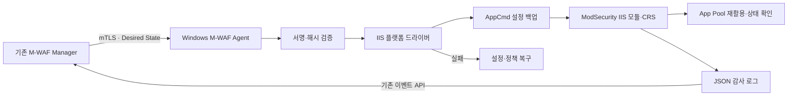

# M-WAF IIS 지원 확장 계획

## 문서 정보

| 항목 | 내용 |
|---|---|
| 문서 상태 | TODO · 구현 보류 |
| 작성일 | 2026-08-10 |
| 대상 저장소 | `m-waf` |
| 목적 | 향후 IIS 지원 착수 여부와 구현 범위를 검토하기 위한 기준 수립 |
| 구현 여부 | 미구현 |
| DB 변경 여부 | 미작성·미적용 |

## 1. 결론

IIS 지원은 기술적으로 가능하지만 현재 Apache/Nginx 지원 코드에 선택지만 추가하는 작업은 아니다. 기존 Manager의 기업 격리, 보호 정책, 불변 개정본, 서명, 배포 상태, 이벤트 수신과 감사 이력은 재사용하고, 보호 서버 측에는 별도의 Windows Agent 실행 계층과 IIS 전용 Connector·설정·복구 드라이버를 추가해야 한다.

구현에 앞서 실제 Windows Server와 IIS에서 다음 항목을 증명하는 POC를 통과해야 한다.

1. ModSecurity v2.9.x IIS 네이티브 모듈이 대상 IIS에서 안정적으로 로드된다.
2. 현재 사용 중인 OWASP CRS와 시스템·기업 오버라이드가 DetectionOnly와 On에서 동작한다.
3. JSON 감사 로그가 현재 M-WAF 이벤트 모델로 손실 없이 변환된다.
4. 설정 적용 실패, 모듈 로드 실패, App Pool 재활용 실패 시 이전 정상 정책과 IIS 설정으로 복구된다.
5. Manager 장애나 네트워크 단절 중에도 IIS는 마지막 정상 정책으로 계속 요청을 처리한다.

POC가 통과하기 전에는 Manager 메뉴, 패키지 카탈로그 또는 운영 지원 범위에 IIS를 노출하지 않는다.

## 2. 제안하는 최초 지원 범위

최초 구현은 다음 범위로 제한한다. 정확한 Windows Server 버전과 ModSecurity 버전은 POC 시작 시 지원 수명과 보안 공지를 다시 확인해 고정한다.

- 운영체제 후보: Windows Server 2022 또는 Windows Server 2025 x64
- 웹서버: IIS 10 x64
- WAF 엔진·Connector: 공식 OWASP ModSecurity v2.9.x IIS 구성
- 정책 범위: Windows 서버 한 대의 IIS 전체에 활성 보호 정책 하나
- Agent 범위: 서버당 M-WAF Agent 하나
- 정책 모드: DetectionOnly, On
- 정책 구성: 현재 게시된 시스템 정책과 기업 오버라이드 상속
- 관리 통신: 기존 Agent 발신 HTTPS, mTLS, 서명 정책 검증 구조 유지
- 설치 방식: M-WAF가 검증하고 서명한 Windows 설치 패키지만 허용
- 복구 방식: IIS 설정 백업, 직전 정상 정책 보존, 실패 시 자동 복구

다음 항목은 최초 범위에서 제외한다.

- IIS 사이트·애플리케이션·가상 디렉터리별 서로 다른 보호 정책
- 서버 한 대에서 여러 활성 보호 정책 동시 적용
- Windows 클라이언트 운영체제
- 32비트 IIS Worker Process
- 운영 서버에서 ModSecurity 또는 CRS 소스 빌드
- 외부 임의 URL이나 서명되지 않은 DLL·MSI 설치
- SharePoint 등 제품별 특수 IIS 구성 자동 조정
- IIS Shared Configuration과 Web Farm 자동 배포

## 3. 유지할 기존 시스템 정책

IIS를 추가해도 다음 정책은 변경하지 않는다.

- 서버당 활성 보호 정책은 최대 하나다.
- 신규 서버는 자동 정책 배정 없이 미배정 안전 상태로 등록한다.
- 보호 정책 생성 시 현재 게시된 시스템 정책을 자동 상속한다.
- 배포된 정책 개정본과 배포 이력은 불변으로 보존한다.
- 정책 적용은 서명·해시 검증, 사전 검증, 적용, 상태 확인, 실패 복구 순서로 처리한다.
- Manager는 임의 PowerShell 또는 명령 문자열을 서버에 전달하지 않는다.
- Agent와 IIS는 Manager 장애 중에도 마지막 정상 정책을 유지한다.
- 이벤트와 관리 데이터의 기업 범위 검증을 유지한다.

## 4. 선행 POC

### 4.1 환경

- 격리된 Windows Server VM 한 대
- IIS 10과 테스트 사이트·전용 App Pool
- x64 ModSecurity v2.9.x IIS 네이티브 모듈
- 현재 고정된 OWASP CRS 소스
- 정상 요청, 탐지 요청, 차단 요청을 발생시킬 테스트 클라이언트
- IIS 설정과 이벤트 로그를 확인할 관리자 권한

Windows 컨테이너만으로 운영 지원을 확정하지 않는다. 네이티브 모듈 로드, IIS 설정 저장소, 서비스 제어와 App Pool 재활용은 실제 지원 대상 Windows Server VM에서 확인한다.

### 4.2 확인 항목

1. `applicationHost.config`에 네이티브 모듈을 등록하고 IIS가 DLL을 정상 로드하는지 확인한다.
2. 현재 CRS와 M-WAF 엔진 설정을 IIS용 설정 파일에서 로드한다.
3. DetectionOnly 요청은 허용하면서 JSON 감사 로그가 생성되는지 확인한다.
4. On 요청은 차단되고 동일 요청 정보가 JSON 감사 로그에 남는지 확인한다.
5. Rule ID, 메시지, 심각도, 요청 메서드, URI, Client IP, 처리 결과와 발생 시각을 현재 이벤트 형식으로 변환한다.
6. 잘못된 Rule, 누락 DLL, 잘못된 경로와 권한 오류를 각각 재현한다.
7. AppCmd 설정 백업 후 변경을 적용하고 실패 시 원본 설정을 복원한다.
8. App Pool 재활용 전후 요청 처리와 정책 적용 상태를 확인한다.
9. IIS·Agent·Manager 재시작과 Manager 연결 단절 후 마지막 정상 정책 유지 여부를 확인한다.
10. 로그 교체·절단·재시작 과정에서 이벤트 중복과 누락을 확인한다.

### 4.3 POC 통과 기준

- DetectionOnly 정상 요청 HTTP 응답 유지
- On 공격 요청 차단
- 탐지·차단 테스트의 이벤트 수신 성공
- 동일 이벤트 재전송 시 Manager 중복 저장 없음
- 잘못된 정책 적용 시 IIS 요청 처리 중단 없이 직전 정책 복구
- IIS 설정 백업·복원과 App Pool 정상화 성공
- Agent 인증서와 개인키가 로그·프로세스 인자·설치 결과에 노출되지 않음
- 현재 CRS의 공식 회귀 테스트 중 IIS에 적용 가능한 범위 통과

POC에서 운영 중단, 복구 불능, 이벤트 형식 불일치 또는 안정적인 ModSecurity IIS 빌드 확보 실패가 확인되면 제품 구현을 중단하고 대체 방식을 별도 검토한다.

## 5. 목표 구조

Agent의 공통 통신·서명 검증·상태 비교·이벤트 spool은 유지하고 아래 기능을 플랫폼 드라이버로 분리한다.

- 운영체제·웹서버 인벤토리 수집
- 정책 파일 저장과 활성 버전 전환
- 파일 소유권·권한 검증
- 웹서버 설정 검증과 재적용
- 서비스·프로세스 제어
- 패키지 설치·업데이트·롤백
- 감사 로그 파일 추적

Linux Apache/Nginx 동작은 기존 드라이버로 유지하고 IIS는 별도 Windows 구현을 사용한다. 조건문을 공통 파일에 계속 추가하는 방식은 사용하지 않는다.

## 6. Windows Agent

### 6.1 실행 구조

- Go 공통 Agent 코드는 유지하되 Linux 전용 파일과 Windows 전용 파일을 build tag 또는 명확한 플랫폼 인터페이스로 분리한다.
- Windows Service Control Manager에 등록되는 전용 Agent 실행 파일을 제공한다.
- 서비스 계정은 IIS 설정·정책 파일·감사 로그에 필요한 최소 권한만 갖는다.
- 서비스 설치, 시작, 중지, 자동 시작과 장애 복구 정책을 설치 패키지에서 관리한다.
- Linux의 systemd, `/proc`, `/etc/os-release`, `dpkg`, `apt`, UID와 POSIX 권한 검사를 Windows 코드에서 사용하지 않는다.

### 6.2 권장 경로

최종 경로는 POC에서 확정하되 기본 후보는 다음과 같다.

- Agent 설정: `%ProgramData%\M-WAF\Agent\agent.json`
- 인증서·키: `%ProgramData%\M-WAF\Agent\pki\`
- 상태·spool: `%ProgramData%\M-WAF\Agent\state\`
- 정책 개정본: `%ProgramData%\M-WAF\Policy\revisions\`
- 활성 정책: `%ProgramData%\M-WAF\Policy\active\`
- 설치 로그: Windows Event Log 또는 제한된 `%ProgramData%\M-WAF\Logs\`

개인키와 등록 토큰은 Windows ACL로 Agent 서비스 계정과 Administrators만 읽을 수 있게 한다. 설치 토큰은 PowerShell 명령 인자에 평문으로 전달하지 않고 기존 설치 흐름과 동일하게 제한된 임시 파일 또는 표준 입력을 사용한다.

### 6.3 인벤토리

Windows Agent는 최소 다음 정보를 보고한다.

- Windows Server 제품명·버전·빌드
- 아키텍처
- IIS 버전
- `applicationHost.config` 위치와 Shared Configuration 사용 여부
- 설치된 IIS 네이티브 모듈과 ModSecurity DLL 버전·SHA-256
- 32/64비트 Worker Process 설정
- 사이트·App Pool 수와 대상 App Pool 상태
- ModSecurity 설정 파일 위치
- JSON 감사 로그 위치와 접근 가능 여부
- 설정 백업·복원, App Pool 재활용 가능 여부
- 지원 정책 artifact 형식과 Agent capability

최초 버전에서는 사이트 목록을 관제 참고 정보로만 사용하고 정책 대상을 사이트 단위로 만들지 않는다.

## 7. IIS 정책 적용 드라이버

### 7.1 설치와 등록

- 공식 OWASP ModSecurity v2.9.x 소스를 고정 tag·commit으로 가져온다.
- 재현 가능한 Windows x64 빌드를 만들고 DLL·의존 파일·라이선스·SBOM을 묶는다.
- 네이티브 모듈은 AppCmd 또는 검증된 설치 API로만 등록한다.
- 설치 전 IIS 설정 백업을 만들고 기존 동일 이름 모듈과 DLL 충돌을 검사한다.
- 운영 서버에서 소스 컴파일이나 외부 다운로드를 수행하지 않는다.

공식 문서가 안내하는 오래된 런타임 또는 기존 MSI를 그대로 신뢰하지 않는다. 착수 시점에 최신 지원 v2.9.x, 의존 라이브러리와 보안 공지를 다시 확인하고 M-WAF 공급망에서 직접 고정·빌드·서명한다.

### 7.2 정책 활성화

정책 적용 순서는 다음과 같다.

1. Desired State와 artifact 서명·해시를 검증한다.
2. 새 정책을 고유한 개정본 디렉터리에 기록한다.
3. IIS 설정 백업과 현재 활성 정책 정보를 보존한다.
4. IIS용 ModSecurity 설정이 새 개정본을 가리키도록 전환한다.
5. AppCmd로 모듈 등록·설정 상태를 조회한다.
6. 대상 App Pool을 재활용한다.
7. App Pool 상태, 모듈 로드 오류와 로컬 상태 확인 요청을 검사한다.
8. 성공한 경우에만 활성 개정본을 확정해 Manager에 보고한다.
9. 실패하면 IIS 설정과 정책 포인터를 복구하고 App Pool을 다시 정상화한다.

IIS에는 Apache/Nginx와 동일한 단일 `configtest` 명령이 있다고 가정하지 않는다. AppCmd 설정 조회, 설정 백업·복원, 모듈 상태, Windows Event Log, App Pool 상태와 실제 HTTP 상태 확인을 결합한 IIS 전용 검증 절차를 정의한다.

### 7.3 정책 artifact

현재 정책 번들에는 Linux 절대 경로가 포함되므로 그대로 IIS에 배포하지 않는다. POC 후 다음 두 방식 중 하나를 선택한다.

1. 권장안: 동일한 정책 개정본에서 Linux와 Windows용 서명 artifact를 각각 생성하고 플랫폼별 해시를 저장한다.
2. 대안: 플랫폼 독립적인 상대 경로만 사용하는 새 artifact 형식을 정의하고 각 Agent가 고정된 안전 경로에 전개한다.

권장안을 선택하면 `revision_id + platform`별 artifact 메타데이터를 보존하는 마이그레이션이 필요할 수 있다. 이 마이그레이션은 구현 승인 후 별도 파일로 작성하며 계획 단계에서는 작성하거나 DB에 적용하지 않는다.

## 8. 감사 로그와 이벤트 수신

- ModSecurity v2.9.x를 YAJL 지원으로 빌드해 JSON 감사 로그를 사용한다.
- 현재 Linux 로그 샘플과 IIS 로그 샘플을 fixture로 분리한다.
- IIS JSON 필드가 누락되거나 표현이 다른 경우 IIS 전용 정규화 계층에서 현재 `security_events`·`security_incidents` 모델로 변환한다.
- 요청·응답 본문, 인증 헤더와 민감 쿠키를 새로 수집하지 않는다.
- Windows 파일 ID, 크기, 수정 시각을 이용해 로그 교체·절단 위치를 추적한다.
- Event Log 오류와 ModSecurity 감사 로그는 용도를 분리한다.
- 이벤트 전송은 기존 mTLS와 기업 설치 토큰 검증 범위를 유지한다.

이벤트 DB 스키마는 현재 필드로 충분한지 POC 샘플로 먼저 검증한다. IIS 전용 원본 필드를 이유로 바로 범용 JSON 컬럼을 추가하지 않는다.

## 9. 패키지와 공급망

### 9.1 필요한 artifact

- Windows x64 Agent 설치 패키지
- ModSecurity IIS 네이티브 모듈과 의존 파일 설치 패키지
- Agent·모듈 각각의 명시적 롤백 artifact
- package manifest, SHA-256, 서명, SBOM, 라이선스와 upstream 출처

### 9.2 Manager 카탈로그

- Agent는 DEB만 허용하는 현재 검증을 Windows 설치 패키지까지 명시적으로 확장한다.
- `os_id`, `os_version`, `architecture`, `web_server=iis`, IIS build, ModSecurity runtime ABI를 정확히 매칭한다.
- IIS artifact가 없더라도 기존 Linux 시스템 정책 게시와 배포가 차단되지 않도록 플랫폼별 coverage를 분리한다.
- IIS 서버에는 IIS용 Agent·모듈·정책 artifact가 모두 있을 때만 설치와 배포를 허용한다.
- 현재 Linux artifact의 검증 규칙을 느슨하게 만들지 않는다.

### 9.3 업데이트와 롤백

- Windows Agent 업데이트 전 기존 바이너리와 서비스 구성을 보존한다.
- 새 Agent가 제한 시간 안에 동일 서버 ID와 mTLS 인증으로 heartbeat를 확인하지 못하면 이전 Agent로 복구한다.
- ModSecurity 모듈 업데이트는 IIS 설정 백업과 이전 DLL을 함께 보존한다.
- 사용 중인 DLL 교체와 재부팅 필요 상태를 명확히 구분해 보고한다.
- 재부팅을 임의 실행하지 않고 운영자 승인 대상 상태로 표시한다.

## 10. Manager와 화면

- 서버 설치 화면에 Windows Server + IIS 환경을 기존 Apache/Nginx와 동등한 카드로 추가한다.
- 설치 명령은 PowerShell용으로 제공하며 토큰·인증서 안전 원칙을 유지한다.
- 서버 상세에 IIS 버전, ModSecurity 모듈, App Pool, 설정 백업, 마지막 정책 검증 결과를 표시한다.
- 보호 정책 화면은 기존 `연결 서버 N대` 모델을 그대로 사용한다.
- 정책 배포 대상에서 플랫폼별 artifact 준비 상태를 표시한다.
- IIS 서버가 미지원 artifact를 요구하면 배포 시작 전에 차단하고 원인을 보여준다.
- 시스템 정책 화면에는 CRS 버전과 시스템 오버라이드만 표시하는 현재 사용자 개념을 유지한다.
- Apache/Nginx/IIS 내부 artifact 차이는 일반 사용자에게 별도 정책 버전으로 노출하지 않는다.

## 11. 보안 요구사항

- Windows 설치 패키지와 실행 파일에 Authenticode 서명을 적용한다.
- Manager package manifest 서명과 artifact SHA-256 검증을 함께 유지한다.
- Agent 개인키, 설치 토큰과 정책 서명키를 Windows Event Log와 설치 로그에 기록하지 않는다.
- Agent 서비스 계정에는 대화형 로그인과 불필요한 네트워크 권한을 부여하지 않는다.
- IIS 설정 변경은 사전에 승인된 고정 작업만 허용하고 Manager에서 임의 명령을 받지 않는다.
- `applicationHost.config`, 정책, DLL과 Agent 상태 경로의 ACL 변조를 감지한다.
- Shared Configuration, UNC 경로와 도메인 서비스 계정은 최초 범위에서 차단하거나 명확한 미지원 상태로 보고한다.
- DLL 검색 경로와 의존 파일 로딩 경로를 고정해 DLL side-loading을 방지한다.

## 12. 구현 단계

### 단계 0. 지원 가능성 POC

- 실제 Windows Server/IIS 환경 준비
- ModSecurity IIS 빌드·로드
- CRS DetectionOnly/On 검증
- JSON 이벤트 변환 검증
- AppCmd 백업·복구와 App Pool 검증
- 결과와 Go/No-Go 결정 기록

### 단계 1. Agent 플랫폼 분리

- 공통 Agent와 Linux 플랫폼 코드 경계 정의
- Windows 인벤토리·파일 권한·서비스 드라이버 추가
- Windows 경로와 설정 스키마 추가
- 기존 Linux 동작 회귀 방지

### 단계 2. Windows 패키지 공급망

- 재현 가능한 Agent·ModSecurity 빌드
- Windows 설치 패키지와 Authenticode 서명
- manifest·SBOM·라이선스·롤백 artifact 생성
- Manager 카탈로그 형식 확장

### 단계 3. IIS 정책 적용과 복구

- AppCmd 설정 백업·등록·상태 확인
- 플랫폼별 정책 artifact 생성
- App Pool 재활용과 상태 확인
- 실패 시 설정·정책·모듈 복구

### 단계 4. 이벤트와 관제

- IIS 감사 로그 reader와 fixture
- 현재 이벤트 모델 정규화
- 서버·이벤트·보고서 IIS 표시
- 기업·보호 정책 필터 격리 검증

### 단계 5. 설치·운영 화면

- Windows PowerShell 설치 흐름
- IIS 인벤토리·준비 상태·오류 표시
- IIS artifact compatibility와 롤백 상태 표시
- 기존 Apache/Nginx 화면 호환성 유지

### 단계 6. 실제 Windows 회귀 검증

- 깨끗한 Windows Server VM 설치
- 탐지·차단·이벤트 수신
- 정책 업데이트·롤백·실패 복구
- Agent·IIS·Manager 재시작
- 설치 제거와 이력 보존
- 장시간 이벤트 수집과 로그 교체

## 13. 검증 시나리오

### 설치

- 지원 Windows Server/IIS 조합만 설치 가능하다.
- 잘못된 아키텍처, 32비트 App Pool, 기존 충돌 모듈과 Shared Configuration을 차단한다.
- 설치 토큰과 개인키가 명령 인자나 로그에 남지 않는다.
- 신규 IIS 서버가 미배정 상태로 등록되고 DetectionOnly 안전 설정만 준비된다.

### 정책

- IIS 서버가 보호 정책에 연결되면 현재 게시 시스템 정책을 상속한다.
- 서명이나 해시가 잘못된 artifact는 IIS 설정 변경 전에 차단된다.
- DetectionOnly에서 정상 요청을 유지하고 탐지 이벤트를 수신한다.
- On에서 공격 요청을 차단하고 차단 이벤트를 수신한다.
- 잘못된 Rule, 경로 또는 모듈 상태에서 이전 정책으로 복구된다.
- 진행 중 배포 서버의 정책 이동이 차단된다.

### IIS 운영

- App Pool 재활용 전후 정상 요청이 복구된다.
- 모듈 DLL 누락과 의존 DLL 오류를 구분해 보고한다.
- Windows Event Log의 모듈 로드 오류를 상태에 반영한다.
- IIS 재시작과 서버 재부팅 후 Agent·모듈·정책이 정상 복원된다.
- Manager 단절 중 마지막 정상 정책을 유지한다.

### 이벤트

- IIS JSON 감사 로그를 현재 이벤트 필드로 변환한다.
- 동일 요청의 여러 Rule을 하나의 incident로 묶는다.
- 로그 교체·절단·Agent 재시작 후 중복과 누락이 없다.
- KST 화면 표시와 UTC DB 저장 원칙을 유지한다.
- 기업과 보호 정책 필터가 다른 기업 데이터를 노출하지 않는다.

### 공급망

- Agent·모듈·정책 artifact의 서명과 SHA-256을 검증한다.
- 현재 IIS 환경과 정확히 일치하지 않는 패키지를 거부한다.
- Agent와 모듈 업데이트 실패 시 각각 명시적 롤백이 동작한다.
- IIS coverage 부재가 기존 Linux 정책 게시·배포를 차단하지 않는다.

## 14. 완료 기준

다음 조건을 모두 만족해야 IIS를 지원 환경으로 표시한다.

- 지원 Windows Server/IIS/ModSecurity 버전 매트릭스 확정
- 재현 가능하고 서명된 Windows Agent·IIS 모듈 패키지 확보
- DetectionOnly·On·이벤트 수신·정책 업데이트·롤백 검증
- AppCmd 기반 설정 백업과 실패 복구 검증
- 실제 Windows Server VM E2E 통과
- 기존 Ubuntu/Debian Apache/Nginx 회귀 검증 통과
- 기업 범위, 보호 정책 관계와 감사 이력 검증
- 설치·업데이트·제거 운영 문서 작성
- 지원 제외 범위와 장애 복구 절차 작성

정적 컴파일이나 단위 테스트만으로 IIS 지원 완료를 선언하지 않는다.

## 15. 착수 전 결정할 항목

- 최초 지원 Windows Server 버전
- IIS 서버 전체 적용만 제공할지 여부
- 지원할 ModSecurity v2.9.x 정확한 tag와 빌드 도구 체인
- MSI 또는 다른 Windows 설치 패키지 형식
- Authenticode 인증서 보관·서명 주체
- IIS 상태 확인용 로컬 HTTP 요청 방식과 포트·Host 처리
- 전체 IIS 재시작과 App Pool 단위 재활용 중 허용 범위
- Windows Event Log 수집 범위
- Windows VM CI 실행 환경과 라이선스·비용
- 플랫폼별 정책 artifact 저장 구조와 DB 마이그레이션 필요 여부
- IIS Shared Configuration과 Web Farm을 계속 제외할지 여부

## 16. 참고 자료

- [OWASP ModSecurity](https://github.com/owasp-modsecurity/ModSecurity)
- [OWASP ModSecurity v2.x Reference Manual](https://github.com/owasp-modsecurity/ModSecurity/wiki/Reference-Manual-%28v2.x%29)
- [OWASP ModSecurity FAQ](https://github.com/owasp-modsecurity/ModSecurity/wiki/ModSecurity-Frequently-Asked-Questions-%28FAQ%29)
- [Microsoft IIS Modules Overview](https://learn.microsoft.com/en-us/iis/get-started/introduction-to-iis/iis-modules-overview)
- [Microsoft AppCmd](https://learn.microsoft.com/en-us/iis/get-started/getting-started-with-iis/getting-started-with-appcmdexe)
- [Microsoft AppCmd Configuration Backup](https://learn.microsoft.com/en-us/iis/web-hosting/web-server-for-shared-hosting/create-a-backup-with-appcmd)

## 17. 현재 상태

- 검토와 계획서 작성만 완료했다.
- 코드, 화면, 패키지, 테스트와 DB 마이그레이션은 작성하지 않았다.
- 실제 Windows Server/IIS POC는 수행하지 않았다.
- 향후 확장 승인 후 단계 0부터 별도 작업으로 진행한다.
